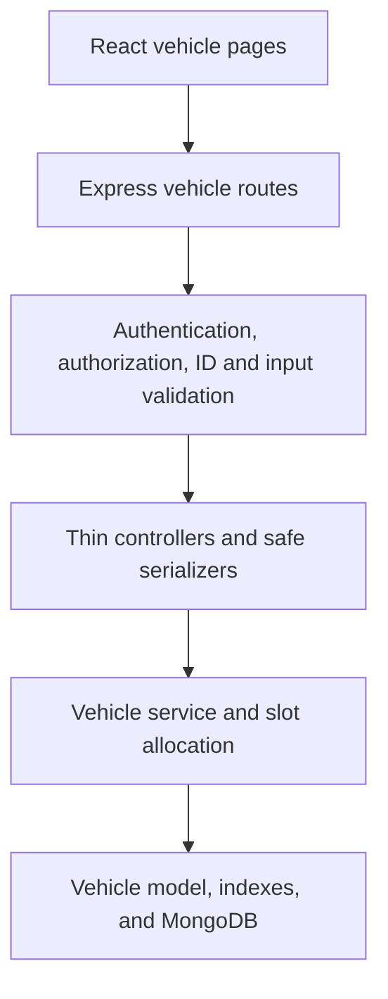

# Vehicle Service Booking Vehicle Profiles Implementation Plan v3.3 (Corrected)

> **For agentic workers:** REQUIRED SUB-SKILL: Use superpowers:subagent-driven-development (recommended) or superpowers:executing-plans to implement this plan task-by-task. Steps use checkbox (`- [ ]`) syntax for tracking.

**Goal:** Build and verify the complete Vehicle Profiles feature (customer vehicle management without delete, admin read-only vehicle list) on top of the approved Authentication subsystem.

**Architecture:** Add a `Vehicle` model and customer/admin HTTP layers without changing authentication behavior. A concurrency-safe service allocates one of five indexed active slots per owner, while thin controllers serialize safe response objects; the React client consumes those contracts through one API adapter and role-protected pages.

**Tech Stack:** Node.js, CommonJS, Express 5, MongoDB, Mongoose 9, `node:test`, Supertest, express-validator; React 19, React Router 7, Vite 8, Vitest 4, Testing Library.

**Spec:** `docs/superpowers/specs/2026-08-28-vehicle-profiles-design.md` (approved v4; unchanged by this plan correction)

## Architecture



- One server normalization source (`server/utils/vehicleRegistration.js`) is imported by the model, validators, service, and admin search. The service re-exports it and contains no second implementation.
- One client normalization source (`client/src/utils/vehicleValidation.js`) drives the live preview; the server never imports client code.
- Authentication middleware, services, routes, and models are read-only dependencies: this plan never changes their behavior.
- Errors pass to the existing central error middleware; the vehicle service converts E11000 by key before the generic 11000 branch can mask it.

## Global Constraints

- Work from `C:\Users\Durai\VehicleServiceBooking\server` for server commands and `C:\Users\Durai\VehicleServiceBooking\client` for client commands; verify the prompt ends in the expected directory before every `npm` command.
- This folder is not a Git repository. No Git commands. No `git init`. No commits. Task 1 creates an external source backup and a CSV baseline manifest; Task 13 compares the final filesystem state against the machine-readable allowlist.
- Keep all existing authentication tests passing. Do not change authentication server behavior (middleware, services, routes, models, cookies).
- `server/.env` remains unchanged. The only approved authentication-file edits are the client-only `authApi.js` error-array normalization and its tests.
- Automated tests use only `mongodb://127.0.0.1:27017/vehicle_service_booking_test`. Manual browser acceptance uses the configured development database. Automated tests must never use the development database `vehicle_service_booking` or any production database.
- The existing package scripts remain the command source of truth; every focused and full invocation appears inside its task with an explicit working-directory change.
- TDD for every behavior: write the failing test, run the exact focused command and confirm expected failure, write the minimal implementation, rerun the focused test and confirm pass, then run the relevant regression group. Every task independently reaches green before the next task starts.
- There are six customer endpoint operations: list, get-one, create, update, archive, restore. No DELETE anywhere.
- V1 supports cars only. Registration normalization is trim, uppercase, then removal of spaces and hyphens; the stored value must match `/^[A-Z0-9]{4,15}$/`.
- A registration number is globally unique across active and archived vehicles, immutable after creation, never transferred in V1, and never released by archiving.
- Declare exactly three Vehicle indexes once: `{ owner: 1, createdAt: -1 }`, unique `{ registrationNumber: 1 }`, and unique partial `{ owner: 1, activeSlot: 1 }` for active rows. Do not add path-level `index: true` or `unique: true` duplicates.
- The five-active limit is enforced by the partial unique slot index plus bounded slot retries. `countDocuments` is never the capacity concurrency arbiter.
- Vehicle documents are archived/restored but never deleted. Administrator vehicle access is read-only; no administrator write route or UI control is added.
- The five-active limit and duplicate-registration responses are exact JSON bodies; never alter their wording.
- `activeSlot` is internal: never serialized, never accepted from the client, never present in any response. `archivedAt` is included only when it contains a Date; the property is omitted entirely when null.
- Invalid MongoDB ObjectIds on vehicle routes return `404 { "message": "Vehicle not found" }` via `mongoose.isValidObjectId`, never the generic 400 validation path; services also guard invalid IDs and return `null` (never a CastError).
- The maximum vehicle year is evaluated during every validation: `value <= new Date().getFullYear() + 1`, never cached at module load.
- Query extraction after validation uses `matchedData(req, { locations: ["query"] })`; `page`/`limit` use `.toInt()`; pagination response values are numbers.
- `findOneAndUpdate`/update operations use `runValidators: true` plus query-aware `pre` validation via `this.getUpdate()` so archive/restore updates enforce the activeSlot invariant.
- No vehicle rate limiter in this phase. Service-status tracking stays deferred to the Booking phase.
- No uploads, bookings, services, reports, payment, SMS, reminders, loyalty, multi-branch behavior, or service-status tracking is implemented in this phase.
- Every executable `npm` command in this plan has an immediately preceding exact `Set-Location`; do not run a command from an assumed directory.
- Multi-command and completion-gate PowerShell blocks inspect `$LASTEXITCODE` immediately after each native `npm` process, because a nonzero native exit does not automatically terminate PowerShell 7.

## File Map

### Server files created

- `server/utils/vehicleRegistration.js` - single normalization source
- `server/models/Vehicle.js`
- `server/middleware/requireValidVehicleId.js` - invalid-ID -> 404 check
- `server/routes/vehicleRoutes.js`
- `server/controllers/vehicleController.js`
- `server/services/vehicleService.js` (re-exports `normalizeRegistrationNumber`)
- `server/validators/vehicleValidators.js`
- `server/utils/vehicleResponse.js`
- `server/tests/models/vehicle.test.js`
- `server/tests/services/vehicleService.test.js`
- `server/tests/vehicleRoutes.test.js`
- `server/tests/adminVehicleRoutes.test.js`
- `server/tests/validators/vehicleValidators.test.js`

### Server files modified

- `server/index.js` (add Vehicle to `authenticationModels()` array)
- `server/app.js` (mount `/api/vehicles`)
- `server/routes/adminRoutes.js` (add `GET /vehicles`)
- `server/controllers/adminController.js` (add `listVehicles`)
- `server/tests/startup.no-db.test.js` (update model-array assertion)

### Client files created

- `client/src/utils/vehicleValidation.js` - single client normalization source
- `client/src/utils/vehicleValidation.test.js`
- `client/src/api/vehicleApi.js`
- `client/src/utils/vehicleErrors.js`
- `client/src/components/SelectField.jsx`
- `client/src/components/SelectField.test.jsx`
- `client/src/pages/VehiclesPage.jsx`
- `client/src/pages/AdminVehiclesPage.jsx`
- `client/src/pages/vehiclesPage.test.jsx`
- `client/src/pages/adminVehiclesPage.test.jsx`
- `client/src/utils/vehicleErrors.test.js`
- `client/src/api/vehicleApi.test.js`
- `client/src/App.test.jsx`

### Client files modified

- `client/src/api/authApi.js` (Phase 0 error normalization)
- `client/src/api/authApi.test.js` (update + extend)
- `client/src/pages/DashboardPage.jsx` (role-specific nav links)
- `client/src/pages/accountFlows.test.jsx` (navigation assertions for both roles)
- `client/src/App.jsx` (routes: customer-only group + admin group)
- `client/src/styles/index.css` (vehicle styles)

### Other files

- `C:\Users\Durai\VehicleServiceBooking-backups\` - external backup, CSV baseline, pointer file, and allowlist (outside the project; never scanned or committed)

### Plan document modified

- `docs/superpowers/plans/2026-08-28-vehicle-profiles-implementation.md` (Task 13 records verification results)

## Interfaces (exact)

- `server/utils/vehicleRegistration.js`: `normalizeRegistrationNumber(value)` -> `String(value ?? "").trim().toUpperCase().replace(/[\s-]/g, "")`. Imported by model, validators, service, admin search; re-exported by `vehicleService.js`.
- `server/middleware/requireValidVehicleId.js`: `requireValidVehicleId(req, res, next)` - `mongoose.isValidObjectId(req.params.id)` false -> `next(new AppError(404, "Vehicle not found"))`; true -> `next()`.
- `server/services/vehicleService.js`: `createVehicle({ owner, registrationNumber, make, model, year, fuelType }) -> Promise<VehicleDocument>`; `listVehicles({ owner, status = "active" }) -> Promise<VehicleDocument[]>`; `getVehicle({ owner, vehicleId })`, `updateVehicle({ owner, vehicleId, patch })`, `archiveVehicle({ owner, vehicleId })`, and `restoreVehicle({ owner, vehicleId }) -> Promise<VehicleDocument | null>`; `adminListVehicles({ page = 1, limit = 20, status = "all", search = "" }) -> Promise<{ vehicles, pagination }>`; and the single normalizer is re-exported. All four `:id` service operations return `null` for invalid/missing/non-owner results; archive also returns `null` when not active, and restore returns `null` when not archived or when its conditional update loses a race.
- `server/utils/vehicleResponse.js`: `toSafeVehicle(vehicle)` -> `{ id, registrationNumber, make, model, year, fuelType, status, createdAt, updatedAt }` plus `archivedAt` only when it is a Date; always omits `activeSlot`, raw `owner`, `__v`. `toSafeAdminVehicle(vehicle)` -> safe vehicle plus `owner: { id, username, email, isActive }`; omits `activeSlot` and all owner sentinel fields.
- `server/validators/vehicleValidators.js`: `registrationNumberValidator()`, `makeValidator()`, `modelValidator()`, `yearValidator()` (live custom validator), `fuelTypeValidator()`, `createVehicleValidation`, `updateVehicleValidation` (optional editable fields + forbidden-field guards + empty-body rejection), `listVehiclesQueryValidation`, `adminListVehiclesQueryValidation` (with `.toInt()`).
- `server/controllers/vehicleController.js`: `listVehicles`, `getVehicle`, `createVehicle`, `updateVehicle`, `archiveVehicle`, `restoreVehicle` - each extracts sanitized query data with `matchedData(req, { locations: ["query"] })` where applicable.
- `server/controllers/adminController.js`: `listVehicles` (admin).
- `server/routes/vehicleRoutes.js`: `createVehicleRouter()`; six operations; middleware order `authenticate -> authorize("customer") -> requireValidVehicleId (for :id routes) -> validation -> controller`.
- `server/routes/adminRoutes.js`: adds `GET /vehicles` with `authenticate -> authorize("admin") -> adminListVehiclesQueryValidation -> validateRequest -> adminController.listVehicles`.
- `client/src/utils/vehicleValidation.js`: `normalizeRegistrationNumber(value)` - same algorithm as the server source.
- `client/src/api/vehicleApi.js`: `list({ status = "active" } = {}) -> GET /vehicles?status=...`; `get(id) -> GET /vehicles/:id`; `create(payload) -> POST /vehicles`; `update(id, payload) -> PATCH /vehicles/:id`; `archive(id) -> PATCH /vehicles/:id/archive`; `restore(id) -> PATCH /vehicles/:id/restore`; `adminList({ page = 1, limit = 20, status = "all", search = "" } = {}) -> GET /admin/vehicles?...`. GET/archive/restore requests have no body.
- `client/src/utils/vehicleErrors.js`: `handleVehicleApiError(error, { clearSession, navigate })` -> `false` on 401 (clearSession + navigate, no rethrow), otherwise returns the error.
- `client/src/components/SelectField.jsx`: `{ label, id, error, value, onChange, options, ...selectProps }`.
- `client/src/pages/VehiclesPage.jsx`: `export function VehiclesPage()`; `client/src/pages/AdminVehiclesPage.jsx`: `export function AdminVehiclesPage()`.
- `client/src/App.jsx`: separate `<Route element={<ProtectedRoute allowedRoles={["customer"]} />}>` group containing `/vehicles`; the existing admin group `allowedRoles={["admin"]}` contains `/admin/vehicles`; the existing unrestricted `ProtectedRoute` group keeps `/dashboard` and `/change-password`.

## Command rule

Use the focused and full commands inside each task. They intentionally repeat `Set-Location` before every `npm` invocation so a command never depends on remembered shell state.

---
### Task 1: Non-Git safety preflight, MongoDB readiness, backup, baseline, and allowlist

**Files:**
- Create outside project: a timestamped `pre-vehicle-yyyyMMdd-HHmmss` directory under `C:\Users\Durai\VehicleServiceBooking-backups\`
- Create outside project: a timestamped `baseline-yyyyMMdd-HHmmss.csv` file under `C:\Users\Durai\VehicleServiceBooking-backups\`
- Create outside project: `C:\Users\Durai\VehicleServiceBooking-backups\baseline-pointer.txt`
- Create outside project: `C:\Users\Durai\VehicleServiceBooking-backups\allowlist.txt`

**Interfaces:**
- Produces: a recoverable source backup that contains no `.env`, `node_modules`, or `dist`; a timestamped CSV baseline with project-relative `Path` and SHA-256 `Hash`; a persistent pointer to that baseline; and an exact 38-path allowlist consumed by Task 13.
- Safety boundary: automated tests use only `vehicle_service_booking_test`. Manual browser acceptance uses the configured development database. Automated tests must never use the development database `vehicle_service_booking` or any production database.

- [ ] **Step 1: Confirm the project directory**

```powershell
Set-Location "C:\Users\Durai\VehicleServiceBooking"
$expectedRoot = "C:\Users\Durai\VehicleServiceBooking"
$actualRoot = (Get-Location).Path
if ($actualRoot -ne $expectedRoot) {
    throw "Wrong project directory: $actualRoot"
}
"PROJECT ROOT: PASS"
```

Expected: `PROJECT ROOT: PASS`.

- [ ] **Step 2: Check MongoDB before running any tests**

Run in the working PowerShell window:

```powershell
$mongodPath = "C:\mongodb\bin\mongod.exe"
$mongoDataPath = "C:\mongodb\data\db"
$mongoPortOpen = Test-NetConnection 127.0.0.1 -Port 27017 -InformationLevel Quiet

if ($mongoPortOpen) {
    "MONGODB PORT: ALREADY READY"
}
else {
    if (-not (Test-Path -LiteralPath $mongodPath -PathType Leaf)) {
        throw "MongoDB executable not found: $mongodPath"
    }
    if (-not (Test-Path -LiteralPath $mongoDataPath -PathType Container)) {
        throw "MongoDB data directory not found: $mongoDataPath"
    }
    "MONGODB PATHS: PASS"
    "Open a separate PowerShell window and run the command in the next code block."
}
```

If the port was not already ready, open a separate PowerShell window and leave this exact command running:

```powershell
& "C:\mongodb\bin\mongod.exe" --dbpath "C:\mongodb\data\db" --bind_ip 127.0.0.1 --port 27017
```

Do not start a second MongoDB process when the first check prints `MONGODB PORT: ALREADY READY`.

- [ ] **Step 3: Confirm MongoDB readiness with a bounded wait**

Run in the working PowerShell window. This makes at most 15 attempts and then stops with an error.

```powershell
$mongoReady = $false
for ($attempt = 1; $attempt -le 15; $attempt++) {
    if (Test-NetConnection 127.0.0.1 -Port 27017 -InformationLevel Quiet) {
        $mongoReady = $true
        break
    }
    Start-Sleep -Seconds 1
}

if (-not $mongoReady) {
    throw "MongoDB did not become ready on 127.0.0.1:27017 after 15 attempts"
}
"MONGODB READINESS: PASS"
```

Expected: `MONGODB READINESS: PASS`. Do not run any test until this passes.

- [ ] **Step 4: Create an external recoverable backup with exclusions applied during copying**

`robocopy` excludes every directory named `node_modules` or `dist` and every file named `.env` while it copies. Nothing secret is copied and removed later.

```powershell
Set-Location "C:\Users\Durai\VehicleServiceBooking"
$ErrorActionPreference = "Stop"
$projectRoot = "C:\Users\Durai\VehicleServiceBooking"
$backupRoot = "C:\Users\Durai\VehicleServiceBooking-backups"
$backupStamp = Get-Date -Format "yyyyMMdd-HHmmss"
$backupPath = Join-Path $backupRoot "pre-vehicle-$backupStamp"

New-Item -ItemType Directory -Path $backupRoot -Force | Out-Null

& robocopy $projectRoot $backupPath /E /COPY:DAT /DCOPY:DAT /R:2 /W:1 /XJ /XF ".env" /XD "node_modules" "dist"
$robocopyExitCode = $LASTEXITCODE

if ($robocopyExitCode -gt 7) {
    throw "robocopy failed with exit code $robocopyExitCode"
}

$forbiddenBackupItems = @(
    Get-ChildItem -LiteralPath $backupPath -Recurse -Force | Where-Object {
        $_.Name -eq ".env" -or
        ($_.PSIsContainer -and $_.Name -in @("node_modules", "dist"))
    }
)

if ($forbiddenBackupItems.Count -gt 0) {
    $forbiddenBackupItems | Select-Object -ExpandProperty FullName
    throw "Backup contains an excluded item"
}

"BACKUP: PASS ($backupPath)"
```

Expected: `BACKUP: PASS (...)`. For `robocopy`, exit codes 0 through 7 are successful; any code above 7 stops the task.

- [ ] **Step 5: Run every pre-change verification gate**

Run only after MongoDB readiness and backup have passed:

```powershell
Set-Location "C:\Users\Durai\VehicleServiceBooking\server"
npm test
if ($LASTEXITCODE -ne 0) { throw "Server pre-change test gate failed with exit code $LASTEXITCODE" }

Set-Location "C:\Users\Durai\VehicleServiceBooking\client"
npm test -- --run
if ($LASTEXITCODE -ne 0) { throw "Client pre-change test gate failed with exit code $LASTEXITCODE" }

Set-Location "C:\Users\Durai\VehicleServiceBooking\client"
npm run lint
if ($LASTEXITCODE -ne 0) { throw "Client pre-change lint gate failed with exit code $LASTEXITCODE" }

Set-Location "C:\Users\Durai\VehicleServiceBooking\client"
npm run build
if ($LASTEXITCODE -ne 0) { throw "Client pre-change build gate failed with exit code $LASTEXITCODE" }
```

Expected: the complete server suite passes; the complete client suite passes; ESLint reports no errors; the client production build completes. Stop before implementation if any command fails.

- [ ] **Step 6: Create the timestamped SHA-256 CSV baseline**

This scans the complete project, including package and configuration files, while excluding `.env`, `node_modules`, and `dist`. The backup directory is external to the project and therefore cannot enter the manifest.

```powershell
Set-Location "C:\Users\Durai\VehicleServiceBooking"
$ErrorActionPreference = "Stop"
$projectRoot = "C:\Users\Durai\VehicleServiceBooking"
$backupRoot = "C:\Users\Durai\VehicleServiceBooking-backups"
$baselineStamp = Get-Date -Format "yyyyMMdd-HHmmss"
$baselinePath = Join-Path $backupRoot "baseline-$baselineStamp.csv"

$baselineRows = @(
    Get-ChildItem -LiteralPath $projectRoot -Recurse -File -Force | ForEach-Object {
        $relativePath = [IO.Path]::GetRelativePath($projectRoot, $_.FullName)
        $pathParts = $relativePath.Split([IO.Path]::DirectorySeparatorChar)

        if (
            $_.Name -ne ".env" -and
            $pathParts -notcontains "node_modules" -and
            $pathParts -notcontains "dist"
        ) {
            [PSCustomObject]@{
                Path = $relativePath
                Hash = (Get-FileHash -LiteralPath $_.FullName -Algorithm SHA256).Hash
            }
        }
    }
) | Sort-Object Path

if ($baselineRows.Count -eq 0) {
    throw "Baseline manifest is empty"
}

$baselineRows | Export-Csv -LiteralPath $baselinePath -NoTypeInformation -Encoding utf8 -ErrorAction Stop
"BASELINE: PASS ($baselinePath; $($baselineRows.Count) files)"
```

Expected: a non-empty timestamped CSV with actual `Path` and `Hash` columns. The command never prints file contents.

- [ ] **Step 7: Reconstruct and persist the baseline path independently**

This is a separate PowerShell block. It does not rely on `$baselinePath` or `$baselineStamp` surviving from Step 6.

```powershell
$ErrorActionPreference = "Stop"
$backupRoot = "C:\Users\Durai\VehicleServiceBooking-backups"
$pointerPath = Join-Path $backupRoot "baseline-pointer.txt"
$latestBaseline = Get-ChildItem -LiteralPath $backupRoot -Filter "baseline-*.csv" -File |
    Sort-Object Name -Descending |
    Select-Object -First 1

if ($null -eq $latestBaseline) {
    throw "No timestamped baseline CSV exists in $backupRoot"
}

Set-Content -LiteralPath $pointerPath -Value $latestBaseline.FullName -Encoding utf8 -ErrorAction Stop
$resolvedBaselinePath = (Get-Content -LiteralPath $pointerPath -Raw -ErrorAction Stop).Trim()

if (-not (Test-Path -LiteralPath $resolvedBaselinePath -PathType Leaf)) {
    throw "Baseline pointer does not resolve to a file: $resolvedBaselinePath"
}

"BASELINE POINTER: PASS ($resolvedBaselinePath)"
```

Expected: `BASELINE POINTER: PASS (...)` naming the timestamped CSV from Step 6.

- [ ] **Step 8: Create and verify the exact 38-entry machine-readable allowlist**

```powershell
$ErrorActionPreference = "Stop"
$backupRoot = "C:\Users\Durai\VehicleServiceBooking-backups"
$allowlistPath = Join-Path $backupRoot "allowlist.txt"
$allowlistText = @'
server\utils\vehicleRegistration.js
server\models\Vehicle.js
server\middleware\requireValidVehicleId.js
server\routes\vehicleRoutes.js
server\controllers\vehicleController.js
server\services\vehicleService.js
server\validators\vehicleValidators.js
server\utils\vehicleResponse.js
server\tests\models\vehicle.test.js
server\tests\services\vehicleService.test.js
server\tests\vehicleRoutes.test.js
server\tests\adminVehicleRoutes.test.js
server\tests\validators\vehicleValidators.test.js
server\index.js
server\app.js
server\routes\adminRoutes.js
server\controllers\adminController.js
server\tests\startup.no-db.test.js
client\src\utils\vehicleValidation.js
client\src\utils\vehicleValidation.test.js
client\src\api\vehicleApi.js
client\src\utils\vehicleErrors.js
client\src\components\SelectField.jsx
client\src\components\SelectField.test.jsx
client\src\pages\VehiclesPage.jsx
client\src\pages\AdminVehiclesPage.jsx
client\src\pages\vehiclesPage.test.jsx
client\src\pages\adminVehiclesPage.test.jsx
client\src\utils\vehicleErrors.test.js
client\src\api\vehicleApi.test.js
client\src\App.test.jsx
client\src\api\authApi.js
client\src\api\authApi.test.js
client\src\pages\DashboardPage.jsx
client\src\pages\accountFlows.test.jsx
client\src\App.jsx
client\src\styles\index.css
docs\superpowers\plans\2026-08-28-vehicle-profiles-implementation.md
'@

$allowlistEntries = @(
    $allowlistText -split '\r?\n' |
        ForEach-Object { $_.Trim() } |
        Where-Object { $_.Length -gt 0 }
)
$uniqueAllowlistEntries = @($allowlistEntries | Sort-Object -Unique)

if ($allowlistEntries.Count -ne 38) {
    throw "Allowlist must contain exactly 38 entries; found $($allowlistEntries.Count)"
}
if ($uniqueAllowlistEntries.Count -ne 38) {
    throw "Allowlist entries must be unique; found $($uniqueAllowlistEntries.Count) unique paths"
}

Set-Content -LiteralPath $allowlistPath -Value $allowlistEntries -Encoding utf8 -ErrorAction Stop
$savedAllowlist = @(
    Get-Content -LiteralPath $allowlistPath -ErrorAction Stop |
        ForEach-Object { $_.Trim() } |
        Where-Object { $_.Length -gt 0 }
)

if ($savedAllowlist.Count -ne 38 -or @($savedAllowlist | Sort-Object -Unique).Count -ne 38) {
    throw "Saved allowlist verification failed"
}

"ALLOWLIST CREATION STEP: PASS (38 unique paths)"
```

Expected: `ALLOWLIST CREATION STEP: PASS (38 unique paths)`.

---

### Task 2: Phase 0 - authApi array-to-map error normalization

**Files:**
- Modify: `client/src/api/authApi.js`
- Modify: `client/src/api/authApi.test.js`

**Interfaces:**
- Consumes: existing `apiRequest` and `ApiError` in `client/src/api/authApi.js`.
- Produces: `ApiError.fieldErrors` as a first-error-wins map derived from server `errors: [{ field, message }]`; missing/malformed/empty errors -> `{}`.

- [ ] **Step 1: Update the failing tests to the array contract**

Modify `src/api/authApi.test.js`:
- Replace the stubbed `errors: { email: ... }` object with `errors: [{ field: "email", message: "Email is already registered" }]`; assert `fieldErrors` equals `{ email: "Email is already registered" }`.
- Replace the stubbed `errors: { token: ... }` object with `errors: [{ field: "token", message: "This link is invalid or expired" }]`; assert `fieldErrors` equals `{ token: "This link is invalid or expired" }`.
- Add cases: first-error-wins (`[{ field: "email", message: "first" }, { field: "email", message: "second" }]` -> `{ email: "first" }`); non-array `errors: "oops"` -> `{}`; empty array -> `{}`; entry missing `field` or `message` -> skipped; **missing `errors` property entirely -> `{}`**; success responses and credential-scanning unchanged.

- [ ] **Step 2: Run the focused test and confirm the expected failure**

```powershell
Set-Location "C:\Users\Durai\VehicleServiceBooking\client"
npm test -- --run src/api/authApi.test.js
```

Expected: FAIL - `fieldErrors` is the raw stub, not the converted map.
- [ ] **Step 3: Implement the normalization**

Modify the `!response.ok` branch of `apiRequest` in `src/api/authApi.js`:

```js
let fieldErrors = {};
if (Array.isArray(data?.errors)) {
  for (const entry of data.errors) {
    if (entry && typeof entry.field === "string" && typeof entry.message === "string" && !(entry.field in fieldErrors)) {
      fieldErrors[entry.field] = entry.message;
    }
  }
}
throw new ApiError(data?.message || "Request failed", { status: response.status, fieldErrors });
```

- [ ] **Step 4: Rerun the focused test and confirm pass**

```powershell
Set-Location "C:\Users\Durai\VehicleServiceBooking\client"
npm test -- --run src/api/authApi.test.js
```

Expected: PASS.

- [ ] **Step 5: Run the client regression group**

```powershell
Set-Location "C:\Users\Durai\VehicleServiceBooking\client"
npm test -- --run
```

Expected: all client tests pass. Task 2 is green before Task 3 starts.

---
### Task 3: Server registration normalization and Vehicle model

**Files:**
- Create: `server/utils/vehicleRegistration.js`
- Create: `server/models/Vehicle.js`
- Create: `server/tests/models/vehicle.test.js`

**Interfaces:**
- Produces: `normalizeRegistrationNumber(value)` from `server/utils/vehicleRegistration.js`.
- Produces: the Mongoose `Vehicle` model from `server/models/Vehicle.js`.
- The model declares exactly three application indexes: `{ owner: 1, createdAt: -1 }`, unique `{ registrationNumber: 1 }`, and unique partial `{ owner: 1, activeSlot: 1 }` for `{ status: "active" }`.
- `registrationNumber` and `activeSlot` remain internal model concerns in this task; HTTP serialization is introduced in Task 4.

- [ ] **Step 1: Write the failing normalization, schema-rule, state-invariant, immutability, and index tests**

Create `server/tests/models/vehicle.test.js`:

```js
const test = require("node:test");
const assert = require("node:assert/strict");
const mongoose = require("mongoose");

const Vehicle = require("../../models/Vehicle");
const {
  normalizeRegistrationNumber,
} = require("../../utils/vehicleRegistration");
const {
  connectTestDb,
  clearTestDb,
  disconnectTestDb,
} = require("../helpers/testDb");

let registrationSequence = 0;

function nextRegistrationNumber() {
  registrationSequence += 1;
  return `TN${String(registrationSequence).padStart(4, "0")}AB12`;
}

function vehicleInput(overrides = {}) {
  return {
    owner: new mongoose.Types.ObjectId(),
    registrationNumber: nextRegistrationNumber(),
    make: "Honda",
    model: "City",
    year: 2021,
    fuelType: "petrol",
    status: "active",
    archivedAt: null,
    activeSlot: 1,
    ...overrides,
  };
}

function isValidationError(error) {
  return error?.name === "ValidationError";
}

function isDuplicateKey(error) {
  return error?.code === 11000;
}

function indexWithKey(indexes, expectedKey) {
  return indexes.filter(
    (index) => JSON.stringify(index.key) === JSON.stringify(expectedKey),
  );
}

test.before(async () => {
  await connectTestDb();
  await Vehicle.init();
});

test.beforeEach(async () => {
  await clearTestDb();
});

test.after(async () => {
  await disconnectTestDb();
});

test("normalizeRegistrationNumber is the single loose India normalizer", () => {
  assert.equal(normalizeRegistrationNumber(" TN 01 AB-1234 "), "TN01AB1234");
  assert.equal(normalizeRegistrationNumber(null), "");
});

test("the model normalizes registration numbers before validating and storing", async () => {
  const vehicle = await Vehicle.create(
    vehicleInput({ registrationNumber: " TN 01 AB-1234 " }),
  );

  assert.equal(vehicle.registrationNumber, "TN01AB1234");
});

test("the stored registration format rejects punctuation and invalid lengths", async () => {
  await assert.rejects(
    Vehicle.create(vehicleInput({ registrationNumber: "TN@01" })),
    isValidationError,
  );
  await assert.rejects(
    Vehicle.create(vehicleInput({ registrationNumber: "A-1" })),
    isValidationError,
  );
  await assert.rejects(
    Vehicle.create(vehicleInput({ registrationNumber: "A".repeat(16) })),
    isValidationError,
  );
});

test("make and model enforce trimmed lengths from 1 through 50", async () => {
  await assert.rejects(
    Vehicle.create(vehicleInput({ make: "   " })),
    isValidationError,
  );
  await assert.rejects(
    Vehicle.create(vehicleInput({ model: "M".repeat(51) })),
    isValidationError,
  );

  const vehicle = await Vehicle.create(
    vehicleInput({ make: " H ", model: " C " }),
  );
  assert.equal(vehicle.make, "H");
  assert.equal(vehicle.model, "C");
});

test("year is an integer within the live 1980 through next-year range", async () => {
  const nextYear = new Date().getFullYear() + 1;
  const invalidYears = [1979, 2020.5, nextYear + 1, [2021], { value: 2021 }];

  for (const year of invalidYears) {
    await assert.rejects(
      Vehicle.create(vehicleInput({ year })),
      isValidationError,
    );
  }

  const minimum = await Vehicle.create(vehicleInput({ year: 1980 }));
  const maximum = await Vehicle.create(vehicleInput({ year: nextYear }));
  assert.equal(minimum.year, 1980);
  assert.equal(maximum.year, nextYear);
});

test("fuelType accepts only the five approved values", async () => {
  for (const fuelType of ["petrol", "diesel", "electric", "hybrid", "cng"]) {
    const vehicle = await Vehicle.create(vehicleInput({ fuelType }));
    assert.equal(vehicle.fuelType, fuelType);
  }

  await assert.rejects(
    Vehicle.create(vehicleInput({ fuelType: "lpg" })),
    isValidationError,
  );
});

test("owner is required", async () => {
  await assert.rejects(
    Vehicle.create(vehicleInput({ owner: undefined })),
    isValidationError,
  );
});

test("document validation enforces the activeSlot state invariant", async () => {
  await assert.rejects(
    new Vehicle(vehicleInput({ status: "active", activeSlot: null })).validate(),
    isValidationError,
  );
  await assert.rejects(
    new Vehicle(vehicleInput({ status: "active", activeSlot: 1.5 })).validate(),
    isValidationError,
  );
  await assert.rejects(
    new Vehicle(vehicleInput({ status: "archived", activeSlot: 1 })).validate(),
    isValidationError,
  );

  await new Vehicle(
    vehicleInput({ status: "archived", archivedAt: new Date(), activeSlot: null }),
  ).validate();
});

test("query updates enforce lifecycle pairs and leave ordinary edits valid", async () => {
  const vehicle = await Vehicle.create(vehicleInput());

  await assert.rejects(
    Vehicle.findOneAndUpdate(
      { _id: vehicle._id },
      { $set: { status: "archived", activeSlot: 2 } },
      { new: true, runValidators: true },
    ),
    isValidationError,
  );

  await assert.rejects(
    Vehicle.updateOne(
      { _id: vehicle._id },
      { $set: { status: "archived", activeSlot: 2 } },
      { runValidators: true },
    ),
    isValidationError,
  );

  const archivedAt = new Date();
  const archived = await Vehicle.findOneAndUpdate(
    { _id: vehicle._id },
    { $set: { status: "archived", archivedAt, activeSlot: null } },
    { new: true, runValidators: true },
  );
  assert.equal(archived.status, "archived");
  assert.equal(archived.activeSlot, null);

  const renamed = await Vehicle.findOneAndUpdate(
    { _id: vehicle._id },
    { $set: { make: "Toyota" } },
    { new: true, runValidators: true },
  );
  assert.equal(renamed.make, "Toyota");
  assert.equal(renamed.status, "archived");

  await assert.rejects(
    Vehicle.findOneAndUpdate(
      { _id: vehicle._id },
      { $set: { status: "active" } },
      { new: true, runValidators: true },
    ),
    isValidationError,
  );

  const restored = await Vehicle.findOneAndUpdate(
    { _id: vehicle._id },
    { $set: { status: "active", archivedAt: null, activeSlot: 1 } },
    { new: true, runValidators: true },
  );
  assert.equal(restored.status, "active");
  assert.equal(restored.activeSlot, 1);
});

test("registrationNumber remains unchanged after an attempted document edit", async () => {
  const vehicle = await Vehicle.create(
    vehicleInput({ registrationNumber: "TN01AB1234" }),
  );

  vehicle.registrationNumber = "KA01AB1234";
  await vehicle.save();

  const reloaded = await Vehicle.findById(vehicle._id);
  assert.equal(reloaded.registrationNumber, "TN01AB1234");
});

test("the schema and collection contain exactly the three application indexes", async () => {
  const schemaIndexes = Vehicle.schema.indexes();
  assert.equal(schemaIndexes.length, 3);

  const indexes = await Vehicle.collection.indexes();
  assert.equal(indexWithKey(indexes, { owner: 1 }).length, 0);
  assert.equal(indexWithKey(indexes, { registrationNumber: 1 }).length, 1);
  assert.equal(indexWithKey(indexes, { registrationNumber: 1 })[0].unique, true);
  assert.equal(indexWithKey(indexes, { owner: 1, createdAt: -1 }).length, 1);

  const slotIndexes = indexWithKey(indexes, { owner: 1, activeSlot: 1 });
  assert.equal(slotIndexes.length, 1);
  assert.equal(slotIndexes[0].unique, true);
  assert.deepEqual(slotIndexes[0].partialFilterExpression, { status: "active" });

  const applicationIndexes = indexes.filter((index) => index.name !== "_id_");
  assert.equal(applicationIndexes.length, 3);
});

test("one owner can occupy slots 1 through 5 and a sixth slot collision fails", async () => {
  const owner = new mongoose.Types.ObjectId();

  for (let activeSlot = 1; activeSlot <= 5; activeSlot += 1) {
    await Vehicle.create(vehicleInput({ owner, activeSlot }));
  }

  assert.equal(await Vehicle.countDocuments({ owner, status: "active" }), 5);
  await assert.rejects(
    Vehicle.create(vehicleInput({ owner, activeSlot: 1 })),
    isDuplicateKey,
  );
});

test("different owners can both use activeSlot 1", async () => {
  await Vehicle.create(
    vehicleInput({ owner: new mongoose.Types.ObjectId(), activeSlot: 1 }),
  );
  await Vehicle.create(
    vehicleInput({ owner: new mongoose.Types.ObjectId(), activeSlot: 1 }),
  );

  assert.equal(await Vehicle.countDocuments({ status: "active", activeSlot: 1 }), 2);
});

test("archived rows with null activeSlot do not collide", async () => {
  const owner = new mongoose.Types.ObjectId();
  await Vehicle.create(
    vehicleInput({ owner, status: "archived", archivedAt: new Date(), activeSlot: null }),
  );
  await Vehicle.create(
    vehicleInput({ owner, status: "archived", archivedAt: new Date(), activeSlot: null }),
  );

  assert.equal(await Vehicle.countDocuments({ owner, status: "archived" }), 2);
});

test("registrationNumber is globally unique across owners and statuses", async () => {
  const registrationNumber = "TN01AB1234";
  await Vehicle.create(
    vehicleInput({ registrationNumber, owner: new mongoose.Types.ObjectId() }),
  );

  await assert.rejects(
    Vehicle.create(
      vehicleInput({
        registrationNumber,
        owner: new mongoose.Types.ObjectId(),
        status: "archived",
        archivedAt: new Date(),
        activeSlot: null,
      }),
    ),
    isDuplicateKey,
  );
});
```

- [ ] **Step 2: Run the focused test and verify the expected failure**

```powershell
Set-Location "C:\Users\Durai\VehicleServiceBooking\server"
npm test -- .\tests\models\vehicle.test.js
```

Expected: FAIL because `../../models/Vehicle` and `../../utils/vehicleRegistration` do not exist.

- [ ] **Step 3: Add the single server registration-number normalizer**

Create `server/utils/vehicleRegistration.js`:

```js
function normalizeRegistrationNumber(value) {
  return String(value ?? "").trim().toUpperCase().replace(/[\s-]/g, "");
}

module.exports = { normalizeRegistrationNumber };
```

- [ ] **Step 4: Add the Vehicle schema, lifecycle validation, and exactly three indexes**

Create `server/models/Vehicle.js`:

```js
const mongoose = require("mongoose");
const {
  normalizeRegistrationNumber,
} = require("../utils/vehicleRegistration");

const VEHICLE_STATE_MESSAGE =
  "Active vehicles require activeSlot 1 to 5; archived vehicles require activeSlot null";

function isValidVehicleState(status, activeSlot) {
  if (status === "active") {
    return Number.isInteger(activeSlot) && activeSlot >= 1 && activeSlot <= 5;
  }
  if (status === "archived") {
    return activeSlot === null;
  }
  return true;
}

function stateValidationError(value) {
  const error = new mongoose.Error.ValidationError();
  error.addError(
    "activeSlot",
    new mongoose.Error.ValidatorError({
      path: "activeSlot",
      value,
      message: VEHICLE_STATE_MESSAGE,
    }),
  );
  return error;
}

function hasOwn(object, property) {
  return Boolean(object) && Object.prototype.hasOwnProperty.call(object, property);
}

function readSetValue(update, property) {
  if (hasOwn(update?.$set, property)) {
    return { provided: true, value: update.$set[property] };
  }
  if (hasOwn(update, property)) {
    return { provided: true, value: update[property] };
  }
  return { provided: false, value: undefined };
}

function anotherOperatorTouches(update, property) {
  return Object.entries(update || {}).some(
    ([operator, payload]) =>
      operator.startsWith("$") &&
      operator !== "$set" &&
      hasOwn(payload, property),
  );
}

const vehicleSchema = new mongoose.Schema(
  {
    owner: {
      type: mongoose.Schema.Types.ObjectId,
      ref: "User",
      required: [true, "Vehicle owner is required"],
    },
    registrationNumber: {
      type: String,
      required: [true, "Registration number is required"],
      immutable: true,
      match: [
        /^[A-Z0-9]{4,15}$/,
        "Registration number must contain 4 to 15 letters and numbers",
      ],
    },
    make: {
      type: String,
      required: [true, "Vehicle make is required"],
      trim: true,
      minlength: [1, "Vehicle make is required"],
      maxlength: [50, "Vehicle make cannot exceed 50 characters"],
    },
    model: {
      type: String,
      required: [true, "Vehicle model is required"],
      trim: true,
      minlength: [1, "Vehicle model is required"],
      maxlength: [50, "Vehicle model cannot exceed 50 characters"],
    },
    year: {
      type: Number,
      required: [true, "Vehicle year is required"],
      set(value) {
        if (Array.isArray(value) || (value !== null && typeof value === "object")) {
          return Number.NaN;
        }
        return value;
      },
      validate: {
        validator(value) {
          return (
            Number.isInteger(value) &&
            value >= 1980 &&
            value <= new Date().getFullYear() + 1
          );
        },
        message: "Vehicle year must be an integer from 1980 through next year",
      },
    },
    fuelType: {
      type: String,
      required: [true, "Fuel type is required"],
      enum: {
        values: ["petrol", "diesel", "electric", "hybrid", "cng"],
        message: "Fuel type is invalid",
      },
    },
    status: {
      type: String,
      required: true,
      enum: ["active", "archived"],
      default: "active",
    },
    archivedAt: {
      type: Date,
      default: null,
    },
    activeSlot: {
      type: Number,
      default: null,
      min: [1, "Active slot must be between 1 and 5"],
      max: [5, "Active slot must be between 1 and 5"],
      validate: {
        validator(value) {
          return value === null || Number.isInteger(value);
        },
        message: "Active slot must be an integer",
      },
    },
  },
  { timestamps: true },
);

vehicleSchema.pre("validate", function normalizeAndValidateVehicle() {
  this.registrationNumber = normalizeRegistrationNumber(this.registrationNumber);
  if (!isValidVehicleState(this.status, this.activeSlot)) {
    this.invalidate("activeSlot", VEHICLE_STATE_MESSAGE, this.activeSlot);
  }
});

vehicleSchema.pre(
  ["findOneAndUpdate", "updateOne"],
  function validateLifecycleUpdate() {
  const update = this.getUpdate() || {};

  if (
    anotherOperatorTouches(update, "status") ||
    anotherOperatorTouches(update, "activeSlot")
  ) {
    throw stateValidationError(undefined);
  }

  const status = readSetValue(update, "status");
  const activeSlot = readSetValue(update, "activeSlot");
  const touchesLifecycle = status.provided || activeSlot.provided;

  if (!touchesLifecycle) {
    return;
  }

  if (
    !status.provided ||
    !activeSlot.provided ||
    !isValidVehicleState(status.value, activeSlot.value)
  ) {
    throw stateValidationError(activeSlot.value);
  }
  },
);

vehicleSchema.index({ owner: 1, createdAt: -1 });
vehicleSchema.index({ registrationNumber: 1 }, { unique: true });
vehicleSchema.index(
  { owner: 1, activeSlot: 1 },
  { unique: true, partialFilterExpression: { status: "active" } },
);

module.exports = mongoose.model("Vehicle", vehicleSchema);
```

Do not add `index: true` to `owner`. Do not add `unique: true` to the `registrationNumber` path. Those options would create duplicate schema index declarations. Task 5 must pass `{ runValidators: true }` on every `findOneAndUpdate` call.

- [ ] **Step 5: Rerun the focused model test and verify it passes**

```powershell
Set-Location "C:\Users\Durai\VehicleServiceBooking\server"
npm test -- .\tests\models\vehicle.test.js
```

Expected: PASS for normalization, schema rules, document/query invariants, immutability after reload, the exact index set, global registration uniqueness, and active-slot concurrency constraints.

- [ ] **Step 6: Run the full server regression gate**

```powershell
Set-Location "C:\Users\Durai\VehicleServiceBooking\server"
npm test
```

Expected: all existing server tests and `tests/models/vehicle.test.js` pass.

---

### Task 4: Vehicle validators, safe serializers, and invalid-ID middleware

**Files:**
- Create: `server/validators/vehicleValidators.js`
- Create: `server/utils/vehicleResponse.js`
- Create: `server/middleware/requireValidVehicleId.js`
- Create: `server/tests/validators/vehicleValidators.test.js`

**Interfaces:**
- Consumes: `normalizeRegistrationNumber(value)` from `server/utils/vehicleRegistration.js`.
- Consumes: `AppError(statusCode, message, errors)` from `server/utils/AppError.js`.
- Produces: `registrationNumberValidator()`, `makeValidator()`, `modelValidator()`, `yearValidator()`, `fuelTypeValidator()`, `createVehicleValidation`, `updateVehicleValidation`, `listVehiclesQueryValidation`, and `adminListVehiclesQueryValidation`.
- Produces: `toSafeVehicle(vehicle)` and `toSafeAdminVehicle(vehicle)` from `server/utils/vehicleResponse.js`.
- Produces: `requireValidVehicleId(req, res, next)` as the default export from `server/middleware/requireValidVehicleId.js`.

- [ ] **Step 1: Write the failing validator, serializer, and middleware tests**

Create `server/tests/validators/vehicleValidators.test.js`:

```js
const test = require("node:test");
const assert = require("node:assert/strict");
const mongoose = require("mongoose");
const { validationResult } = require("express-validator");

const AppError = require("../../utils/AppError");
const {
  createVehicleValidation,
  updateVehicleValidation,
  listVehiclesQueryValidation,
  adminListVehiclesQueryValidation,
} = require("../../validators/vehicleValidators");
const {
  toSafeVehicle,
  toSafeAdminVehicle,
} = require("../../utils/vehicleResponse");
const requireValidVehicleId = require("../../middleware/requireValidVehicleId");

async function runValidation(chains, { body = {}, query = {} } = {}) {
  const req = { body: { ...body }, query: { ...query } };
  for (const chain of chains) {
    await chain.run(req);
  }
  return {
    req,
    errors: validationResult(req).array(),
  };
}

function errorFields(errors) {
  return new Set(errors.map((error) => error.path));
}

function validCreateBody(overrides = {}) {
  return {
    registrationNumber: "TN 01 AB-1234",
    make: "Honda",
    model: "City",
    year: 2021,
    fuelType: "petrol",
    ...overrides,
  };
}

test("create validation normalizes registrationNumber and sanitizes year to Number", async () => {
  const { req, errors } = await runValidation(createVehicleValidation, {
    body: validCreateBody({ year: "2021" }),
  });

  assert.deepEqual(errors, []);
  assert.equal(req.body.registrationNumber, "TN01AB1234");
  assert.equal(req.body.year, 2021);
  assert.equal(typeof req.body.year, "number");
});

test("create validation reports every missing required field", async () => {
  const { errors } = await runValidation(createVehicleValidation);
  const fields = errorFields(errors);

  for (const field of ["registrationNumber", "make", "model", "year", "fuelType"]) {
    assert.equal(fields.has(field), true);
  }
});

test("year validation rejects arrays, objects, decimals, and out-of-range values", async () => {
  const invalidYears = [
    [2021],
    { value: 2021 },
    2020.5,
    1979,
    new Date().getFullYear() + 2,
  ];

  for (const year of invalidYears) {
    const { errors } = await runValidation(createVehicleValidation, {
      body: validCreateBody({ year }),
    });
    assert.equal(errorFields(errors).has("year"), true);
  }
});

test("create validation rejects bad registration and fuel values", async () => {
  const badRegistration = await runValidation(createVehicleValidation, {
    body: validCreateBody({ registrationNumber: "TN@01" }),
  });
  assert.equal(errorFields(badRegistration.errors).has("registrationNumber"), true);

  const badFuel = await runValidation(createVehicleValidation, {
    body: validCreateBody({ fuelType: "lpg" }),
  });
  assert.equal(errorFields(badFuel.errors).has("fuelType"), true);
});

test("update validation accepts and sanitizes any non-empty editable subset", async () => {
  const oneField = await runValidation(updateVehicleValidation, {
    body: { make: " Toyota " },
  });
  assert.deepEqual(oneField.errors, []);
  assert.equal(oneField.req.body.make, "Toyota");

  const fullEdit = await runValidation(updateVehicleValidation, {
    body: { make: "Honda", model: "City", year: "2022", fuelType: "hybrid" },
  });
  assert.deepEqual(fullEdit.errors, []);
  assert.equal(fullEdit.req.body.year, 2022);
});

test("update validation rejects an empty body and each server-managed field", async () => {
  const empty = await runValidation(updateVehicleValidation);
  assert.notEqual(empty.errors.length, 0);

  for (const field of [
    "registrationNumber",
    "owner",
    "status",
    "archivedAt",
    "activeSlot",
  ]) {
    const { errors } = await runValidation(updateVehicleValidation, {
      body: { make: "Honda", [field]: "forbidden" },
    });
    assert.equal(errorFields(errors).has(field), true);
  }
});

test("customer list query accepts only active, archived, or all", async () => {
  const valid = await runValidation(listVehiclesQueryValidation, {
    query: { status: "all" },
  });
  assert.deepEqual(valid.errors, []);

  const invalid = await runValidation(listVehiclesQueryValidation, {
    query: { status: "deleted" },
  });
  assert.equal(errorFields(invalid.errors).has("status"), true);
});

test("admin query validation converts page and limit to numbers", async () => {
  const valid = await runValidation(adminListVehiclesQueryValidation, {
    query: { page: "2", limit: "25", status: "archived", search: "TN 01" },
  });
  assert.deepEqual(valid.errors, []);
  assert.equal(valid.req.query.page, 2);
  assert.equal(valid.req.query.limit, 25);

  const invalid = await runValidation(adminListVehiclesQueryValidation, {
    query: { page: "0", limit: "101", status: "deleted" },
  });
  const fields = errorFields(invalid.errors);
  assert.equal(fields.has("page"), true);
  assert.equal(fields.has("limit"), true);
  assert.equal(fields.has("status"), true);
});

test("toSafeVehicle exposes only the customer-safe fields and omits null archivedAt", () => {
  const vehicle = {
    id: "vehicle-1",
    registrationNumber: "TN01AB1234",
    make: "Honda",
    model: "City",
    year: 2021,
    fuelType: "petrol",
    status: "active",
    archivedAt: null,
    activeSlot: 1,
    owner: "owner-1",
    __v: 0,
    createdAt: new Date("2026-08-28T00:00:00.000Z"),
    updatedAt: new Date("2026-08-28T01:00:00.000Z"),
  };

  const safe = toSafeVehicle(vehicle);
  assert.deepEqual(Object.keys(safe).sort(), [
    "createdAt",
    "fuelType",
    "id",
    "make",
    "model",
    "registrationNumber",
    "status",
    "updatedAt",
    "year",
  ]);
  assert.equal("activeSlot" in safe, false);
  assert.equal("owner" in safe, false);
  assert.equal("__v" in safe, false);
  assert.equal("archivedAt" in safe, false);
});

test("toSafeVehicle includes archivedAt only when it is a Date", () => {
  const archivedAt = new Date("2026-08-28T02:00:00.000Z");
  const safe = toSafeVehicle({
    id: "vehicle-2",
    registrationNumber: "TN02AB1234",
    make: "Tata",
    model: "Nexon",
    year: 2022,
    fuelType: "electric",
    status: "archived",
    archivedAt,
    createdAt: new Date("2026-08-28T00:00:00.000Z"),
    updatedAt: new Date("2026-08-28T01:00:00.000Z"),
  });

  assert.equal(safe.archivedAt, archivedAt);
});

test("toSafeAdminVehicle adds exactly the approved owner projection", () => {
  const safe = toSafeAdminVehicle({
    id: "vehicle-3",
    registrationNumber: "TN03AB1234",
    make: "Mahindra",
    model: "XUV",
    year: 2023,
    fuelType: "diesel",
    status: "active",
    archivedAt: null,
    activeSlot: 1,
    createdAt: new Date("2026-08-28T00:00:00.000Z"),
    updatedAt: new Date("2026-08-28T01:00:00.000Z"),
    owner: {
      id: "owner-3",
      username: "owner_three",
      email: "owner3@example.com",
      isActive: true,
      mobile: "9876543210",
      address: "Chennai",
      role: "customer",
      isEmailVerified: true,
      tokenVersion: 7,
    },
  });

  assert.deepEqual(safe.owner, {
    id: "owner-3",
    username: "owner_three",
    email: "owner3@example.com",
    isActive: true,
  });
  assert.equal("activeSlot" in safe, false);
  assert.deepEqual(Object.keys(safe.owner).sort(), ["email", "id", "isActive", "username"]);
});

test("requireValidVehicleId returns AppError 404 for an invalid id", () => {
  let nextError;
  requireValidVehicleId(
    { params: { id: "not-an-object-id" } },
    {},
    (error) => {
      nextError = error;
    },
  );

  assert.ok(nextError instanceof AppError);
  assert.equal(nextError.statusCode, 404);
  assert.equal(nextError.message, "Vehicle not found");
});

test("requireValidVehicleId continues for a valid id", () => {
  let nextCalls = 0;
  let nextArgument = "unset";
  requireValidVehicleId(
    { params: { id: new mongoose.Types.ObjectId().toString() } },
    {},
    (error) => {
      nextCalls += 1;
      nextArgument = error;
    },
  );

  assert.equal(nextCalls, 1);
  assert.equal(nextArgument, undefined);
});
```

- [ ] **Step 2: Run the focused test and verify the expected failure**

```powershell
Set-Location "C:\Users\Durai\VehicleServiceBooking\server"
npm test -- .\tests\validators\vehicleValidators.test.js
```

Expected: FAIL because `vehicleValidators.js`, `vehicleResponse.js`, and `requireValidVehicleId.js` do not exist.

- [ ] **Step 3: Implement the request validators with structural year checks and live bounds**

Create `server/validators/vehicleValidators.js`:

```js
const { body, query } = require("express-validator");
const {
  normalizeRegistrationNumber,
} = require("../utils/vehicleRegistration");

const FUEL_TYPES = ["petrol", "diesel", "electric", "hybrid", "cng"];
const EDITABLE_FIELDS = ["make", "model", "year", "fuelType"];
const SERVER_MANAGED_FIELDS = [
  "registrationNumber",
  "owner",
  "status",
  "archivedAt",
  "activeSlot",
];

function registrationNumberValidator() {
  return body("registrationNumber")
    .isString()
    .withMessage("Registration number must be text")
    .bail()
    .customSanitizer(normalizeRegistrationNumber)
    .matches(/^[A-Z0-9]{4,15}$/)
    .withMessage("Registration number must contain 4 to 15 letters and numbers");
}

function textValidator(field, label) {
  return body(field)
    .isString()
    .withMessage(`${label} must be text`)
    .bail()
    .trim()
    .isLength({ min: 1, max: 50 })
    .withMessage(`${label} must contain 1 to 50 characters`);
}

function makeValidator() {
  return textValidator("make", "Vehicle make");
}

function modelValidator() {
  return textValidator("model", "Vehicle model");
}

function yearValidator() {
  return body("year")
    .custom((value) => {
      if (
        value === null ||
        Array.isArray(value) ||
        typeof value === "object"
      ) {
        return false;
      }

      const numericYear = Number(value);
      return (
        Number.isFinite(numericYear) &&
        Number.isInteger(numericYear) &&
        numericYear >= 1980 &&
        numericYear <= new Date().getFullYear() + 1
      );
    })
    .withMessage("Vehicle year must be an integer from 1980 through next year")
    .bail()
    .customSanitizer((value) => Number(value));
}

function fuelTypeValidator() {
  return body("fuelType")
    .isString()
    .withMessage("Fuel type must be text")
    .bail()
    .isIn(FUEL_TYPES)
    .withMessage("Fuel type is invalid");
}

const createVehicleValidation = [
  registrationNumberValidator(),
  makeValidator(),
  modelValidator(),
  yearValidator(),
  fuelTypeValidator(),
];

const updateVehicleValidation = [
  makeValidator().optional(),
  modelValidator().optional(),
  yearValidator().optional(),
  fuelTypeValidator().optional(),
  ...SERVER_MANAGED_FIELDS.map((field) =>
    body(field)
      .not()
      .exists()
      .withMessage("This field cannot be changed"),
  ),
  body().custom((_value, { req }) =>
    EDITABLE_FIELDS.some((field) =>
      Object.prototype.hasOwnProperty.call(req.body || {}, field),
    ),
  ).withMessage("At least one editable vehicle field is required"),
];

const listVehiclesQueryValidation = [
  query("status")
    .optional()
    .isIn(["active", "archived", "all"])
    .withMessage("Status must be active, archived, or all"),
];

const adminListVehiclesQueryValidation = [
  query("page")
    .optional()
    .isInt({ min: 1 })
    .withMessage("Page must be a positive integer")
    .toInt(),
  query("limit")
    .optional()
    .isInt({ min: 1, max: 100 })
    .withMessage("Limit must be an integer from 1 to 100")
    .toInt(),
  query("status")
    .optional()
    .isIn(["active", "archived", "all"])
    .withMessage("Status must be active, archived, or all"),
  query("search")
    .optional()
    .isString()
    .withMessage("Search must be text")
    .bail()
    .trim(),
];

module.exports = {
  registrationNumberValidator,
  makeValidator,
  modelValidator,
  yearValidator,
  fuelTypeValidator,
  createVehicleValidation,
  updateVehicleValidation,
  listVehiclesQueryValidation,
  adminListVehiclesQueryValidation,
};
```

- [ ] **Step 4: Implement the customer/admin safe serializers**

Create `server/utils/vehicleResponse.js`:

```js
function identifier(value) {
  if (value?.id) {
    return value.id;
  }
  return value?._id?.toString();
}

function toSafeVehicle(vehicle) {
  const safe = {
    id: identifier(vehicle),
    registrationNumber: vehicle.registrationNumber,
    make: vehicle.make,
    model: vehicle.model,
    year: vehicle.year,
    fuelType: vehicle.fuelType,
    status: vehicle.status,
    createdAt: vehicle.createdAt,
    updatedAt: vehicle.updatedAt,
  };

  if (vehicle.archivedAt instanceof Date) {
    safe.archivedAt = vehicle.archivedAt;
  }

  return safe;
}

function toSafeAdminVehicle(vehicle) {
  const owner = vehicle.owner;
  return {
    ...toSafeVehicle(vehicle),
    owner: {
      id: identifier(owner),
      username: owner.username,
      email: owner.email,
      isActive: owner.isActive,
    },
  };
}

module.exports = { toSafeVehicle, toSafeAdminVehicle };
```

Task 6 imports the customer serializer exactly as:

```js
const { toSafeVehicle } = require("../utils/vehicleResponse");
```

Task 7 imports the admin serializer exactly as:

```js
const { toSafeAdminVehicle } = require("../utils/vehicleResponse");
```

The admin controller must import and call the exported `toSafeAdminVehicle` name.

- [ ] **Step 5: Implement the invalid-vehicle-ID middleware**

Create `server/middleware/requireValidVehicleId.js`:

```js
const mongoose = require("mongoose");
const AppError = require("../utils/AppError");

function requireValidVehicleId(req, res, next) {
  if (!mongoose.isValidObjectId(req.params.id)) {
    return next(new AppError(404, "Vehicle not found"));
  }
  return next();
}

module.exports = requireValidVehicleId;
```

- [ ] **Step 6: Run the focused tests and full server regression gate**

```powershell
Set-Location "C:\Users\Durai\VehicleServiceBooking\server"
npm test -- .\tests\validators\vehicleValidators.test.js
```

Expected: the validator, serializer, and invalid-ID middleware tests pass.

```powershell
Set-Location "C:\Users\Durai\VehicleServiceBooking\server"
npm test
```

Expected: all server tests pass before Task 5 starts.

---
### Task 5: Concurrency-safe vehicle service

**Files:**
- Create: `server/services/vehicleService.js`
- Create: `server/tests/services/vehicleService.test.js`

**Interfaces:**
- Consumes: `Vehicle` from `server/models/Vehicle.js`, `normalizeRegistrationNumber(value)` from `server/utils/vehicleRegistration.js`, and the existing `AppError(statusCode, message, errors)`.
- Produces: `normalizeRegistrationNumber` (re-export), `createVehicle({ owner, registrationNumber, make, model, year, fuelType })`, `listVehicles({ owner, status })` returning a `Vehicle[]`, `getVehicle({ owner, vehicleId })`, `updateVehicle({ owner, vehicleId, patch })`, `archiveVehicle({ owner, vehicleId })`, and `restoreVehicle({ owner, vehicleId })`. Every `:id` operation returns `null` for an invalid ObjectId, a missing vehicle, or a vehicle outside the owner scope. Task 7 adds `adminListVehicles`.

- [ ] **Step 1: Create the service-test harness and the non-concurrent failing tests**

Create `server/tests/services/vehicleService.test.js` with the existing Node test-runner style. Initialize the `Vehicle` indexes once after connecting; clearing collections does not remove indexes.

```js
const test = require("node:test");
const assert = require("node:assert/strict");
const mongoose = require("mongoose");

const User = require("../../models/User");
const Vehicle = require("../../models/Vehicle");
const {
  normalizeRegistrationNumber,
  createVehicle,
  listVehicles,
  getVehicle,
  updateVehicle,
  archiveVehicle,
  restoreVehicle,
} = require("../../services/vehicleService");
const {
  connectTestDb,
  clearTestDb,
  disconnectTestDb,
} = require("../helpers/testDb");

const LIMIT_MESSAGE = "Maximum of 5 active vehicles reached";
const DUPLICATE_MESSAGE = "This registration number is already registered";
let ownerSequence = 0;

async function createOwner(overrides = {}) {
  ownerSequence += 1;
  return User.create({
    username: `vehicle_owner_${ownerSequence}`,
    email: `vehicle_owner_${ownerSequence}@example.com`,
    mobile: "9876543210",
    address: "Chennai",
    passwordHash: "service-test-password-hash",
    role: "customer",
    isEmailVerified: true,
    isActive: true,
    ...overrides,
  });
}

function vehicleInput(owner, registrationNumber, overrides = {}) {
  return {
    owner: owner._id,
    registrationNumber,
    make: "Honda",
    model: "City",
    year: 2021,
    fuelType: "petrol",
    ...overrides,
  };
}

function assertAppError(error, field, message) {
  assert.equal(error.statusCode, 409);
  assert.equal(error.message, message);
  assert.deepEqual(error.errors, [{ field, message }]);
}

test.before(async () => {
  await connectTestDb();
  await Vehicle.init();
});
test.beforeEach(clearTestDb);
test.after(disconnectTestDb);

test("normalization is re-exported from the single server source", () => {
  assert.equal(normalizeRegistrationNumber("TN 01 AB-1234"), "TN01AB1234");
  assert.equal(normalizeRegistrationNumber("  ka-03-mn-9999 "), "KA03MN9999");
  assert.equal(normalizeRegistrationNumber("tn@01"), "TN@01");
});

test("listVehicles returns only the owner documents in newest-first order", async () => {
  const owner = await createOwner();
  const anotherOwner = await createOwner();
  const older = await createVehicle(vehicleInput(owner, "TN01AA1001"));
  const newer = await createVehicle(vehicleInput(owner, "TN01AA1002"));
  await createVehicle(vehicleInput(anotherOwner, "TN01AA1003"));

  const vehicles = await listVehicles({ owner: owner._id, status: "all" });

  assert.equal(Array.isArray(vehicles), true);
  assert.deepEqual(vehicles.map((vehicle) => vehicle.id), [newer.id, older.id]);
  assert.equal(vehicles.every((vehicle) => vehicle instanceof mongoose.Model), true);
});

test("getVehicle hides invalid, missing, and another owner's identifiers", async () => {
  const owner = await createOwner();
  const anotherOwner = await createOwner();
  const vehicle = await createVehicle(vehicleInput(owner, "TN01AA1010"));

  assert.equal((await getVehicle({ owner: owner._id, vehicleId: vehicle.id })).id, vehicle.id);
  assert.equal(await getVehicle({ owner: owner._id, vehicleId: "not-an-id" }), null);
  assert.equal(
    await getVehicle({ owner: owner._id, vehicleId: new mongoose.Types.ObjectId() }),
    null,
  );
  assert.equal(
    await getVehicle({ owner: anotherOwner._id, vehicleId: vehicle.id }),
    null,
  );
});

test("updateVehicle applies only present editable keys and validates updates", async () => {
  const owner = await createOwner();
  const anotherOwner = await createOwner();
  const vehicle = await createVehicle(vehicleInput(owner, "TN01AA1020"));

  const updated = await updateVehicle({
    owner: owner._id,
    vehicleId: vehicle.id,
    patch: { make: "Toyota" },
  });
  assert.equal(updated.make, "Toyota");
  assert.equal(updated.model, "City");
  assert.equal(updated.year, 2021);
  assert.equal(updated.fuelType, "petrol");
  assert.equal(updated.registrationNumber, "TN01AA1020");

  await assert.rejects(
    updateVehicle({ owner: owner._id, vehicleId: vehicle.id, patch: { year: 1979 } }),
    /year/i,
  );
  assert.equal(
    await updateVehicle({ owner: owner._id, vehicleId: "not-an-id", patch: { make: "X" } }),
    null,
  );
  assert.equal(
    await updateVehicle({ owner: anotherOwner._id, vehicleId: vehicle.id, patch: { make: "X" } }),
    null,
  );
});
```

- [ ] **Step 2: Run the focused service test and verify the initial failure**

```powershell
Set-Location "C:\Users\Durai\VehicleServiceBooking\server"
npm test -- .\tests\services\vehicleService.test.js
```

Expected: FAIL because `../../services/vehicleService` does not exist.

- [ ] **Step 3: Implement the error helpers and the basic read/update operations**

Create `server/services/vehicleService.js` with these imports, constants, helpers, and operations. Do not use `countDocuments` to enforce capacity.

```js
const mongoose = require("mongoose");

const Vehicle = require("../models/Vehicle");
const AppError = require("../utils/AppError");
const { normalizeRegistrationNumber } = require("../utils/vehicleRegistration");

const EDITABLE_FIELDS = ["make", "model", "year", "fuelType"];
const LIMIT_MESSAGE = "Maximum of 5 active vehicles reached";
const DUPLICATE_MESSAGE = "This registration number is already registered";

function maximumActiveVehiclesError() {
  return new AppError(409, LIMIT_MESSAGE, [
    { field: "vehicles", message: LIMIT_MESSAGE },
  ]);
}

function duplicateRegistrationError() {
  return new AppError(409, DUPLICATE_MESSAGE, [
    { field: "registrationNumber", message: DUPLICATE_MESSAGE },
  ]);
}

function duplicateKeyShape(error) {
  return error?.keyPattern || error?.keyValue || {};
}

function isRegistrationDuplicate(error) {
  return error?.code === 11000 &&
    Object.hasOwn(duplicateKeyShape(error), "registrationNumber");
}

function isActiveSlotDuplicate(error) {
  const shape = duplicateKeyShape(error);
  return error?.code === 11000 &&
    Object.hasOwn(shape, "owner") &&
    Object.hasOwn(shape, "activeSlot");
}

async function listVehicles({ owner, status = "active" }) {
  const filter = { owner };
  if (status !== "all") filter.status = status;
  return Vehicle.find(filter).sort({ createdAt: -1, _id: -1 });
}

async function getVehicle({ owner, vehicleId }) {
  if (!mongoose.isValidObjectId(vehicleId)) return null;
  return Vehicle.findOne({ _id: vehicleId, owner });
}

async function updateVehicle({ owner, vehicleId, patch }) {
  if (!mongoose.isValidObjectId(vehicleId)) return null;
  const $set = {};
  for (const field of EDITABLE_FIELDS) {
    if (Object.hasOwn(patch, field)) $set[field] = patch[field];
  }
  return Vehicle.findOneAndUpdate(
    { _id: vehicleId, owner },
    { $set },
    { new: true, runValidators: true },
  );
}
```

- [ ] **Step 4: Add the failing create-concurrency tests**

Append these tests to `server/tests/services/vehicleService.test.js`. Every call uses the full object payload signature.

```js
test("createVehicle assigns slots 1 through 5 and the sixth concurrent create gets the exact limit error", async () => {
  const owner = await createOwner();
  const results = await Promise.allSettled(
    Array.from({ length: 6 }, (_, index) =>
      createVehicle(
        vehicleInput(owner, `TN${String(index + 1).padStart(2, "0")}AB1234`),
      ),
    ),
  );
  const fulfilled = results.filter((result) => result.status === "fulfilled");
  const rejected = results.filter((result) => result.status === "rejected");

  assert.equal(fulfilled.length, 5);
  assert.equal(rejected.length, 1);
  assertAppError(rejected[0].reason, "vehicles", LIMIT_MESSAGE);
  const stored = await Vehicle.find({ owner: owner._id, status: "active" }).lean();
  assert.deepEqual(stored.map((vehicle) => vehicle.activeSlot).sort(), [1, 2, 3, 4, 5]);
});

test("concurrent global registration creates have one winner and one exact duplicate error", async () => {
  const ownerA = await createOwner();
  const ownerB = await createOwner();
  const results = await Promise.allSettled([
    createVehicle(vehicleInput(ownerA, "TN01AB1234")),
    createVehicle(vehicleInput(ownerB, "TN01AB1234")),
  ]);
  const fulfilled = results.filter((result) => result.status === "fulfilled");
  const rejected = results.filter((result) => result.status === "rejected");

  assert.equal(fulfilled.length, 1);
  assert.equal(rejected.length, 1);
  assertAppError(rejected[0].reason, "registrationNumber", DUPLICATE_MESSAGE);
  assert.equal(await Vehicle.countDocuments({ registrationNumber: "TN01AB1234" }), 1);
});

test("an existing registration beats the active-vehicle limit", async () => {
  const owner = await createOwner();
  for (let index = 1; index <= 5; index += 1) {
    await createVehicle(vehicleInput(owner, `TN01AC10${index}`));
  }

  await assert.rejects(
    createVehicle(vehicleInput(owner, "TN01AC101")),
    (error) => {
      assertAppError(error, "registrationNumber", DUPLICATE_MESSAGE);
      return true;
    },
  );
});
```

- [ ] **Step 5: Run the create tests and verify they fail**

```powershell
Set-Location "C:\Users\Durai\VehicleServiceBooking\server"
npm test -- .\tests\services\vehicleService.test.js
```

Expected: FAIL because `createVehicle` is not exported.

- [ ] **Step 6: Implement the bounded, concurrency-safe create algorithm**

Add this function to `server/services/vehicleService.js`. The precheck gives an already-stored registration deterministic precedence; the final recheck preserves that precedence after slot races. Only an `owner+activeSlot` E11000 advances to the next slot.

```js
async function createVehicle({
  owner,
  registrationNumber,
  make,
  model,
  year,
  fuelType,
}) {
  const normalizedRegistration = normalizeRegistrationNumber(registrationNumber);
  if (await Vehicle.exists({ registrationNumber: normalizedRegistration })) {
    throw duplicateRegistrationError();
  }

  for (let activeSlot = 1; activeSlot <= 5; activeSlot += 1) {
    try {
      return await Vehicle.create({
        owner,
        registrationNumber: normalizedRegistration,
        make,
        model,
        year,
        fuelType,
        status: "active",
        archivedAt: null,
        activeSlot,
      });
    } catch (error) {
      if (isRegistrationDuplicate(error)) throw duplicateRegistrationError();
      if (isActiveSlotDuplicate(error)) continue;
      throw error;
    }
  }

  if (await Vehicle.exists({ registrationNumber: normalizedRegistration })) {
    throw duplicateRegistrationError();
  }
  throw maximumActiveVehiclesError();
}
```

- [ ] **Step 7: Add the failing archive/restore lifecycle and race tests**

Append these tests. The distinct-vehicle race proves one available slot has one winner and one exact 409. The same-vehicle race proves a conditional update that loses the race returns `null` instead of becoming a false limit error.

```js
test("archive frees its slot and a later create reuses it", async () => {
  const owner = await createOwner();
  const first = await createVehicle(vehicleInput(owner, "TN01AD1001"));
  for (let index = 2; index <= 5; index += 1) {
    await createVehicle(vehicleInput(owner, `TN01AD100${index}`));
  }

  const archived = await archiveVehicle({ owner: owner._id, vehicleId: first.id });
  assert.equal(archived.status, "archived");
  assert.equal(archived.activeSlot, null);
  assert.equal(archived.archivedAt instanceof Date, true);

  const replacement = await createVehicle(vehicleInput(owner, "TN01AD1006"));
  assert.equal(replacement.activeSlot, 1);
});

test("archiving never releases the globally unique registration", async () => {
  const ownerA = await createOwner();
  const ownerB = await createOwner();
  const vehicle = await createVehicle(vehicleInput(ownerA, "TN01AD1010"));
  await archiveVehicle({ owner: ownerA._id, vehicleId: vehicle.id });

  await assert.rejects(
    createVehicle(vehicleInput(ownerB, "TN 01 AD-1010")),
    (error) => {
      assertAppError(error, "registrationNumber", DUPLICATE_MESSAGE);
      return true;
    },
  );
});

test("restore into a full pool throws the exact limit error", async () => {
  const owner = await createOwner();
  for (let index = 1; index <= 5; index += 1) {
    await createVehicle(vehicleInput(owner, `TN01AE100${index}`));
  }
  const archived = await Vehicle.create({
    ...vehicleInput(owner, "TN01AE1006"),
    status: "archived",
    archivedAt: new Date(),
    activeSlot: null,
  });

  await assert.rejects(
    restoreVehicle({ owner: owner._id, vehicleId: archived.id }),
    (error) => {
      assertAppError(error, "vehicles", LIMIT_MESSAGE);
      return true;
    },
  );
});

test("parallel restores of distinct vehicles into one free slot have one winner", async () => {
  const owner = await createOwner();
  for (let index = 1; index <= 4; index += 1) {
    await createVehicle(vehicleInput(owner, `TN01AF100${index}`));
  }
  const archivedA = await Vehicle.create({
    ...vehicleInput(owner, "TN01AF1005"),
    status: "archived",
    archivedAt: new Date(),
    activeSlot: null,
  });
  const archivedB = await Vehicle.create({
    ...vehicleInput(owner, "TN01AF1006"),
    status: "archived",
    archivedAt: new Date(),
    activeSlot: null,
  });

  const results = await Promise.allSettled([
    restoreVehicle({ owner: owner._id, vehicleId: archivedA.id }),
    restoreVehicle({ owner: owner._id, vehicleId: archivedB.id }),
  ]);
  const fulfilled = results.filter((result) => result.status === "fulfilled");
  const rejected = results.filter((result) => result.status === "rejected");

  assert.equal(fulfilled.length, 1);
  assert.equal(fulfilled[0].value.status, "active");
  assert.equal(rejected.length, 1);
  assertAppError(rejected[0].reason, "vehicles", LIMIT_MESSAGE);
});

test("parallel restores of the same vehicle return one document and one null", async () => {
  const owner = await createOwner();
  const archived = await Vehicle.create({
    ...vehicleInput(owner, "TN01AG1001"),
    status: "archived",
    archivedAt: new Date(),
    activeSlot: null,
  });

  const results = await Promise.allSettled([
    restoreVehicle({ owner: owner._id, vehicleId: archived.id }),
    restoreVehicle({ owner: owner._id, vehicleId: archived.id }),
  ]);
  assert.equal(results.every((result) => result.status === "fulfilled"), true);
  assert.equal(results.filter((result) => result.value === null).length, 1);
  assert.equal(results.filter((result) => result.value?.status === "active").length, 1);
});

test("all id-scoped mutations return null for invalid, missing, or non-owner input", async () => {
  const owner = await createOwner();
  const anotherOwner = await createOwner();
  const vehicle = await createVehicle(vehicleInput(owner, "TN01AH1001"));
  const missingId = new mongoose.Types.ObjectId();

  assert.equal(await archiveVehicle({ owner: owner._id, vehicleId: "bad" }), null);
  assert.equal(await archiveVehicle({ owner: owner._id, vehicleId: missingId }), null);
  assert.equal(await archiveVehicle({ owner: anotherOwner._id, vehicleId: vehicle.id }), null);
  assert.equal(await restoreVehicle({ owner: owner._id, vehicleId: "bad" }), null);
  assert.equal(await restoreVehicle({ owner: owner._id, vehicleId: missingId }), null);
  assert.equal(await restoreVehicle({ owner: anotherOwner._id, vehicleId: vehicle.id }), null);
});
```

- [ ] **Step 8: Run the archive/restore tests and verify they fail**

```powershell
Set-Location "C:\Users\Durai\VehicleServiceBooking\server"
npm test -- .\tests\services\vehicleService.test.js
```

Expected: FAIL because `archiveVehicle` and `restoreVehicle` are not exported.

- [ ] **Step 9: Implement archive and the concurrency-safe restore algorithm**

Add these functions. In `restoreVehicle`, return the updated document immediately on success and return `null` immediately when the conditional `findOneAndUpdate` returns `null`. Retry only `owner+activeSlot` conflicts.

```js
async function archiveVehicle({ owner, vehicleId }) {
  if (!mongoose.isValidObjectId(vehicleId)) return null;
  return Vehicle.findOneAndUpdate(
    { _id: vehicleId, owner, status: "active" },
    {
      $set: {
        status: "archived",
        archivedAt: new Date(),
        activeSlot: null,
      },
    },
    { new: true, runValidators: true },
  );
}

async function restoreVehicle({ owner, vehicleId }) {
  if (!mongoose.isValidObjectId(vehicleId)) return null;
  const target = await Vehicle.findOne({ _id: vehicleId, owner })
    .select("status activeSlot")
    .lean();
  if (!target || target.status !== "archived" || target.activeSlot !== null) {
    return null;
  }

  for (let activeSlot = 1; activeSlot <= 5; activeSlot += 1) {
    try {
      const updated = await Vehicle.findOneAndUpdate(
        { _id: vehicleId, owner, status: "archived", activeSlot: null },
        {
          $set: {
            status: "active",
            archivedAt: null,
            activeSlot,
          },
        },
        { new: true, runValidators: true },
      );
      if (!updated) return null;
      return updated;
    } catch (error) {
      if (isRegistrationDuplicate(error)) throw duplicateRegistrationError();
      if (isActiveSlotDuplicate(error)) continue;
      throw error;
    }
  }

  throw maximumActiveVehiclesError();
}
```

- [ ] **Step 10: Export the complete Task 5 interface**

End `server/services/vehicleService.js` with this exact export. Do not export the internal error or duplicate-key helpers.

```js
module.exports = {
  normalizeRegistrationNumber,
  createVehicle,
  listVehicles,
  getVehicle,
  updateVehicle,
  archiveVehicle,
  restoreVehicle,
};
```

- [ ] **Step 11: Run the focused service suite**

```powershell
Set-Location "C:\Users\Durai\VehicleServiceBooking\server"
npm test -- .\tests\services\vehicleService.test.js
```

Expected: PASS, including both `Promise.allSettled` concurrency groups, duplicate-before-limit precedence, owner isolation, and null race behavior.

- [ ] **Step 12: Run the complete server regression suite**

```powershell
Set-Location "C:\Users\Durai\VehicleServiceBooking\server"
npm test
```

Expected: all server tests pass.

---
### Task 6: Customer controllers, routes, authorization, and HTTP contracts

**Files:**
- Create: `server/controllers/vehicleController.js`
- Create: `server/routes/vehicleRoutes.js`
- Create: `server/tests/vehicleRoutes.test.js`
- Modify: `server/app.js`

**Interfaces:**
- Consumes: Task 4 validation chains, `requireValidVehicleId`, `toSafeVehicle`, and Task 5 service functions.
- Produces six customer operations under `/api/vehicles`. Authentication and `authorize("customer")` run before ID/body/query validation. Every successful single-vehicle operation returns one bare safe vehicle object; only the list uses `{ vehicles: [...] }`.

- [ ] **Step 1: Create the HTTP-test harness and exact authorization matrix**

Create `server/tests/vehicleRoutes.test.js` with these imports and helpers. `Vehicle.init()` is mandatory because this suite exercises both unique indexes.

```js
const test = require("node:test");
const assert = require("node:assert/strict");
const mongoose = require("mongoose");
const request = require("supertest");

const app = require("../app");
const User = require("../models/User");
const Vehicle = require("../models/Vehicle");
const { createVehicle } = require("../services/vehicleService");
const { hashPassword } = require("../services/passwordService");
const {
  connectTestDb,
  clearTestDb,
  disconnectTestDb,
} = require("./helpers/testDb");

const ORIGIN = "http://localhost:5173";
const LIMIT_MESSAGE = "Maximum of 5 active vehicles reached";
const DUPLICATE_MESSAGE = "This registration number is already registered";
let userSequence = 0;

async function createUser(role = "customer") {
  userSequence += 1;
  return User.create({
    username: `${role}_${userSequence}`,
    email: `${role}_${userSequence}@example.com`,
    mobile: role === "customer" ? "9876543210" : undefined,
    address: role === "customer" ? "Chennai" : undefined,
    passwordHash: await hashPassword("StrongPass1"),
    role,
    isEmailVerified: true,
    isActive: true,
  });
}

async function loginAs(role) {
  const user = await createUser(role);
  const login = await request(app)
    .post("/api/auth/login")
    .set("Origin", ORIGIN)
    .send({ identifier: user.email, password: "StrongPass1" });
  assert.equal(login.status, 200);
  return { user, cookie: login.headers["set-cookie"][0] };
}

function validPayload(registrationNumber, overrides = {}) {
  return {
    registrationNumber,
    make: "Honda",
    model: "City",
    year: 2021,
    fuelType: "petrol",
    ...overrides,
  };
}

function expectSafeVehicle(vehicle, { archived = false } = {}) {
  const expectedKeys = [
    "createdAt",
    "fuelType",
    "id",
    "make",
    "model",
    "registrationNumber",
    "status",
    "updatedAt",
    "year",
  ];
  if (archived) expectedKeys.push("archivedAt");
  assert.deepEqual(Object.keys(vehicle).sort(), expectedKeys.sort());
  assert.equal(Object.hasOwn(vehicle, "activeSlot"), false);
  assert.equal(Object.hasOwn(vehicle, "owner"), false);
  assert.equal(Object.hasOwn(vehicle, "__v"), false);
}

function expectVehicleNotFound(response) {
  assert.equal(response.status, 404);
  assert.deepEqual(response.body, { message: "Vehicle not found" });
}

test.before(async () => {
  await connectTestDb();
  await Vehicle.init();
});
test.beforeEach(clearTestDb);
test.after(disconnectTestDb);
```

Add table-driven tests for all six operations. These exact request factories ensure authentication/authorization is tested before route validation.

```js
function customerOperations(vehicleId, payload = validPayload("TN01AJ1001")) {
  return [
    ["list", () => request(app).get("/api/vehicles")],
    ["get", () => request(app).get(`/api/vehicles/${vehicleId}`)],
    ["create", () => request(app).post("/api/vehicles").set("Origin", ORIGIN).send(payload)],
    ["update", () => request(app).patch(`/api/vehicles/${vehicleId}`).set("Origin", ORIGIN).send({ make: "Toyota" })],
    ["archive", () => request(app).patch(`/api/vehicles/${vehicleId}/archive`).set("Origin", ORIGIN).send({})],
    ["restore", () => request(app).patch(`/api/vehicles/${vehicleId}/restore`).set("Origin", ORIGIN).send({})],
  ];
}

test("all six customer operations require authentication", async () => {
  const vehicleId = new mongoose.Types.ObjectId();
  for (const [name, makeRequest] of customerOperations(vehicleId)) {
    const response = await makeRequest();
    assert.equal(response.status, 401, name);
    assert.deepEqual(response.body, { message: "Authentication required" }, name);
  }
});

test("an authenticated admin receives the exact 403 on all six customer operations", async () => {
  const { cookie } = await loginAs("admin");
  const vehicleId = new mongoose.Types.ObjectId();
  for (const [name, makeRequest] of customerOperations(vehicleId)) {
    const response = await makeRequest().set("Cookie", cookie);
    assert.equal(response.status, 403, name);
    assert.deepEqual(
      response.body,
      { message: "You do not have permission for this action" },
      name,
    );
  }
});
```

- [ ] **Step 2: Add the failing list, safe-response, and owner-isolation tests**

Append these tests. They lock `listVehicles` to a service array and the controller to the exact `{ vehicles }` envelope. The stable `_id` tiebreaker makes newest-first deterministic when timestamps are equal.

```js
test("list returns only the customer's vehicles, newest first, in the exact envelope", async () => {
  const { user, cookie } = await loginAs("customer");
  const other = await createUser("customer");
  const older = await createVehicle({ owner: user._id, ...validPayload("TN01AK1001") });
  const newer = await createVehicle({ owner: user._id, ...validPayload("TN01AK1002") });
  await createVehicle({ owner: other._id, ...validPayload("TN01AK1003") });

  const response = await request(app)
    .get("/api/vehicles?status=all")
    .set("Cookie", cookie);

  assert.equal(response.status, 200);
  assert.deepEqual(Object.keys(response.body), ["vehicles"]);
  assert.deepEqual(response.body.vehicles.map((vehicle) => vehicle.id), [newer.id, older.id]);
  response.body.vehicles.forEach((vehicle) => expectSafeVehicle(vehicle));
});

test("create, get, update, archive, and restore return one safe vehicle object", async () => {
  const { cookie } = await loginAs("customer");
  const created = await request(app)
    .post("/api/vehicles")
    .set("Origin", ORIGIN)
    .set("Cookie", cookie)
    .send(validPayload("TN01AL1001"));
  assert.equal(created.status, 201);
  expectSafeVehicle(created.body);

  const fetched = await request(app)
    .get(`/api/vehicles/${created.body.id}`)
    .set("Cookie", cookie);
  assert.equal(fetched.status, 200);
  expectSafeVehicle(fetched.body);

  const updated = await request(app)
    .patch(`/api/vehicles/${created.body.id}`)
    .set("Origin", ORIGIN)
    .set("Cookie", cookie)
    .send({ make: "Toyota" });
  assert.equal(updated.status, 200);
  assert.equal(updated.body.make, "Toyota");
  assert.equal(updated.body.model, "City");
  assert.equal(updated.body.year, 2021);
  assert.equal(updated.body.fuelType, "petrol");
  assert.equal(updated.body.registrationNumber, "TN01AL1001");
  expectSafeVehicle(updated.body);

  const archived = await request(app)
    .patch(`/api/vehicles/${created.body.id}/archive`)
    .set("Origin", ORIGIN)
    .set("Cookie", cookie)
    .send({});
  assert.equal(archived.status, 200);
  assert.equal(archived.body.status, "archived");
  assert.equal(Number.isNaN(Date.parse(archived.body.archivedAt)), false);
  expectSafeVehicle(archived.body, { archived: true });

  const restored = await request(app)
    .patch(`/api/vehicles/${created.body.id}/restore`)
    .set("Origin", ORIGIN)
    .set("Cookie", cookie)
    .send({});
  assert.equal(restored.status, 200);
  assert.equal(restored.body.status, "active");
  assert.equal(Object.hasOwn(restored.body, "archivedAt"), false);
  expectSafeVehicle(restored.body);
});
```

- [ ] **Step 3: Add the failing validation, exact-409, identical-404, and lifecycle tests**

Add the following assertions to `server/tests/vehicleRoutes.test.js` as separate `test(...)` cases. The code below defines the exact expected bodies and the four ID-route request factories; use them without changing the strings.

```js
const DUPLICATE_BODY = {
  message: DUPLICATE_MESSAGE,
  errors: [{ field: "registrationNumber", message: DUPLICATE_MESSAGE }],
};
const LIMIT_BODY = {
  message: LIMIT_MESSAGE,
  errors: [{ field: "vehicles", message: LIMIT_MESSAGE }],
};

function idOperations(id, cookie) {
  return [
    () => request(app).get(`/api/vehicles/${id}`).set("Cookie", cookie),
    () => request(app).patch(`/api/vehicles/${id}`).set("Origin", ORIGIN).set("Cookie", cookie).send({ make: "X" }),
    () => request(app).patch(`/api/vehicles/${id}/archive`).set("Origin", ORIGIN).set("Cookie", cookie).send({}),
    () => request(app).patch(`/api/vehicles/${id}/restore`).set("Origin", ORIGIN).set("Cookie", cookie).send({}),
  ];
}

test("invalid, missing, and non-owner IDs have one identical 404 on all four ID routes", async () => {
  const { user, cookie } = await loginAs("customer");
  const other = await createUser("customer");
  const otherVehicle = await createVehicle({ owner: other._id, ...validPayload("TN01AM1001") });
  const identifiers = ["not-an-id", new mongoose.Types.ObjectId().toString(), otherVehicle.id];

  for (const id of identifiers) {
    for (const makeRequest of idOperations(id, cookie)) {
      expectVehicleNotFound(await makeRequest());
    }
  }
  assert.equal(await Vehicle.countDocuments({ owner: user._id }), 0);
});

test("arbitrary create fields and every server-managed field are rejected", async () => {
  const { cookie } = await loginAs("customer");
  for (const field of ["surprise", "owner", "status", "archivedAt", "activeSlot"]) {
    const response = await request(app)
      .post("/api/vehicles")
      .set("Origin", ORIGIN)
      .set("Cookie", cookie)
      .send({ ...validPayload(`TN01AN10${field.length}`), [field]: "forbidden" });
    assert.equal(response.status, 400, field);
  }
});

test("empty, unknown, immutable, and server-managed update fields are rejected", async () => {
  const { cookie } = await loginAs("customer");
  const created = await request(app)
    .post("/api/vehicles")
    .set("Origin", ORIGIN)
    .set("Cookie", cookie)
    .send(validPayload("TN01AP1001"));
  const invalidBodies = [
    {},
    { surprise: true },
    { registrationNumber: "TN01AP9999" },
    { owner: new mongoose.Types.ObjectId().toString() },
    { status: "archived" },
    { archivedAt: new Date().toISOString() },
    { activeSlot: 2 },
  ];
  for (const body of invalidBodies) {
    const response = await request(app)
      .patch(`/api/vehicles/${created.body.id}`)
      .set("Origin", ORIGIN)
      .set("Cookie", cookie)
      .send(body);
    assert.equal(response.status, 400, JSON.stringify(body));
  }
  const reloaded = await Vehicle.findById(created.body.id);
  assert.equal(reloaded.registrationNumber, "TN01AP1001");
});

test("duplicate registration wins over capacity and both exact 409 bodies are preserved", async () => {
  const { cookie } = await loginAs("customer");
  for (let index = 1; index <= 5; index += 1) {
    const response = await request(app)
      .post("/api/vehicles")
      .set("Origin", ORIGIN)
      .set("Cookie", cookie)
      .send(validPayload(`TN01AQ100${index}`));
    assert.equal(response.status, 201);
  }

  const duplicate = await request(app)
    .post("/api/vehicles")
    .set("Origin", ORIGIN)
    .set("Cookie", cookie)
    .send(validPayload("TN01AQ1001"));
  assert.equal(duplicate.status, 409);
  assert.deepEqual(duplicate.body, DUPLICATE_BODY);

  const sixth = await request(app)
    .post("/api/vehicles")
    .set("Origin", ORIGIN)
    .set("Cookie", cookie)
    .send(validPayload("TN01AQ1006"));
  assert.equal(sixth.status, 409);
  assert.deepEqual(sixth.body, LIMIT_BODY);
});

test("restore into a full pool returns the exact limit body", async () => {
  const { user, cookie } = await loginAs("customer");
  for (let index = 1; index <= 5; index += 1) {
    await createVehicle({ owner: user._id, ...validPayload(`TN01AR100${index}`) });
  }
  const archived = await Vehicle.create({
    owner: user._id,
    ...validPayload("TN01AR1006"),
    status: "archived",
    archivedAt: new Date(),
    activeSlot: null,
  });
  const response = await request(app)
    .patch(`/api/vehicles/${archived.id}/restore`)
    .set("Origin", ORIGIN)
    .set("Cookie", cookie)
    .send({});
  assert.equal(response.status, 409);
  assert.deepEqual(response.body, LIMIT_BODY);
});

test("list status filters, action bodies, and absence of DELETE follow the contract", async () => {
  const { user, cookie } = await loginAs("customer");
  const active = await createVehicle({ owner: user._id, ...validPayload("TN01AS1001") });
  const archived = await createVehicle({ owner: user._id, ...validPayload("TN01AS1002") });
  await request(app)
    .patch(`/api/vehicles/${archived.id}/archive`)
    .set("Origin", ORIGIN)
    .set("Cookie", cookie)
    .send({});

  const defaultList = await request(app).get("/api/vehicles").set("Cookie", cookie);
  const archivedList = await request(app).get("/api/vehicles?status=archived").set("Cookie", cookie);
  const allList = await request(app).get("/api/vehicles?status=all").set("Cookie", cookie);
  const invalidList = await request(app).get("/api/vehicles?status=deleted").set("Cookie", cookie);
  assert.deepEqual(defaultList.body.vehicles.map((vehicle) => vehicle.id), [active.id]);
  assert.deepEqual(archivedList.body.vehicles.map((vehicle) => vehicle.id), [archived.id]);
  assert.equal(allList.body.vehicles.length, 2);
  assert.equal(invalidList.status, 400);

  for (const action of ["archive", "restore"]) {
    const response = await request(app)
      .patch(`/api/vehicles/${active.id}/${action}`)
      .set("Origin", ORIGIN)
      .set("Cookie", cookie)
      .send({ unexpected: true });
    assert.equal(response.status, 400, action);
  }
  const deleted = await request(app)
    .delete(`/api/vehicles/${active.id}`)
    .set("Origin", ORIGIN)
    .set("Cookie", cookie);
  assert.equal(deleted.status, 404);
});
```

- [ ] **Step 4: Run the complete customer-route test and verify it fails**

```powershell
Set-Location "C:\Users\Durai\VehicleServiceBooking\server"
npm test -- .\tests\vehicleRoutes.test.js
```

Expected: FAIL with missing controller/router modules or 404 responses because `/api/vehicles` is not mounted.

- [ ] **Step 5: Implement the customer controller with the locked service/response contracts**

Create `server/controllers/vehicleController.js`. `listVehicles` receives the service array directly and maps that array into the response envelope.

```js
const { matchedData } = require("express-validator");

const vehicleService = require("../services/vehicleService");
const AppError = require("../utils/AppError");
const { toSafeVehicle } = require("../utils/vehicleResponse");

async function listVehicles(req, res) {
  const query = matchedData(req, { locations: ["query"] });
  const vehicles = await vehicleService.listVehicles({
    owner: req.user._id,
    status: query.status || "active",
  });
  res.status(200).json({ vehicles: vehicles.map(toSafeVehicle) });
}

async function getVehicle(req, res, next) {
  const vehicle = await vehicleService.getVehicle({
    owner: req.user._id,
    vehicleId: req.params.id,
  });
  if (!vehicle) return next(new AppError(404, "Vehicle not found"));
  return res.status(200).json(toSafeVehicle(vehicle));
}

async function createVehicle(req, res) {
  const vehicle = await vehicleService.createVehicle({
    owner: req.user._id,
    ...req.validated,
  });
  res.status(201).json(toSafeVehicle(vehicle));
}

async function updateVehicle(req, res, next) {
  const vehicle = await vehicleService.updateVehicle({
    owner: req.user._id,
    vehicleId: req.params.id,
    patch: req.validated,
  });
  if (!vehicle) return next(new AppError(404, "Vehicle not found"));
  return res.status(200).json(toSafeVehicle(vehicle));
}

async function archiveVehicle(req, res, next) {
  const vehicle = await vehicleService.archiveVehicle({
    owner: req.user._id,
    vehicleId: req.params.id,
  });
  if (!vehicle) return next(new AppError(404, "Vehicle not found"));
  return res.status(200).json(toSafeVehicle(vehicle));
}

async function restoreVehicle(req, res, next) {
  const vehicle = await vehicleService.restoreVehicle({
    owner: req.user._id,
    vehicleId: req.params.id,
  });
  if (!vehicle) return next(new AppError(404, "Vehicle not found"));
  return res.status(200).json(toSafeVehicle(vehicle));
}

module.exports = {
  listVehicles,
  getVehicle,
  createVehicle,
  updateVehicle,
  archiveVehicle,
  restoreVehicle,
};
```

- [ ] **Step 6: Implement the customer router in exact middleware order**

Create `server/routes/vehicleRoutes.js`. The router-level middleware gives every operation `authenticate -> authorize("customer")`; each `:id` route then applies `requireValidVehicleId` before its body validation.

```js
const express = require("express");

const vehicleController = require("../controllers/vehicleController");
const authenticate = require("../middleware/authenticate");
const authorize = require("../middleware/authorize");
const requireValidVehicleId = require("../middleware/requireValidVehicleId");
const { rejectUnknownFields, validateRequest } = require("../middleware/validateRequest");
const asyncHandler = require("../utils/asyncHandler");
const {
  createVehicleValidation,
  updateVehicleValidation,
  listVehiclesQueryValidation,
} = require("../validators/vehicleValidators");

function createVehicleRouter() {
  const router = express.Router();
  router.use(asyncHandler(authenticate), authorize("customer"));

  router.get(
    "/",
    listVehiclesQueryValidation,
    validateRequest,
    asyncHandler(vehicleController.listVehicles),
  );
  router.get(
    "/:id",
    requireValidVehicleId,
    asyncHandler(vehicleController.getVehicle),
  );
  router.post(
    "/",
    rejectUnknownFields(["registrationNumber", "make", "model", "year", "fuelType"]),
    createVehicleValidation,
    validateRequest,
    asyncHandler(vehicleController.createVehicle),
  );
  router.patch(
    "/:id",
    requireValidVehicleId,
    rejectUnknownFields(["make", "model", "year", "fuelType"]),
    updateVehicleValidation,
    validateRequest,
    asyncHandler(vehicleController.updateVehicle),
  );
  router.patch(
    "/:id/archive",
    requireValidVehicleId,
    rejectUnknownFields([]),
    asyncHandler(vehicleController.archiveVehicle),
  );
  router.patch(
    "/:id/restore",
    requireValidVehicleId,
    rejectUnknownFields([]),
    asyncHandler(vehicleController.restoreVehicle),
  );

  return router;
}

module.exports = createVehicleRouter;
```

- [ ] **Step 7: Mount the customer router before `notFound`**

Modify `server/app.js` in two places only:

```js
const createVehicleRouter = require("./routes/vehicleRoutes");
```

```js
app.use("/api/auth", createAuthRouter({ rateLimiters }));
app.use("/api/admin", createAdminRouter({ rateLimiters }));
app.use("/api/vehicles", createVehicleRouter());

app.use(notFound);
```

- [ ] **Step 8: Run the customer HTTP contract suite**

```powershell
Set-Location "C:\Users\Durai\VehicleServiceBooking\server"
npm test -- .\tests\vehicleRoutes.test.js
```

Expected: PASS for all six authentication/authorization checks, safe serialization on the list and every single response, owner isolation, newest-first ordering, validation, exact 409 bodies, and identical 404 bodies.

- [ ] **Step 9: Run the complete server regression suite**

```powershell
Set-Location "C:\Users\Durai\VehicleServiceBooking\server"
npm test
```

Expected: all server tests pass.

---
### Task 7: Admin read-only vehicle endpoint

**Files:**
- Create: `server/tests/adminVehicleRoutes.test.js`
- Modify: `server/services/vehicleService.js`
- Modify: `server/controllers/adminController.js`
- Modify: `server/routes/adminRoutes.js`

**Interfaces:**
- Consumes: `adminListVehiclesQueryValidation`, `toSafeAdminVehicle(vehicle)`, the existing admin router factory, and Task 5's service.
- Produces: `adminListVehicles({ page, limit, status, search })` and `GET /api/admin/vehicles?page=&limit=&status=&search=`. This phase adds no admin POST/PATCH/DELETE vehicle operation.

- [ ] **Step 1: Write the failing admin HTTP contract tests**

Create `server/tests/adminVehicleRoutes.test.js` with its own executable harness; do not import helpers from another test file.

```js
const test = require("node:test");
const assert = require("node:assert/strict");
const request = require("supertest");
const app = require("../app");
const User = require("../models/User");
const Vehicle = require("../models/Vehicle");
const { hashPassword } = require("../services/passwordService");
const { connectTestDb, clearTestDb, disconnectTestDb } = require("./helpers/testDb");

const ORIGIN = "http://localhost:5173";
let userSequence = 0;

async function createUser(role = "customer", overrides = {}) {
  userSequence += 1;
  return User.create({
    username: `${role}_${userSequence}`,
    email: `${role}_${userSequence}@example.com`,
    mobile: role === "customer" ? "9876543210" : undefined,
    address: role === "customer" ? "Chennai" : undefined,
    passwordHash: await hashPassword("StrongPass1"),
    role,
    isEmailVerified: true,
    isActive: true,
    ...overrides,
  });
}

async function loginAs(role) {
  const user = await createUser(role);
  const response = await request(app)
    .post("/api/auth/login")
    .set("Origin", ORIGIN)
    .send({ identifier: user.email, password: "StrongPass1" });
  return { user, cookie: response.headers["set-cookie"][0] };
}

function vehicleFixture(owner, registrationNumber, activeSlot, overrides = {}) {
  return {
    owner: owner._id,
    registrationNumber,
    make: "Honda",
    model: "City",
    year: 2021,
    fuelType: "petrol",
    status: "active",
    archivedAt: null,
    activeSlot,
    ...overrides,
  };
}

test.before(async () => {
  await connectTestDb();
  await Vehicle.init();
});
test.beforeEach(clearTestDb);
test.after(disconnectTestDb);
```

Lock these exact behaviors with executable assertions:

```js
test("admin vehicle list requires admin authentication", async () => {
  const missing = await request(app).get("/api/admin/vehicles");
  assert.equal(missing.status, 401);
  assert.deepEqual(missing.body, { message: "Authentication required" });

  const { cookie } = await loginAs("customer");
  const forbidden = await request(app)
    .get("/api/admin/vehicles")
    .set("Cookie", cookie);
  assert.equal(forbidden.status, 403);
  assert.deepEqual(forbidden.body, {
    message: "You do not have permission for this action",
  });
});

test("admin list has numeric pagination, stable newest-first order, and exact safe owner projection", async () => {
  const { cookie } = await loginAs("admin");
  const owner = await createUser("customer", {
    mobile: "9876543210",
    address: "sentinel-address",
    isEmailVerified: true,
  });
  const older = await Vehicle.create(vehicleFixture(owner, "TN01AT1001", 1));
  const newer = await Vehicle.create(vehicleFixture(owner, "TN01AT1002", 2));

  const response = await request(app)
    .get("/api/admin/vehicles")
    .set("Cookie", cookie);

  assert.equal(response.status, 200);
  assert.deepEqual(Object.keys(response.body).sort(), ["pagination", "vehicles"]);
  assert.deepEqual(response.body.pagination, {
    page: 1,
    limit: 20,
    total: 2,
    totalPages: 1,
  });
  assert.deepEqual(response.body.vehicles.map((vehicle) => vehicle.id), [newer.id, older.id]);
  for (const vehicle of response.body.vehicles) {
    assert.deepEqual(Object.keys(vehicle.owner).sort(), ["email", "id", "isActive", "username"]);
    assert.equal(Object.hasOwn(vehicle, "activeSlot"), false);
    for (const sentinel of ["mobile", "address", "role", "isEmailVerified", "tokenVersion"]) {
      assert.equal(Object.hasOwn(vehicle.owner, sentinel), false, sentinel);
    }
  }
});

test("pagination and status validation use numeric sanitized values", async () => {
  const { cookie } = await loginAs("admin");
  assert.equal((await request(app).get("/api/admin/vehicles?page=1&limit=100").set("Cookie", cookie)).status, 200);
  assert.equal((await request(app).get("/api/admin/vehicles?page=0").set("Cookie", cookie)).status, 400);
  assert.equal((await request(app).get("/api/admin/vehicles?limit=101").set("Cookie", cookie)).status, 400);
  assert.equal((await request(app).get("/api/admin/vehicles?status=deleted").set("Cookie", cookie)).status, 400);
});
```

Add the normalized/escaped search test with an explicit seed:

```js
test("search normalizes registration and escapes every raw regex candidate", async () => {
  const { cookie: adminCookie } = await loginAs("admin");
  const owner = await createUser("customer", {
    username: "support_owner",
    email: "support@example.com",
  });
  await Vehicle.create(vehicleFixture(owner, "TN01AU1001", 1));

  for (const query of [
    "TN 01 AU-1001",
    "Honda",
    "City",
    "support_owner",
    "support@example.com",
  ]) {
    const response = await request(app)
      .get(`/api/admin/vehicles?search=${encodeURIComponent(query)}`)
      .set("Cookie", adminCookie);
    assert.equal(response.status, 200, query);
    assert.deepEqual(
      response.body.vehicles.map((vehicle) => vehicle.registrationNumber),
      ["TN01AU1001"],
      query,
    );
  }

  for (const query of ["TN01AU1001.*", "no-match-value"]) {
    const response = await request(app)
      .get(`/api/admin/vehicles?search=${encodeURIComponent(query)}`)
      .set("Cookie", adminCookie);
    assert.equal(response.status, 200);
    assert.deepEqual(response.body.vehicles, []);
  }
});
```

Add this separate status/read-only test:

```js
test("status filters are exact and administrator vehicle writes do not exist", async () => {
  const { cookie } = await loginAs("admin");
  const owner = await createUser("customer");
  const active = await Vehicle.create(vehicleFixture(owner, "TN01AV1001", 1));
  const archived = await Vehicle.create(vehicleFixture(owner, "TN01AV1002", null, {
    status: "archived",
    archivedAt: new Date(),
  }));

  for (const [status, expected] of [
    ["active", [active.registrationNumber]],
    ["archived", [archived.registrationNumber]],
    ["all", [archived.registrationNumber, active.registrationNumber]],
  ]) {
    const response = await request(app)
      .get(`/api/admin/vehicles?status=${status}`)
      .set("Cookie", cookie);
    assert.equal(response.status, 200);
    assert.deepEqual(
      response.body.vehicles.map((item) => item.registrationNumber),
      expected,
    );
  }

  for (const method of ["patch", "delete"]) {
    const response = await request(app)
      [method](`/api/admin/vehicles/${active.id}`)
      .set("Origin", ORIGIN)
      .set("Cookie", cookie)
      .send({ make: "Forbidden" });
    assert.equal(response.status, 404, method);
  }
});
```

- [ ] **Step 2: Run the admin route test and verify the initial failure**

```powershell
Set-Location "C:\Users\Durai\VehicleServiceBooking\server"
npm test -- .\tests\adminVehicleRoutes.test.js
```

Expected: FAIL because `GET /api/admin/vehicles` is not registered.

- [ ] **Step 3: Add the exact two-phase admin query to the service**

Add the `User` import and function below to `server/services/vehicleService.js`. Registration matching is a distinct normalized exact candidate. Make/model/username/email matching uses an escaped case-insensitive raw regex. The populated projection deliberately contains only four owner fields.

```js
const User = require("../models/User");

function escapeRegex(value) {
  return value.replace(/[.*+?^${}()|[\]\\]/g, "\\$&");
}

async function adminListVehicles({
  page = 1,
  limit = 20,
  status = "all",
  search = "",
}) {
  const filter = {};
  if (status !== "all") filter.status = status;

  const searchText = String(search).trim();
  if (searchText) {
    const normalized = normalizeRegistrationNumber(searchText);
    const rawRegex = new RegExp(escapeRegex(searchText), "i");
    const matchingUserIds = (
      await User.find({
        $or: [{ username: rawRegex }, { email: rawRegex }],
      }).select("_id").lean()
    ).map((user) => user._id);

    const candidates = [
      { make: rawRegex },
      { model: rawRegex },
      { owner: { $in: matchingUserIds } },
    ];
    if (/^[A-Z0-9]{4,15}$/.test(normalized)) {
      candidates.unshift({ registrationNumber: normalized });
    }
    filter.$or = candidates;
  }

  const total = await Vehicle.countDocuments(filter);
  const vehicles = await Vehicle.find(filter)
    .sort({ createdAt: -1, _id: -1 })
    .skip((page - 1) * limit)
    .limit(limit)
    .populate("owner", "username email isActive");

  return {
    vehicles,
    pagination: {
      page,
      limit,
      total,
      totalPages: Math.ceil(total / limit),
    },
  };
}
```

Add `adminListVehicles` to the existing `module.exports` object without changing the seven Task 5 exports.

- [ ] **Step 4: Add the admin controller using the defined serializer**

Modify `server/controllers/adminController.js`; preserve `createInvitation` and use only the exported `toSafeAdminVehicle` serializer.

```js
const { matchedData } = require("express-validator");
const authService = require("../services/authService");
const vehicleService = require("../services/vehicleService");
const { toSafeAdminVehicle } = require("../utils/vehicleResponse");

async function listVehicles(req, res) {
  const query = matchedData(req, { locations: ["query"] });
  const { vehicles, pagination } = await vehicleService.adminListVehicles({
    page: query.page ?? 1,
    limit: query.limit ?? 20,
    status: query.status ?? "all",
    search: query.search ?? "",
  });
  res.status(200).json({
    vehicles: vehicles.map(toSafeAdminVehicle),
    pagination,
  });
}

module.exports = { createInvitation, listVehicles };
```

Keep the existing `createInvitation` function between the imports and `listVehicles`; do not rewrite its behavior.

- [ ] **Step 5: Register the read-only admin route**

Modify imports in `server/routes/adminRoutes.js` to include `adminListVehiclesQueryValidation`, then add this route inside `createAdminRouter({ rateLimiters })` before `return router`:

```js
router.get(
  "/vehicles",
  asyncHandler(authenticate),
  authorize("admin"),
  adminListVehiclesQueryValidation,
  validateRequest,
  asyncHandler(adminController.listVehicles),
);
```

Do not add any admin vehicle POST, PATCH, or DELETE route.

- [ ] **Step 6: Run the admin HTTP contract suite**

```powershell
Set-Location "C:\Users\Durai\VehicleServiceBooking\server"
npm test -- .\tests\adminVehicleRoutes.test.js
```

Expected: PASS for 401/403, numeric pagination, status filtering, normalized/escaped search, stable order, owner projection, sentinel omission, and read-only routing.

- [ ] **Step 7: Run the complete server regression suite**

```powershell
Set-Location "C:\Users\Durai\VehicleServiceBooking\server"
npm test
```

Expected: all server tests pass.

---
### Task 8: Startup model initialization

**Files:**
- Modify: `server/index.js`
- Modify: `server/tests/startup.no-db.test.js`

**Interfaces:**
- Preserves the existing `authenticationModels()` name and `initializeModels(models = authenticationModels())` behavior.
- Produces the exact startup model sequence `User`, `AuthToken`, `AdminInvitation`, `Vehicle`.

- [ ] **Step 1: Update the failing startup model-name test**

In `server/tests/startup.no-db.test.js`, add the `Vehicle` import beside the three existing model imports:

```js
const Vehicle = require("../models/Vehicle");
```

Replace only the final model-initialization test with this exact test; leave the other startup failure-boundary tests unchanged:

```js
test("startup initializes User, AuthToken, AdminInvitation, and Vehicle indexes", async () => {
  const initialized = [];
  const models = [User, AuthToken, AdminInvitation, Vehicle];
  const originalInitializers = models.map((model) => model.init);
  models.forEach((model) => {
    model.init = async () => {
      initialized.push(model.modelName);
    };
  });

  try {
    await initializeModels();
  } finally {
    models.forEach((model, index) => {
      model.init = originalInitializers[index];
    });
  }

  assert.deepEqual(initialized, [
    "User",
    "AuthToken",
    "AdminInvitation",
    "Vehicle",
  ]);
});
```

- [ ] **Step 2: Run the focused startup test and verify the failure**

```powershell
Set-Location "C:\Users\Durai\VehicleServiceBooking\server"
npm test -- .\tests\startup.no-db.test.js
```

Expected: FAIL because the default `authenticationModels()` array initializes only the three authentication models.

- [ ] **Step 3: Add Vehicle to the existing model factory**

Modify only `authenticationModels()` in `server/index.js`:

```js
function authenticationModels() {
  return [
    require("./models/User"),
    require("./models/AuthToken"),
    require("./models/AdminInvitation"),
    require("./models/Vehicle"),
  ];
}
```

Do not rename this function, export it, or change `initializeModels`, `startServer`, connection sequencing, or failure handling.

- [ ] **Step 4: Rerun the focused startup suite**

```powershell
Set-Location "C:\Users\Durai\VehicleServiceBooking\server"
npm test -- .\tests\startup.no-db.test.js
```

Expected: PASS, with the exact initialized-name array `['User', 'AuthToken', 'AdminInvitation', 'Vehicle']`.

- [ ] **Step 5: Run the complete server regression suite**

```powershell
Set-Location "C:\Users\Durai\VehicleServiceBooking\server"
npm test
```

Expected: all server tests pass.

---
### Task 9: Client vehicle normalization, API adapter, and centralized vehicle 401 handling

**Files:**
- Create: `client/src/utils/vehicleValidation.js`
- Create: `client/src/utils/vehicleValidation.test.js`
- Create: `client/src/api/vehicleApi.js`
- Create: `client/src/api/vehicleApi.test.js`
- Create: `client/src/utils/vehicleErrors.js`
- Create: `client/src/utils/vehicleErrors.test.js`

**Interfaces:**
- Consumes: `apiRequest(path, options)` from `client/src/api/authApi.js`. `apiRequest` adds `credentials: "include"`, JSON-serializes a non-null `body`, and converts the server error array into `ApiError.fieldErrors` before rejecting.
- Produces: `normalizeRegistrationNumber(value)`; `vehicleApi.list`, `get`, `create`, `update`, `archive`, `restore`, and `adminList`; `handleVehicleApiError(error, { clearSession, navigate })`.
- `vehicleApi` returns server JSON unchanged: single-vehicle responses are bare safe vehicle objects, while list responses retain their `{ vehicles }` and optional `{ pagination }` envelopes.
- GET, archive, and restore requests never carry a request body. `create` and `update` carry only the caller-supplied payload.

- [ ] **Step 1: Write the client normalization tests**

Create `client/src/utils/vehicleValidation.test.js`:

```js
import { describe, expect, it } from "vitest";
import { normalizeRegistrationNumber } from "./vehicleValidation";

describe("normalizeRegistrationNumber", () => {
  it.each([
    ["TN 01 AB-1234", "TN01AB1234"],
    ["  ka-03-mn-9999 ", "KA03MN9999"],
    ["", ""],
    [undefined, ""],
  ])("normalizes %j to %s", (input, expected) => {
    expect(normalizeRegistrationNumber(input)).toBe(expected);
  });
});
```

- [ ] **Step 2: Run the normalization test and verify RED**

```powershell
Set-Location "C:\Users\Durai\VehicleServiceBooking\client"
npm test -- --run src/utils/vehicleValidation.test.js
```

Expected: FAIL because `vehicleValidation.js` does not exist.

- [ ] **Step 3: Implement the single client normalization source**

Create `client/src/utils/vehicleValidation.js`:

```js
export function normalizeRegistrationNumber(value) {
  return String(value ?? "").trim().toUpperCase().replace(/[\s-]/g, "");
}
```

- [ ] **Step 4: Rerun the normalization test and verify GREEN**

```powershell
Set-Location "C:\Users\Durai\VehicleServiceBooking\client"
npm test -- --run src/utils/vehicleValidation.test.js
```

Expected: PASS.

- [ ] **Step 5: Write exact request-contract tests for all vehicle API methods**

Create `client/src/api/vehicleApi.test.js`. Test through the real exported `vehicleApi` and the real `apiRequest`; mock only `fetch`:

```js
import { afterEach, describe, expect, it, vi } from "vitest";
import { vehicleApi } from "./vehicleApi";

function jsonResponse(body, status = 200) {
  return {
    ok: status >= 200 && status < 300,
    status,
    headers: { get: () => "application/json" },
    json: vi.fn().mockResolvedValue(body),
  };
}

function installFetch(body = { ok: true }, status = 200) {
  const fetch = vi.fn().mockResolvedValue(jsonResponse(body, status));
  vi.stubGlobal("fetch", fetch);
  return fetch;
}

afterEach(() => {
  vi.unstubAllGlobals();
  vi.restoreAllMocks();
});

describe("vehicleApi request contracts", () => {
  it.each([
    [undefined, "active"],
    ["all", "all"],
    ["archived", "archived"],
  ])("lists vehicles with the exact status query", async (status, expectedStatus) => {
    const fetch = installFetch({ vehicles: [] });

    await vehicleApi.list(status === undefined ? undefined : { status });

    expect(fetch).toHaveBeenCalledTimes(1);
    expect(fetch).toHaveBeenCalledWith(
      `http://localhost:5000/api/vehicles?status=${expectedStatus}`,
      expect.objectContaining({ credentials: "include" }),
    );
    const options = fetch.mock.calls[0][1];
    expect(options.method).toBeUndefined();
    expect(options.headers).toBeUndefined();
    expect(options).not.toHaveProperty("body");
  });

  it("gets one vehicle with an encoded id and no body", async () => {
    const fetch = installFetch({ id: "vehicle/1" });

    await vehicleApi.get("vehicle/1");

    expect(fetch).toHaveBeenCalledWith(
      "http://localhost:5000/api/vehicles/vehicle%2F1",
      expect.objectContaining({ credentials: "include" }),
    );
    const options = fetch.mock.calls[0][1];
    expect(options.method).toBeUndefined();
    expect(options.headers).toBeUndefined();
    expect(options).not.toHaveProperty("body");
  });

  it("creates a vehicle with the exact JSON body", async () => {
    const payload = {
      registrationNumber: "TN01AB1234",
      make: "Tata",
      model: "Nexon",
      year: 2025,
      fuelType: "electric",
    };
    const fetch = installFetch({ id: "vehicle-1", ...payload }, 201);

    await vehicleApi.create(payload);

    expect(fetch).toHaveBeenCalledWith(
      "http://localhost:5000/api/vehicles",
      expect.objectContaining({
        method: "POST",
        credentials: "include",
        headers: { "Content-Type": "application/json" },
        body: JSON.stringify(payload),
      }),
    );
  });

  it("updates a vehicle with only the supplied editable fields", async () => {
    const payload = { make: "Mahindra", model: "XUV400", year: 2026, fuelType: "electric" };
    const fetch = installFetch({ id: "vehicle-1", ...payload });

    await vehicleApi.update("vehicle-1", payload);

    expect(fetch).toHaveBeenCalledWith(
      "http://localhost:5000/api/vehicles/vehicle-1",
      expect.objectContaining({
        method: "PATCH",
        credentials: "include",
        headers: { "Content-Type": "application/json" },
        body: JSON.stringify(payload),
      }),
    );
  });

  it.each([
    ["archive", "/vehicles/vehicle-1/archive"],
    ["restore", "/vehicles/vehicle-1/restore"],
  ])("maps %s to a bodyless PATCH", async (methodName, path) => {
    const fetch = installFetch({ id: "vehicle-1", status: methodName === "archive" ? "archived" : "active" });

    await vehicleApi[methodName]("vehicle-1");

    expect(fetch).toHaveBeenCalledWith(
      `http://localhost:5000/api${path}`,
      expect.objectContaining({ method: "PATCH", credentials: "include" }),
    );
    const options = fetch.mock.calls[0][1];
    expect(options.headers).toBeUndefined();
    expect(options).not.toHaveProperty("body");
  });

  it("encodes the complete admin list query in a stable order", async () => {
    const fetch = installFetch({
      vehicles: [],
      pagination: { page: 2, limit: 10, total: 0, totalPages: 0 },
    });

    await vehicleApi.adminList({
      page: 2,
      limit: 10,
      status: "archived",
      search: "TN 01 & Tata",
    });

    expect(fetch).toHaveBeenCalledWith(
      "http://localhost:5000/api/admin/vehicles?page=2&limit=10&status=archived&search=TN+01+%26+Tata",
      expect.objectContaining({ credentials: "include" }),
    );
    const options = fetch.mock.calls[0][1];
    expect(options.method).toBeUndefined();
    expect(options.headers).toBeUndefined();
    expect(options).not.toHaveProperty("body");
  });

  it("uses exact admin defaults", async () => {
    const fetch = installFetch({
      vehicles: [],
      pagination: { page: 1, limit: 20, total: 0, totalPages: 0 },
    });

    await vehicleApi.adminList();

    expect(fetch.mock.calls[0][0]).toBe(
      "http://localhost:5000/api/admin/vehicles?page=1&limit=20&status=all&search=",
    );
  });

  it.each([
    [
      "This registration number is already registered",
      [{ field: "registrationNumber", message: "This registration number is already registered" }],
      { registrationNumber: "This registration number is already registered" },
    ],
    [
      "Maximum of 5 active vehicles reached",
      [{ field: "vehicles", message: "Maximum of 5 active vehicles reached" }],
      { vehicles: "Maximum of 5 active vehicles reached" },
    ],
  ])("preserves normalized 409 field errors", async (message, errors, fieldErrors) => {
    installFetch({ message, errors }, 409);

    await expect(vehicleApi.create({})).rejects.toMatchObject({
      status: 409,
      message,
      fieldErrors,
    });
  });

  it("preserves a 401 status", async () => {
    installFetch({ message: "Authentication required" }, 401);

    await expect(vehicleApi.list()).rejects.toMatchObject({
      status: 401,
      message: "Authentication required",
      fieldErrors: {},
    });
  });

  it("uses an empty field-error map when errors is missing", async () => {
    installFetch({ message: "Request failed" }, 400);

    await expect(vehicleApi.list()).rejects.toMatchObject({
      status: 400,
      fieldErrors: {},
    });
  });
});
```

- [ ] **Step 6: Run the API test and verify RED**

```powershell
Set-Location "C:\Users\Durai\VehicleServiceBooking\client"
npm test -- --run src/api/vehicleApi.test.js
```

Expected: FAIL because `vehicleApi.js` does not exist.

- [ ] **Step 7: Implement every vehicle API method exactly once**

Create `client/src/api/vehicleApi.js`:

```js
import { apiRequest } from "./authApi";

function list({ status = "active" } = {}) {
  const query = new URLSearchParams({ status });
  return apiRequest(`/vehicles?${query.toString()}`);
}

function get(id) {
  return apiRequest(`/vehicles/${encodeURIComponent(id)}`);
}

function create(payload) {
  return apiRequest("/vehicles", { method: "POST", body: payload });
}

function update(id, payload) {
  return apiRequest(`/vehicles/${encodeURIComponent(id)}`, {
    method: "PATCH",
    body: payload,
  });
}

function archive(id) {
  return apiRequest(`/vehicles/${encodeURIComponent(id)}/archive`, { method: "PATCH" });
}

function restore(id) {
  return apiRequest(`/vehicles/${encodeURIComponent(id)}/restore`, { method: "PATCH" });
}

function adminList({ page = 1, limit = 20, status = "all", search = "" } = {}) {
  const query = new URLSearchParams({
    page: String(page),
    limit: String(limit),
    status,
    search,
  });
  return apiRequest(`/admin/vehicles?${query.toString()}`);
}

export const vehicleApi = { list, get, create, update, archive, restore, adminList };
```

- [ ] **Step 8: Rerun the API test and verify GREEN**

```powershell
Set-Location "C:\Users\Durai\VehicleServiceBooking\client"
npm test -- --run src/api/vehicleApi.test.js
```

Expected: PASS.

- [ ] **Step 9: Write the shared vehicle-error tests**

Create `client/src/utils/vehicleErrors.test.js`:

```js
import { describe, expect, it, vi } from "vitest";
import { handleVehicleApiError } from "./vehicleErrors";

describe("handleVehicleApiError", () => {
  it("clears the session and redirects exactly once for 401", () => {
    const clearSession = vi.fn();
    const navigate = vi.fn();
    const error = Object.assign(new Error("Authentication required"), { status: 401 });

    expect(handleVehicleApiError(error, { clearSession, navigate })).toBe(false);
    expect(clearSession).toHaveBeenCalledTimes(1);
    expect(navigate).toHaveBeenCalledTimes(1);
    expect(navigate).toHaveBeenCalledWith("/login", { replace: true });
  });

  it("returns a non-401 error without changing the session", () => {
    const clearSession = vi.fn();
    const navigate = vi.fn();
    const error = Object.assign(new Error("Server unavailable"), { status: 503 });

    expect(handleVehicleApiError(error, { clearSession, navigate })).toBe(error);
    expect(clearSession).not.toHaveBeenCalled();
    expect(navigate).not.toHaveBeenCalled();
  });
});
```

- [ ] **Step 10: Run the shared error test and verify RED**

```powershell
Set-Location "C:\Users\Durai\VehicleServiceBooking\client"
npm test -- --run src/utils/vehicleErrors.test.js
```

Expected: FAIL because `vehicleErrors.js` does not exist.

- [ ] **Step 11: Implement the shared 401 handler**

Create `client/src/utils/vehicleErrors.js`:

```js
export function handleVehicleApiError(error, { clearSession, navigate }) {
  if (error?.status === 401) {
    clearSession();
    navigate("/login", { replace: true });
    return false;
  }

  return error;
}
```

- [ ] **Step 12: Rerun the shared error test and the Task 9 regression group**

```powershell
Set-Location "C:\Users\Durai\VehicleServiceBooking\client"
npm test -- --run src/utils/vehicleErrors.test.js
if ($LASTEXITCODE -ne 0) { throw "Vehicle error-handler tests failed with exit code $LASTEXITCODE" }
Set-Location "C:\Users\Durai\VehicleServiceBooking\client"
npm test -- --run src/utils/vehicleValidation.test.js src/api/vehicleApi.test.js src/utils/vehicleErrors.test.js src/api/authApi.test.js
if ($LASTEXITCODE -ne 0) { throw "Client Task 9 regression tests failed with exit code $LASTEXITCODE" }
```

Expected: all listed tests PASS.

---

### Task 10: Accessible SelectField and customer VehiclesPage

**Files:**
- Create: `client/src/components/SelectField.jsx`
- Create: `client/src/components/SelectField.test.jsx`
- Create: `client/src/pages/VehiclesPage.jsx`
- Create: `client/src/pages/vehiclesPage.test.jsx`
- Modify: `client/src/styles/index.css`

**Interfaces:**
- Consumes: `vehicleApi`, `normalizeRegistrationNumber`, `handleVehicleApiError`, `useAuth().clearSession`, and `useNavigate()`.
- Produces: `SelectField({ label, id, error, value, onChange, options, ...selectProps })` and `VehiclesPage()`.
- The page performs one customer list request with `{ status: "all" }`, divides the response by each vehicle's `status`, and never reads `activeSlot`.
- `listRequestRef` owns the in-flight list promise. The second React StrictMode effect setup reuses that promise, so initial mounting performs one request. The effect only starts the promise; it does not synchronously set React state. Retry and mutation event handlers prepare visible state before starting a later request.
- `mountedRef` is set in the effect setup and cleared in cleanup. Every asynchronous list or mutation continuation checks it before setting state, clearing the session, or navigating, so a response from an unmounted page cannot affect a later session.
- A list failure owns the full-page error state. Create failures own the form error. Archive, restore, and update failures own the action error. A handled 401 owns none of these errors because it clears the session and navigates to `/login`.

- [ ] **Step 1: Write SelectField accessibility and interaction tests**

Create `client/src/components/SelectField.test.jsx`:

```jsx
import { render, screen } from "@testing-library/react";
import userEvent from "@testing-library/user-event";
import { describe, expect, it, vi } from "vitest";
import { SelectField } from "./SelectField";

const options = [
  { value: "petrol", label: "Petrol" },
  { value: "diesel", label: "Diesel" },
];

describe("SelectField", () => {
  it("associates its label and error description", () => {
    render(
      <SelectField
        id="fuelType"
        label="Fuel type"
        value="petrol"
        onChange={() => {}}
        options={options}
        error="Choose a fuel type"
      />,
    );

    const select = screen.getByLabelText("Fuel type");
    expect(select).toHaveAttribute("id", "fuelType");
    expect(select).toHaveAttribute("aria-invalid", "true");
    expect(select).toHaveAttribute("aria-describedby", "fuelType-error");
    expect(screen.getByText("Choose a fuel type")).toHaveAttribute("id", "fuelType-error");
  });

  it("does not expose error attributes without an error", () => {
    render(
      <SelectField
        id="fuelType"
        label="Fuel type"
        value="petrol"
        onChange={() => {}}
        options={options}
      />,
    );

    const select = screen.getByLabelText("Fuel type");
    expect(select).not.toHaveAttribute("aria-invalid");
    expect(select).not.toHaveAttribute("aria-describedby");
  });

  it("is keyboard focusable and forwards native key events", async () => {
    const user = userEvent.setup();
    const onKeyDown = vi.fn();
    render(
      <SelectField
        id="fuelType"
        label="Fuel type"
        value="petrol"
        onChange={() => {}}
        onKeyDown={onKeyDown}
        options={options}
      />,
    );

    await user.tab();
    expect(screen.getByLabelText("Fuel type")).toHaveFocus();
    await user.keyboard("{ArrowDown}{Enter}");

    expect(onKeyDown.mock.calls.map(([event]) => event.key)).toEqual(
      expect.arrayContaining(["ArrowDown", "Enter"]),
    );
  });

  it("changes value through the native select interaction", async () => {
    const user = userEvent.setup();
    const onChange = vi.fn();
    render(
      <SelectField
        id="fuelType"
        label="Fuel type"
        value="petrol"
        onChange={(event) => onChange(event.target.value)}
        options={options}
      />,
    );

    await user.selectOptions(screen.getByLabelText("Fuel type"), "diesel");

    expect(onChange).toHaveBeenCalledTimes(1);
    expect(onChange).toHaveBeenCalledWith("diesel");
  });
});
```

The keyboard test intentionally does not assert that `{ArrowDown}{Enter}` changes a native select in JSDOM. The separate `selectOptions` test verifies value changes. Do not add production `onKeyDown` behavior.

- [ ] **Step 2: Run the SelectField test and verify RED**

```powershell
Set-Location "C:\Users\Durai\VehicleServiceBooking\client"
npm test -- --run src/components/SelectField.test.jsx
```

Expected: FAIL because `SelectField.jsx` does not exist.

- [ ] **Step 3: Implement SelectField as a native select**

Create `client/src/components/SelectField.jsx`:

```jsx
export function SelectField({ label, id, error, options, ...selectProps }) {
  const errorId = `${id}-error`;

  return (
    <div className="field-group">
      <label htmlFor={id}>{label}</label>
      <select
        id={id}
        aria-invalid={error ? "true" : undefined}
        aria-describedby={error ? errorId : undefined}
        {...selectProps}
      >
        {options.map((option) => (
          <option key={option.value} value={option.value}>
            {option.label}
          </option>
        ))}
      </select>
      {error ? <p id={errorId} className="field-error">{error}</p> : null}
    </div>
  );
}
```

- [ ] **Step 4: Rerun the SelectField test and verify GREEN**

```powershell
Set-Location "C:\Users\Durai\VehicleServiceBooking\client"
npm test -- --run src/components/SelectField.test.jsx
```

Expected: PASS.

- [ ] **Step 5: Create the VehiclesPage test harness and fixtures**

Start `client/src/pages/vehiclesPage.test.jsx` with this exact harness. `renderApp` already supplies `StrictMode` and `MemoryRouter`:

```jsx
import { act, screen, waitFor, within } from "@testing-library/react";
import userEvent from "@testing-library/user-event";
import { afterEach, beforeEach, describe, expect, it, vi } from "vitest";
import { useLocation } from "react-router-dom";
import { vehicleApi } from "../api/vehicleApi";
import { useAuth } from "../auth/AuthContext";
import { renderApp } from "../test/renderApp";
import { VehiclesPage } from "./VehiclesPage";

vi.mock("../api/vehicleApi", () => ({
  vehicleApi: {
    list: vi.fn(),
    create: vi.fn(),
    update: vi.fn(),
    archive: vi.fn(),
    restore: vi.fn(),
  },
}));

vi.mock("../auth/AuthContext", () => ({ useAuth: vi.fn() }));

const activeVehicle = {
  id: "vehicle-active",
  registrationNumber: "TN01AB1234",
  make: "Tata",
  model: "Nexon",
  year: 2025,
  fuelType: "electric",
  status: "active",
  createdAt: "2026-08-28T10:00:00.000Z",
  updatedAt: "2026-08-28T10:00:00.000Z",
};

const archivedVehicle = {
  ...activeVehicle,
  id: "vehicle-archived",
  registrationNumber: "KA03MN9999",
  status: "archived",
  archivedAt: "2026-08-29T10:30:00.000Z",
};

function deferred() {
  let resolve;
  let reject;
  const promise = new Promise((res, rej) => {
    resolve = res;
    reject = rej;
  });
  return { promise, resolve, reject };
}

function apiError(message, { status, fieldErrors = {} } = {}) {
  return Object.assign(new Error(message), { status, fieldErrors });
}

function LocationProbe() {
  const location = useLocation();
  return <output aria-label="Current location">{location.pathname}</output>;
}

function renderVehiclesPage() {
  return renderApp(
    <>
      <VehiclesPage />
      <LocationProbe />
    </>,
    { route: "/vehicles" },
  );
}

let clearSession;

beforeEach(() => {
  clearSession = vi.fn();
  useAuth.mockReturnValue({ clearSession });
});

afterEach(() => {
  vi.clearAllMocks();
});
```

- [ ] **Step 6: Add failing tests for StrictMode deduplication, list states, retry, and explicit initial 401**

Append these tests to `client/src/pages/vehiclesPage.test.jsx`:

```jsx
describe("VehiclesPage loading and session handling", () => {
  it("makes exactly one initial status=all call under StrictMode", async () => {
    const request = deferred();
    vehicleApi.list.mockReturnValue(request.promise);

    renderVehiclesPage();

    expect(screen.getByRole("status")).toHaveTextContent("Loading vehicles");
    await waitFor(() => {
      expect(vehicleApi.list).toHaveBeenCalledTimes(1);
      expect(vehicleApi.list).toHaveBeenCalledWith({ status: "all" });
    });

    await act(async () => request.resolve({ vehicles: [] }));
    expect(await screen.findByText("No active vehicles")).toBeInTheDocument();
    expect(screen.getByText("No archived vehicles")).toBeInTheDocument();
    expect(vehicleApi.list).toHaveBeenCalledTimes(1);
  });

  it("splits one response into active and archived sections", async () => {
    vehicleApi.list.mockResolvedValue({ vehicles: [activeVehicle, archivedVehicle] });

    renderVehiclesPage();

    const activeSection = await screen.findByRole("region", { name: "Active vehicles" });
    const archivedSection = screen.getByRole("region", { name: "Archived vehicles" });
    expect(within(activeSection).getByText("TN01AB1234")).toBeInTheDocument();
    expect(within(activeSection).queryByText("KA03MN9999")).not.toBeInTheDocument();
    expect(within(archivedSection).getByText("KA03MN9999")).toBeInTheDocument();
    expect(within(archivedSection).getByText("2026-08-29T10:30:00.000Z")).toBeInTheDocument();
  });

  it("shows a page error and Retry performs exactly one new list request", async () => {
    const user = userEvent.setup();
    vehicleApi.list
      .mockRejectedValueOnce(apiError("Vehicle service unavailable", { status: 503 }))
      .mockResolvedValueOnce({ vehicles: [] });

    renderVehiclesPage();

    expect(await screen.findByRole("alert")).toHaveTextContent("Vehicle service unavailable");
    await user.click(screen.getByRole("button", { name: "Retry" }));

    expect(await screen.findByText("No active vehicles")).toBeInTheDocument();
    expect(vehicleApi.list).toHaveBeenCalledTimes(2);
  });

  it("handles an initial-list 401 without rendering an error", async () => {
    vehicleApi.list.mockRejectedValue(apiError("Authentication required", { status: 401 }));

    renderVehiclesPage();

    await waitFor(() => {
      expect(clearSession).toHaveBeenCalledTimes(1);
      expect(screen.getByLabelText("Current location")).toHaveTextContent("/login");
    });
    expect(screen.queryByRole("alert")).not.toBeInTheDocument();
  });

  it("ignores an initial-list 401 that arrives after unmount", async () => {
    const request = deferred();
    vehicleApi.list.mockReturnValue(request.promise);
    const view = renderVehiclesPage();
    await waitFor(() => expect(vehicleApi.list).toHaveBeenCalledTimes(1));

    view.unmount();
    await act(async () => request.reject(apiError("Stale authentication failure", { status: 401 })));

    expect(clearSession).not.toHaveBeenCalled();
  });
});
```

- [ ] **Step 7: Run the VehiclesPage tests and verify RED**

```powershell
Set-Location "C:\Users\Durai\VehicleServiceBooking\client"
npm test -- --run src/pages/vehiclesPage.test.jsx
```

Expected: FAIL because `VehiclesPage.jsx` does not exist.

- [ ] **Step 8: Implement the StrictMode-safe loader and page-state shell**

Create `client/src/pages/VehiclesPage.jsx` with these imports, constants, states, and loader. This is the only initial-load effect:

```jsx
import { useCallback, useEffect, useMemo, useRef, useState } from "react";
import { useNavigate } from "react-router-dom";
import { vehicleApi } from "../api/vehicleApi";
import { useAuth } from "../auth/AuthContext";
import { SelectField } from "../components/SelectField";
import { handleVehicleApiError } from "../utils/vehicleErrors";
import { normalizeRegistrationNumber } from "../utils/vehicleValidation";

const fuelOptions = [
  { value: "petrol", label: "Petrol" },
  { value: "diesel", label: "Diesel" },
  { value: "electric", label: "Electric" },
  { value: "hybrid", label: "Hybrid" },
  { value: "cng", label: "CNG" },
];

const emptyCreateForm = {
  registrationNumber: "",
  make: "",
  model: "",
  year: "",
  fuelType: "petrol",
};

const emptyEditForm = { make: "", model: "", year: "", fuelType: "petrol" };

function errorMessage(error) {
  return (
    error?.fieldErrors?.registrationNumber ||
    error?.fieldErrors?.vehicles ||
    error?.message ||
    "The vehicle request failed"
  );
}

export function VehiclesPage() {
  const { clearSession } = useAuth();
  const navigate = useNavigate();
  const [vehicles, setVehicles] = useState([]);
  const [pageStatus, setPageStatus] = useState("loading");
  const [pageError, setPageError] = useState("");
  const [createForm, setCreateForm] = useState(emptyCreateForm);
  const [editForm, setEditForm] = useState(emptyEditForm);
  const [editingId, setEditingId] = useState(null);
  const [confirmArchiveId, setConfirmArchiveId] = useState(null);
  const [formError, setFormError] = useState("");
  const [actionError, setActionError] = useState("");
  const [pendingAction, setPendingAction] = useState("");
  const listRequestRef = useRef(null);
  const mountedRef = useRef(false);

  const requestVehicles = useCallback(() => {
    if (listRequestRef.current) return listRequestRef.current;

    const request = vehicleApi
      .list({ status: "all" })
      .then((response) => {
        if (!mountedRef.current) return;
        setVehicles(Array.isArray(response?.vehicles) ? response.vehicles : []);
        setPageStatus("ready");
      })
      .catch((error) => {
        if (!mountedRef.current) return;
        const unhandled = handleVehicleApiError(error, { clearSession, navigate });
        if (unhandled === false) return;
        setPageError(errorMessage(unhandled));
        setPageStatus("error");
      })
      .finally(() => {
        if (listRequestRef.current === request) listRequestRef.current = null;
      });

    listRequestRef.current = request;
    return request;
  }, [clearSession, navigate]);

  useEffect(() => {
    mountedRef.current = true;
    void requestVehicles();
    return () => {
      mountedRef.current = false;
    };
  }, [requestVehicles]);

  function retryList() {
    setPageStatus("loading");
    setPageError("");
    void requestVehicles();
  }

  const activeVehicles = useMemo(
    () => vehicles.filter((vehicle) => vehicle.status === "active"),
    [vehicles],
  );
  const archivedVehicles = useMemo(
    () => vehicles.filter((vehicle) => vehicle.status === "archived"),
    [vehicles],
  );

  if (pageStatus === "loading") {
    return <section><h1>My vehicles</h1><p role="status">Loading vehicles…</p></section>;
  }

  if (pageStatus === "error") {
    return (
      <section>
        <h1>My vehicles</h1>
        <p role="alert">{pageError}</p>
        <button type="button" onClick={retryList}>Retry</button>
      </section>
    );
  }

  return (
    <section className="vehicles-page" aria-labelledby="vehicles-title">
      <h1 id="vehicles-title">My vehicles</h1>
      <div className="vehicle-sections">
        <section aria-label="Active vehicles">
          <h2>Active</h2>
          {activeVehicles.length === 0
            ? <p>No active vehicles</p>
            : activeVehicles.map((vehicle) => <article key={vehicle.id}>{vehicle.registrationNumber}</article>)}
        </section>
        <section aria-label="Archived vehicles">
          <h2>Archived</h2>
          {archivedVehicles.length === 0
            ? <p>No archived vehicles</p>
            : archivedVehicles.map((vehicle) => (
              <article key={vehicle.id}>
                <p>{vehicle.registrationNumber}</p>
                {vehicle.archivedAt ? <p>{vehicle.archivedAt}</p> : null}
              </article>
            ))}
        </section>
      </div>
    </section>
  );
}
```

- [ ] **Step 9: Rerun the loader tests and verify GREEN**

```powershell
Set-Location "C:\Users\Durai\VehicleServiceBooking\client"
npm test -- --run src/pages/vehiclesPage.test.jsx -t "StrictMode|splits|Retry|initial-list"
```

Expected: PASS for the loader/session tests, including one StrictMode request and no session change after unmount.

- [ ] **Step 10: Add failing create, edit, archive, restore, error-ownership, and mounted-mutation 401 tests**

Append tests with these exact expectations to `client/src/pages/vehiclesPage.test.jsx`:

```jsx
async function fillCreateForm(user) {
  await user.type(screen.getByLabelText("Registration number"), "TN 01 AB-1234");
  await user.type(screen.getByLabelText("Make"), "Tata");
  await user.type(screen.getByLabelText("Model"), "Nexon");
  await user.type(screen.getByLabelText("Year"), "2025");
  await user.selectOptions(screen.getByLabelText("Fuel type"), "electric");
}

describe("VehiclesPage mutations", () => {
  it("creates with normalized registration and refreshes the list", async () => {
    const user = userEvent.setup();
    vehicleApi.list
      .mockResolvedValueOnce({ vehicles: [] })
      .mockResolvedValueOnce({ vehicles: [activeVehicle] });
    vehicleApi.create.mockResolvedValue(activeVehicle);
    renderVehiclesPage();
    await screen.findByText("No active vehicles");

    await fillCreateForm(user);
    expect(screen.getByLabelText("Normalized registration number")).toHaveTextContent("TN01AB1234");
    await user.click(screen.getByRole("button", { name: "Add vehicle" }));

    await waitFor(() => {
      expect(vehicleApi.create).toHaveBeenCalledWith({
        registrationNumber: "TN01AB1234",
        make: "Tata",
        model: "Nexon",
        year: 2025,
        fuelType: "electric",
      });
      expect(vehicleApi.list).toHaveBeenCalledTimes(2);
    });
    expect(await screen.findByText("TN01AB1234")).toBeInTheDocument();
  });

  it.each([
    [
      "This registration number is already registered",
      { registrationNumber: "This registration number is already registered" },
    ],
    [
      "Maximum of 5 active vehicles reached",
      { vehicles: "Maximum of 5 active vehicles reached" },
    ],
  ])("keeps create 409 in the form: %s", async (message, fieldErrors) => {
    const user = userEvent.setup();
    vehicleApi.list.mockResolvedValue({ vehicles: [] });
    vehicleApi.create.mockRejectedValue(apiError(message, { status: 409, fieldErrors }));
    renderVehiclesPage();
    await screen.findByText("No active vehicles");
    await fillCreateForm(user);
    await user.click(screen.getByRole("button", { name: "Add vehicle" }));

    expect(await screen.findByTestId("vehicle-form-error")).toHaveTextContent(message);
    expect(screen.queryByTestId("vehicle-action-error")).not.toBeInTheDocument();
  });

  it("prefills edit, saves only four editable fields, and Cancel makes no update", async () => {
    const user = userEvent.setup();
    vehicleApi.list.mockResolvedValue({ vehicles: [activeVehicle] });
    vehicleApi.update.mockResolvedValue({ ...activeVehicle, model: "Nexon EV" });
    renderVehiclesPage();
    await screen.findByText("TN01AB1234");

    await user.click(screen.getByRole("button", { name: "Edit TN01AB1234" }));
    expect(screen.getByLabelText("Edit make")).toHaveValue("Tata");
    expect(screen.getByLabelText("Edit model")).toHaveValue("Nexon");
    expect(screen.getByLabelText("Edit year")).toHaveValue(2025);
    expect(screen.getByLabelText("Edit fuel type")).toHaveValue("electric");
    await user.clear(screen.getByLabelText("Edit model"));
    await user.type(screen.getByLabelText("Edit model"), "Nexon EV");
    await user.click(screen.getByRole("button", { name: "Save vehicle" }));

    expect(vehicleApi.update).toHaveBeenCalledWith("vehicle-active", {
      make: "Tata",
      model: "Nexon EV",
      year: 2025,
      fuelType: "electric",
    });
    expect(vehicleApi.update.mock.calls[0][1]).not.toHaveProperty("registrationNumber");

    await user.click(screen.getByRole("button", { name: "Edit TN01AB1234" }));
    await user.click(screen.getByRole("button", { name: "Cancel edit" }));
    expect(vehicleApi.update).toHaveBeenCalledTimes(1);
    expect(screen.getByRole("button", { name: "Add vehicle" })).toBeInTheDocument();
  });

  it("archives after inline confirmation and refreshes both sections", async () => {
    const user = userEvent.setup();
    vehicleApi.list
      .mockResolvedValueOnce({ vehicles: [activeVehicle] })
      .mockResolvedValueOnce({ vehicles: [{ ...activeVehicle, status: "archived", archivedAt: "2026-08-29T11:00:00.000Z" }] });
    vehicleApi.archive.mockResolvedValue({
      ...activeVehicle,
      status: "archived",
      archivedAt: "2026-08-29T11:00:00.000Z",
    });
    renderVehiclesPage();
    await screen.findByText("TN01AB1234");

    await user.click(screen.getByRole("button", { name: "Archive TN01AB1234" }));
    await user.click(screen.getByRole("button", { name: "Confirm archive TN01AB1234" }));

    expect(vehicleApi.archive).toHaveBeenCalledWith("vehicle-active");
    expect(await within(screen.getByRole("region", { name: "Archived vehicles" })).findByText("TN01AB1234")).toBeInTheDocument();
  });

  it("keeps a restore-limit 409 in the action error", async () => {
    const user = userEvent.setup();
    const message = "Maximum of 5 active vehicles reached";
    vehicleApi.list.mockResolvedValue({ vehicles: [archivedVehicle] });
    vehicleApi.restore.mockRejectedValue(
      apiError(message, { status: 409, fieldErrors: { vehicles: message } }),
    );
    renderVehiclesPage();
    await screen.findByText("KA03MN9999");

    await user.click(screen.getByRole("button", { name: "Restore KA03MN9999" }));

    expect(await screen.findByTestId("vehicle-action-error")).toHaveTextContent(message);
    expect(screen.queryByTestId("vehicle-form-error")).not.toBeInTheDocument();
  });

  it("restores an archived vehicle and refreshes both sections", async () => {
    const user = userEvent.setup();
    vehicleApi.list
      .mockResolvedValueOnce({ vehicles: [archivedVehicle] })
      .mockResolvedValueOnce({ vehicles: [{ ...archivedVehicle, status: "active", archivedAt: undefined }] });
    vehicleApi.restore.mockResolvedValue({
      ...archivedVehicle,
      status: "active",
      archivedAt: undefined,
    });
    renderVehiclesPage();
    await screen.findByText("KA03MN9999");

    await user.click(screen.getByRole("button", { name: "Restore KA03MN9999" }));

    expect(vehicleApi.restore).toHaveBeenCalledWith("vehicle-archived");
    expect(await within(screen.getByRole("region", { name: "Active vehicles" })).findByText("KA03MN9999")).toBeInTheDocument();
  });

  it("keeps an ordinary mutation failure in the non-destructive action error", async () => {
    const user = userEvent.setup();
    vehicleApi.list.mockResolvedValue({ vehicles: [archivedVehicle] });
    vehicleApi.restore.mockRejectedValue(apiError("Restore service unavailable", { status: 503 }));
    renderVehiclesPage();
    await screen.findByText("KA03MN9999");
    await user.click(screen.getByRole("button", { name: "Restore KA03MN9999" }));

    expect(await screen.findByTestId("vehicle-action-error")).toHaveTextContent("Restore service unavailable");
    expect(screen.getByText("KA03MN9999")).toBeInTheDocument();
  });

  it("handles a mutation 401 after the page is mounted", async () => {
    const user = userEvent.setup();
    vehicleApi.list.mockResolvedValue({ vehicles: [activeVehicle] });
    vehicleApi.archive.mockRejectedValue(apiError("Authentication required", { status: 401 }));
    renderVehiclesPage();
    await screen.findByText("TN01AB1234");

    await user.click(screen.getByRole("button", { name: "Archive TN01AB1234" }));
    await user.click(screen.getByRole("button", { name: "Confirm archive TN01AB1234" }));

    await waitFor(() => {
      expect(clearSession).toHaveBeenCalledTimes(1);
      expect(screen.getByLabelText("Current location")).toHaveTextContent("/login");
    });
    expect(screen.queryByTestId("vehicle-action-error")).not.toBeInTheDocument();
  });

  it("ignores a mutation 401 that arrives after unmount", async () => {
    const user = userEvent.setup();
    const request = deferred();
    vehicleApi.list.mockResolvedValue({ vehicles: [activeVehicle] });
    vehicleApi.archive.mockReturnValue(request.promise);
    const view = renderVehiclesPage();
    await screen.findByText("TN01AB1234");

    await user.click(screen.getByRole("button", { name: "Archive TN01AB1234" }));
    await user.click(screen.getByRole("button", { name: "Confirm archive TN01AB1234" }));
    await waitFor(() => expect(vehicleApi.archive).toHaveBeenCalledTimes(1));
    view.unmount();
    await act(async () => request.reject(apiError("Stale authentication failure", { status: 401 })));

    expect(clearSession).not.toHaveBeenCalled();
  });
});
```

- [ ] **Step 11: Complete VehiclesPage with exact mutation handlers and rendered controls**

Insert these handlers before the `pageStatus` conditional returns in `VehiclesPage`, then replace the ready-state `return` from Step 8 with the final JSX at the end of this code block. Keep the already-tested loading and error returns unchanged:

```jsx
  function updateCreateField(event) {
    setFormError("");
    setCreateForm((current) => ({ ...current, [event.target.name]: event.target.value }));
  }

  function updateEditField(event) {
    setActionError("");
    setEditForm((current) => ({ ...current, [event.target.name]: event.target.value }));
  }

  async function handleCreate(event) {
    event.preventDefault();
    setFormError("");
    setPendingAction("create");
    try {
      await vehicleApi.create({
        registrationNumber: normalizeRegistrationNumber(createForm.registrationNumber),
        make: createForm.make.trim(),
        model: createForm.model.trim(),
        year: Number(createForm.year),
        fuelType: createForm.fuelType,
      });
      if (!mountedRef.current) return;
      setCreateForm(emptyCreateForm);
      setPageError("");
      await requestVehicles();
    } catch (error) {
      if (!mountedRef.current) return;
      const unhandled = handleVehicleApiError(error, { clearSession, navigate });
      if (unhandled !== false) setFormError(errorMessage(unhandled));
    } finally {
      if (mountedRef.current) setPendingAction("");
    }
  }

  function beginEdit(vehicle) {
    setActionError("");
    setEditingId(vehicle.id);
    setEditForm({
      make: vehicle.make,
      model: vehicle.model,
      year: String(vehicle.year),
      fuelType: vehicle.fuelType,
    });
  }

  function cancelEdit() {
    setEditingId(null);
    setEditForm(emptyEditForm);
    setActionError("");
  }

  async function handleUpdate(event) {
    event.preventDefault();
    setActionError("");
    setPendingAction(`update:${editingId}`);
    try {
      await vehicleApi.update(editingId, {
        make: editForm.make.trim(),
        model: editForm.model.trim(),
        year: Number(editForm.year),
        fuelType: editForm.fuelType,
      });
      if (!mountedRef.current) return;
      cancelEdit();
      setPageError("");
      await requestVehicles();
    } catch (error) {
      if (!mountedRef.current) return;
      const unhandled = handleVehicleApiError(error, { clearSession, navigate });
      if (unhandled !== false) setActionError(errorMessage(unhandled));
    } finally {
      if (mountedRef.current) setPendingAction("");
    }
  }

  async function handleArchive(vehicle) {
    setActionError("");
    setPendingAction(`archive:${vehicle.id}`);
    try {
      await vehicleApi.archive(vehicle.id);
      if (!mountedRef.current) return;
      setConfirmArchiveId(null);
      setPageError("");
      await requestVehicles();
    } catch (error) {
      if (!mountedRef.current) return;
      const unhandled = handleVehicleApiError(error, { clearSession, navigate });
      if (unhandled !== false) setActionError(errorMessage(unhandled));
    } finally {
      if (mountedRef.current) setPendingAction("");
    }
  }

  async function handleRestore(vehicle) {
    setActionError("");
    setPendingAction(`restore:${vehicle.id}`);
    try {
      await vehicleApi.restore(vehicle.id);
      if (!mountedRef.current) return;
      setPageError("");
      await requestVehicles();
    } catch (error) {
      if (!mountedRef.current) return;
      const unhandled = handleVehicleApiError(error, { clearSession, navigate });
      if (unhandled !== false) setActionError(errorMessage(unhandled));
    } finally {
      if (mountedRef.current) setPendingAction("");
    }
  }

  function renderVehicle(vehicle) {
    const isEditing = editingId === vehicle.id;
    const isConfirmingArchive = confirmArchiveId === vehicle.id;

    return (
      <article className="vehicle-card" key={vehicle.id} aria-label={`Vehicle ${vehicle.registrationNumber}`}>
        <h3>{vehicle.registrationNumber}</h3>
        <p>{vehicle.make} {vehicle.model}</p>
        <p>{vehicle.year} · {vehicle.fuelType}</p>
        {vehicle.status === "archived" && vehicle.archivedAt ? <p>{vehicle.archivedAt}</p> : null}

        {isEditing ? (
          <form className="vehicle-form" onSubmit={handleUpdate}>
            <label htmlFor={`edit-make-${vehicle.id}`}>Edit make</label>
            <input id={`edit-make-${vehicle.id}`} name="make" value={editForm.make} onChange={updateEditField} />
            <label htmlFor={`edit-model-${vehicle.id}`}>Edit model</label>
            <input id={`edit-model-${vehicle.id}`} name="model" value={editForm.model} onChange={updateEditField} />
            <label htmlFor={`edit-year-${vehicle.id}`}>Edit year</label>
            <input id={`edit-year-${vehicle.id}`} name="year" type="number" value={editForm.year} onChange={updateEditField} />
            <SelectField
              id={`edit-fuel-${vehicle.id}`}
              label="Edit fuel type"
              name="fuelType"
              value={editForm.fuelType}
              onChange={updateEditField}
              options={fuelOptions}
            />
            <button disabled={pendingAction !== ""} type="submit">Save vehicle</button>
            <button type="button" onClick={cancelEdit}>Cancel edit</button>
          </form>
        ) : (
          <button type="button" onClick={() => beginEdit(vehicle)}>
            Edit {vehicle.registrationNumber}
          </button>
        )}

        {vehicle.status === "active" ? (
          isConfirmingArchive ? (
            <div>
              <button
                disabled={pendingAction !== ""}
                type="button"
                onClick={() => void handleArchive(vehicle)}
              >
                Confirm archive {vehicle.registrationNumber}
              </button>
              <button type="button" onClick={() => setConfirmArchiveId(null)}>Keep vehicle</button>
            </div>
          ) : (
            <button type="button" onClick={() => setConfirmArchiveId(vehicle.id)}>
              Archive {vehicle.registrationNumber}
            </button>
          )
        ) : (
          <button
            disabled={pendingAction !== ""}
            type="button"
            onClick={() => void handleRestore(vehicle)}
          >
            Restore {vehicle.registrationNumber}
          </button>
        )}
      </article>
    );
  }

  return (
    <section className="vehicles-page" aria-labelledby="vehicles-title">
      <h1 id="vehicles-title">My vehicles</h1>

      <form className="vehicle-form" onSubmit={handleCreate}>
        <h2>Add vehicle</h2>
        {formError ? <p role="alert" data-testid="vehicle-form-error">{formError}</p> : null}
        <label htmlFor="registrationNumber">Registration number</label>
        <input
          id="registrationNumber"
          name="registrationNumber"
          value={createForm.registrationNumber}
          onChange={updateCreateField}
        />
        <output aria-label="Normalized registration number">
          {normalizeRegistrationNumber(createForm.registrationNumber)}
        </output>
        <label htmlFor="make">Make</label>
        <input id="make" name="make" value={createForm.make} onChange={updateCreateField} />
        <label htmlFor="model">Model</label>
        <input id="model" name="model" value={createForm.model} onChange={updateCreateField} />
        <label htmlFor="year">Year</label>
        <input id="year" name="year" type="number" value={createForm.year} onChange={updateCreateField} />
        <SelectField
          id="fuelType"
          label="Fuel type"
          name="fuelType"
          value={createForm.fuelType}
          onChange={updateCreateField}
          options={fuelOptions}
        />
        <button disabled={pendingAction !== ""} type="submit">Add vehicle</button>
      </form>

      {actionError ? <p role="alert" data-testid="vehicle-action-error">{actionError}</p> : null}

      <div className="vehicle-sections">
        <section aria-label="Active vehicles">
          <h2>Active</h2>
          {activeVehicles.length === 0 ? <p>No active vehicles</p> : activeVehicles.map(renderVehicle)}
        </section>
        <section aria-label="Archived vehicles">
          <h2>Archived</h2>
          {archivedVehicles.length === 0 ? <p>No archived vehicles</p> : archivedVehicles.map(renderVehicle)}
        </section>
      </div>
    </section>
  );
}
```

- [ ] **Step 12: Add the scoped vehicle styles**

Append concrete rules to `client/src/styles/index.css` for `.vehicles-page`, `.vehicle-form`, `.vehicle-sections`, `.vehicle-card`, `.field-error`, and `.action-error`. Reuse the file's existing color, radius, spacing, and focus tokens. Do not change authentication selectors. Ensure every input, select, and button has a minimum interactive height of `44px`; use a one-column form under `640px`.

- [ ] **Step 13: Run all Task 10 tests and verify GREEN**

```powershell
Set-Location "C:\Users\Durai\VehicleServiceBooking\client"
npm test -- --run src/components/SelectField.test.jsx src/pages/vehiclesPage.test.jsx
```

Expected: PASS with exactly one initial list request in the StrictMode test and no unhandled promise rejection.

- [ ] **Step 14: Run the client regression group**

```powershell
Set-Location "C:\Users\Durai\VehicleServiceBooking\client"
npm test -- --run
```

Expected: all client tests PASS.

---
### Task 11: Read-only AdminVehiclesPage with committed filters and stale-response protection

**Files:**
- Create: `client/src/pages/AdminVehiclesPage.jsx`
- Create: `client/src/pages/adminVehiclesPage.test.jsx`

**Interfaces:**
- Consumes: `vehicleApi.adminList({ page, limit, status, search })`, `handleVehicleApiError`, `useAuth().clearSession`, and `useNavigate()`.
- Produces: `AdminVehiclesPage()`.
- Exactly one effect performs requests. Its dependencies are `page`, `statusFilter`, `appliedSearch`, `retryGeneration`, `clearSession`, and `navigate`. The effect starts the request but makes no synchronous state update; search, status, pagination, and Retry event handlers set loading/error state before changing an effect dependency. Typing changes only `searchInput`; submitting commits `appliedSearch`.
- `requestGenerationRef` increments immediately before each request. Both fulfillment and rejection compare their captured generation, and the effect-local `active` flag is cleared by cleanup, before touching session or page state. Therefore, stale successes, stale errors, post-unmount responses, and stale 401 responses are ignored.
- Retry increments only `retryGeneration`; it never invokes the API directly. One increment causes one new effect request.

- [ ] **Step 1: Create the admin-page test harness and safe fixtures**

Create `client/src/pages/adminVehiclesPage.test.jsx`:

```jsx
import { act, render, screen, waitFor, within } from "@testing-library/react";
import userEvent from "@testing-library/user-event";
import { afterEach, beforeEach, describe, expect, it, vi } from "vitest";
import { MemoryRouter, useLocation } from "react-router-dom";
import { vehicleApi } from "../api/vehicleApi";
import { useAuth } from "../auth/AuthContext";
import { AdminVehiclesPage } from "./AdminVehiclesPage";

vi.mock("../api/vehicleApi", () => ({
  vehicleApi: { adminList: vi.fn() },
}));

vi.mock("../auth/AuthContext", () => ({ useAuth: vi.fn() }));

const vehicle = {
  id: "vehicle-1",
  registrationNumber: "TN01AB1234",
  make: "Tata",
  model: "Nexon",
  year: 2025,
  fuelType: "electric",
  status: "archived",
  archivedAt: "2026-08-29T10:30:00.000Z",
  owner: {
    id: "owner-1",
    username: "durai_01",
    email: "durai@example.com",
    isActive: true,
    mobile: "DO-NOT-RENDER",
    address: "DO-NOT-RENDER",
    role: "DO-NOT-RENDER",
    isEmailVerified: "DO-NOT-RENDER",
  },
  activeSlot: "DO-NOT-RENDER",
};

function response(vehicles = [], overrides = {}) {
  return {
    vehicles,
    pagination: { page: 1, limit: 20, total: vehicles.length, totalPages: 1, ...overrides },
  };
}

function deferred() {
  let resolve;
  let reject;
  const promise = new Promise((res, rej) => {
    resolve = res;
    reject = rej;
  });
  return { promise, resolve, reject };
}

function apiError(message, status) {
  return Object.assign(new Error(message), { status, fieldErrors: {} });
}

function LocationProbe() {
  const location = useLocation();
  return <output aria-label="Current location">{location.pathname}</output>;
}

function renderAdminPage() {
  return render(
    <MemoryRouter initialEntries={["/admin/vehicles"]}>
      <AdminVehiclesPage />
      <LocationProbe />
    </MemoryRouter>,
  );
}

let clearSession;

beforeEach(() => {
  clearSession = vi.fn();
  useAuth.mockReturnValue({ clearSession });
});

afterEach(() => {
  vi.clearAllMocks();
});
```

- [ ] **Step 2: Add failing tests for loading, empty, safe rendering, read-only controls, committed search, pagination, 401, and Retry**

Append:

```jsx
describe("AdminVehiclesPage", () => {
  it("shows loading, then the empty state", async () => {
    const request = deferred();
    vehicleApi.adminList.mockReturnValue(request.promise);
    renderAdminPage();

    expect(screen.getByRole("status")).toHaveTextContent("Loading customer vehicles");
    await act(async () => request.resolve(response([])));
    expect(await screen.findByText("No customer vehicles found")).toBeInTheDocument();
  });

  it("renders only approved vehicle and owner fields and no write controls", async () => {
    vehicleApi.adminList.mockResolvedValue(response([vehicle]));
    renderAdminPage();

    const table = await screen.findByRole("table", { name: "Customer vehicles" });
    expect(within(table).getByText("TN01AB1234")).toBeInTheDocument();
    expect(within(table).getByText("durai_01")).toBeInTheDocument();
    expect(within(table).getByText("durai@example.com")).toBeInTheDocument();
    expect(within(table).getByText("Yes")).toBeInTheDocument();
    expect(within(table).getByText("2026-08-29T10:30:00.000Z")).toBeInTheDocument();
    expect(screen.queryByText("DO-NOT-RENDER")).not.toBeInTheDocument();
    for (const name of [/edit/i, /archive/i, /restore/i, /delete/i]) {
      expect(screen.queryByRole("button", { name })).not.toBeInTheDocument();
      expect(screen.queryByRole("link", { name })).not.toBeInTheDocument();
    }
  });

  it("does not search while typing and submits one committed search on page 1", async () => {
    const user = userEvent.setup();
    vehicleApi.adminList.mockResolvedValue(response([]));
    renderAdminPage();
    await screen.findByText("No customer vehicles found");
    expect(vehicleApi.adminList).toHaveBeenCalledTimes(1);

    await user.type(screen.getByLabelText("Search vehicles"), " TN 01 ");
    expect(vehicleApi.adminList).toHaveBeenCalledTimes(1);
    await user.click(screen.getByRole("button", { name: "Search" }));

    await waitFor(() => expect(vehicleApi.adminList).toHaveBeenCalledTimes(2));
    expect(vehicleApi.adminList).toHaveBeenLastCalledWith({
      page: 1,
      limit: 20,
      status: "all",
      search: "TN 01",
    });
  });

  it("changes page, then a status change resets page to 1 with one request", async () => {
    const user = userEvent.setup();
    vehicleApi.adminList
      .mockResolvedValueOnce(response([vehicle], { page: 1, total: 40, totalPages: 2 }))
      .mockResolvedValueOnce(response([vehicle], { page: 2, total: 40, totalPages: 2 }))
      .mockResolvedValueOnce(response([vehicle], { page: 1, total: 1, totalPages: 1 }));
    renderAdminPage();
    await screen.findByText("Page 1 of 2");

    await user.click(screen.getByRole("button", { name: "Next" }));
    expect(await screen.findByText("Page 2 of 2")).toBeInTheDocument();
    expect(screen.getByRole("button", { name: "Next" })).toBeDisabled();
    expect(screen.getByRole("button", { name: "Previous" })).not.toBeDisabled();

    await user.selectOptions(screen.getByLabelText("Vehicle status"), "archived");
    await waitFor(() => expect(vehicleApi.adminList).toHaveBeenCalledTimes(3));
    expect(vehicleApi.adminList).toHaveBeenLastCalledWith({
      page: 1,
      limit: 20,
      status: "archived",
      search: "",
    });
  });

  it("handles a current 401 without showing a page error", async () => {
    vehicleApi.adminList.mockRejectedValue(apiError("Authentication required", 401));
    renderAdminPage();

    await waitFor(() => {
      expect(clearSession).toHaveBeenCalledTimes(1);
      expect(screen.getByLabelText("Current location")).toHaveTextContent("/login");
    });
    expect(screen.queryByRole("alert")).not.toBeInTheDocument();
  });

  it("shows a current load error and Retry performs exactly one new request", async () => {
    const user = userEvent.setup();
    vehicleApi.adminList
      .mockRejectedValueOnce(apiError("Vehicle list unavailable", 503))
      .mockResolvedValueOnce(response([]));
    renderAdminPage();

    expect(await screen.findByRole("alert")).toHaveTextContent("Vehicle list unavailable");
    await user.click(screen.getByRole("button", { name: "Retry" }));

    expect(await screen.findByText("No customer vehicles found")).toBeInTheDocument();
    expect(vehicleApi.adminList).toHaveBeenCalledTimes(2);
  });
});
```

- [ ] **Step 3: Add failing out-of-order tests for stale success and stale rejection**

Append:

```jsx
describe("AdminVehiclesPage request generations", () => {
  it("ignores an older success that resolves after the current request", async () => {
    const user = userEvent.setup();
    const older = deferred();
    const current = deferred();
    vehicleApi.adminList
      .mockReturnValueOnce(older.promise)
      .mockReturnValueOnce(current.promise);
    renderAdminPage();
    await waitFor(() => expect(vehicleApi.adminList).toHaveBeenCalledTimes(1));

    await user.selectOptions(screen.getByLabelText("Vehicle status"), "archived");
    await waitFor(() => expect(vehicleApi.adminList).toHaveBeenCalledTimes(2));
    await act(async () => current.resolve(response([vehicle])));
    expect(await screen.findByText("TN01AB1234")).toBeInTheDocument();

    const staleVehicle = { ...vehicle, id: "stale", registrationNumber: "STALE9999" };
    await act(async () => older.resolve(response([staleVehicle])));
    expect(screen.queryByText("STALE9999")).not.toBeInTheDocument();
    expect(screen.getByText("TN01AB1234")).toBeInTheDocument();
  });

  it("ignores an older 401 after the current request succeeds", async () => {
    const user = userEvent.setup();
    const older = deferred();
    const current = deferred();
    vehicleApi.adminList
      .mockReturnValueOnce(older.promise)
      .mockReturnValueOnce(current.promise);
    renderAdminPage();
    await waitFor(() => expect(vehicleApi.adminList).toHaveBeenCalledTimes(1));

    await user.selectOptions(screen.getByLabelText("Vehicle status"), "active");
    await waitFor(() => expect(vehicleApi.adminList).toHaveBeenCalledTimes(2));
    await act(async () => current.resolve(response([vehicle])));
    expect(await screen.findByText("TN01AB1234")).toBeInTheDocument();

    await act(async () => older.reject(apiError("Stale authentication failure", 401)));
    expect(screen.queryByText("Stale authentication failure")).not.toBeInTheDocument();
    expect(screen.getByText("TN01AB1234")).toBeInTheDocument();
    expect(clearSession).not.toHaveBeenCalled();
    expect(screen.getByLabelText("Current location")).toHaveTextContent("/admin/vehicles");
  });

  it("ignores a 401 that arrives after the page unmounts", async () => {
    const request = deferred();
    vehicleApi.adminList.mockReturnValue(request.promise);
    const view = renderAdminPage();
    await waitFor(() => expect(vehicleApi.adminList).toHaveBeenCalledTimes(1));

    view.unmount();
    await act(async () => request.reject(apiError("Stale authentication failure", 401)));

    expect(clearSession).not.toHaveBeenCalled();
  });
});
```

- [ ] **Step 4: Run the admin page tests and verify RED**

```powershell
Set-Location "C:\Users\Durai\VehicleServiceBooking\client"
npm test -- --run src/pages/adminVehiclesPage.test.jsx
```

Expected: FAIL because `AdminVehiclesPage.jsx` does not exist.

- [ ] **Step 5: Implement the single generation-guarded effect and committed controls**

Create `client/src/pages/AdminVehiclesPage.jsx`:

```jsx
import { useEffect, useRef, useState } from "react";
import { useNavigate } from "react-router-dom";
import { vehicleApi } from "../api/vehicleApi";
import { useAuth } from "../auth/AuthContext";
import { handleVehicleApiError } from "../utils/vehicleErrors";

const emptyPagination = { page: 1, limit: 20, total: 0, totalPages: 0 };

export function AdminVehiclesPage() {
  const { clearSession } = useAuth();
  const navigate = useNavigate();
  const [vehicles, setVehicles] = useState([]);
  const [pagination, setPagination] = useState(emptyPagination);
  const [pageStatus, setPageStatus] = useState("loading");
  const [pageError, setPageError] = useState("");
  const [searchInput, setSearchInput] = useState("");
  const [appliedSearch, setAppliedSearch] = useState("");
  const [statusFilter, setStatusFilter] = useState("all");
  const [page, setPage] = useState(1);
  const [retryGeneration, setRetryGeneration] = useState(0);
  const requestGenerationRef = useRef(0);

  useEffect(() => {
    let active = true;
    const requestGeneration = requestGenerationRef.current + 1;
    requestGenerationRef.current = requestGeneration;

    vehicleApi
      .adminList({ page, limit: 20, status: statusFilter, search: appliedSearch })
      .then(
        (response) => {
          if (!active || requestGeneration !== requestGenerationRef.current) return;
          setVehicles(Array.isArray(response?.vehicles) ? response.vehicles : []);
          setPagination(response?.pagination ?? emptyPagination);
          setPageStatus("ready");
        },
        (error) => {
          if (!active || requestGeneration !== requestGenerationRef.current) return;
          const unhandled = handleVehicleApiError(error, { clearSession, navigate });
          if (unhandled === false) return;
          setPageError(unhandled?.message || "The customer vehicle list could not be loaded");
          setPageStatus("error");
        },
      );

    return () => {
      active = false;
    };
  }, [page, statusFilter, appliedSearch, retryGeneration, clearSession, navigate]);

  function prepareRequest() {
    setPageStatus("loading");
    setPageError("");
  }

  function handleSearchSubmit(event) {
    event.preventDefault();
    const nextSearch = searchInput.trim();
    prepareRequest();
    if (page === 1 && appliedSearch === nextSearch) {
      setRetryGeneration((current) => current + 1);
      return;
    }
    setPage(1);
    setAppliedSearch(nextSearch);
  }

  function handleStatusChange(event) {
    prepareRequest();
    setPage(1);
    setStatusFilter(event.target.value);
  }

  function handlePreviousPage() {
    prepareRequest();
    setPage((current) => Math.max(1, current - 1));
  }

  function handleNextPage() {
    prepareRequest();
    setPage((current) => current + 1);
  }

  function handleRetry() {
    prepareRequest();
    setRetryGeneration((current) => current + 1);
  }

  const displayedTotalPages = Math.max(1, Number(pagination.totalPages) || 0);

  return (
    <section className="vehicles-page" aria-labelledby="admin-vehicles-title">
      <h1 id="admin-vehicles-title">Customer vehicles</h1>
      <form onSubmit={handleSearchSubmit}>
        <label htmlFor="vehicle-search">Search vehicles</label>
        <input
          id="vehicle-search"
          value={searchInput}
          onChange={(event) => setSearchInput(event.target.value)}
        />
        <button type="submit">Search</button>
      </form>
      <label htmlFor="vehicle-status-filter">Vehicle status</label>
      <select id="vehicle-status-filter" value={statusFilter} onChange={handleStatusChange}>
        <option value="all">All</option>
        <option value="active">Active</option>
        <option value="archived">Archived</option>
      </select>

      {pageStatus === "loading" ? <p role="status">Loading customer vehicles…</p> : null}
      {pageStatus === "error" ? (
        <div>
          <p role="alert">{pageError}</p>
          <button type="button" onClick={handleRetry}>
            Retry
          </button>
        </div>
      ) : null}
      {pageStatus === "ready" && vehicles.length === 0 ? <p>No customer vehicles found</p> : null}
      {pageStatus === "ready" && vehicles.length > 0 ? (
        <table aria-label="Customer vehicles" className="vehicle-table">
          <thead>
            <tr>
              <th>Registration number</th><th>Make</th><th>Model</th><th>Year</th>
              <th>Fuel type</th><th>Status</th><th>Archived at</th>
              <th>Owner username</th><th>Owner email</th><th>Owner active</th>
            </tr>
          </thead>
          <tbody>
            {vehicles.map((vehicle) => (
              <tr key={vehicle.id}>
                <td>{vehicle.registrationNumber}</td><td>{vehicle.make}</td><td>{vehicle.model}</td>
                <td>{vehicle.year}</td><td>{vehicle.fuelType}</td><td>{vehicle.status}</td>
                <td>{vehicle.archivedAt ?? "—"}</td><td>{vehicle.owner?.username}</td>
                <td>{vehicle.owner?.email}</td><td>{vehicle.owner?.isActive ? "Yes" : "No"}</td>
              </tr>
            ))}
          </tbody>
        </table>
      ) : null}

      {pageStatus === "ready" ? (
        <nav aria-label="Vehicle pages" className="pagination">
          <button
            type="button"
            disabled={page <= 1}
            onClick={handlePreviousPage}
          >
            Previous
          </button>
          <span>Page {page} of {displayedTotalPages}</span>
          <button
            type="button"
            disabled={page >= displayedTotalPages}
            onClick={handleNextPage}
          >
            Next
          </button>
        </nav>
      ) : null}
    </section>
  );
}
```

- [ ] **Step 6: Rerun the admin page tests and verify GREEN**

```powershell
Set-Location "C:\Users\Durai\VehicleServiceBooking\client"
npm test -- --run src/pages/adminVehiclesPage.test.jsx
```

Expected: PASS, including both out-of-order cases and Retry making exactly one new request.

- [ ] **Step 7: Run the client regression group**

```powershell
Set-Location "C:\Users\Durai\VehicleServiceBooking\client"
npm test -- --run
```

Expected: all client tests PASS.

---

### Task 12: Role-scoped routes, dashboard navigation, and integration guard tests

**Files:**
- Modify: `client/src/App.jsx`
- Modify: `client/src/pages/DashboardPage.jsx`
- Modify: `client/src/pages/accountFlows.test.jsx`
- Create: `client/src/App.test.jsx`

**Interfaces:**
- Consumes: existing `AuthProvider`, `ProtectedRoute`, `AppShell`, `VehiclesPage`, and `AdminVehiclesPage`.
- Produces: customer-only `/vehicles`; admin-only `/admin/vehicles`; a customer-only `My vehicles` dashboard link; an admin-only `Manage vehicles` dashboard link.
- `/dashboard` and `/change-password` remain in the unrestricted authenticated group. Authentication pages, `GuestOnlyRoute`, and existing administrator-invitation routing remain unchanged.

- [ ] **Step 1: Create the exact real-provider route-test harness**

Create `client/src/App.test.jsx`. The nesting must remain `MemoryRouter` > `AuthProvider` > (`App` + `LocationProbe`):

```jsx
import { render, screen, waitFor } from "@testing-library/react";
import { afterEach, beforeEach, describe, expect, it, vi } from "vitest";
import { MemoryRouter, useLocation } from "react-router-dom";
import { App } from "./App";
import { authApi } from "./api/authApi";
import { vehicleApi } from "./api/vehicleApi";
import { AuthProvider } from "./auth/AuthContext";

vi.mock("./api/authApi", () => ({
  authApi: { getCurrentUser: vi.fn() },
}));

vi.mock("./api/vehicleApi", () => ({
  vehicleApi: {
    list: vi.fn(),
    get: vi.fn(),
    create: vi.fn(),
    update: vi.fn(),
    archive: vi.fn(),
    restore: vi.fn(),
    adminList: vi.fn(),
  },
}));

const baseUser = {
  id: "user-1",
  username: "durai_01",
  email: "durai@example.com",
  mobile: "9876543210",
  address: "Chennai",
  role: "customer",
  isEmailVerified: true,
  isActive: true,
  createdAt: "2026-08-28T00:00:00.000Z",
  updatedAt: "2026-08-28T00:00:00.000Z",
};

function LocationProbe() {
  const location = useLocation();
  return <output aria-label="Current location">{location.pathname}</output>;
}

function renderAppAt(route) {
  return render(
    <MemoryRouter initialEntries={[route]}>
      <AuthProvider>
        <App />
        <LocationProbe />
      </AuthProvider>
    </MemoryRouter>,
  );
}

function authenticateAs(role) {
  authApi.getCurrentUser.mockResolvedValue({ user: { ...baseUser, role } });
}

function authenticateAsGuest() {
  authApi.getCurrentUser.mockRejectedValue(
    Object.assign(new Error("Authentication required"), { status: 401 }),
  );
}

beforeEach(() => {
  vehicleApi.list.mockResolvedValue({ vehicles: [] });
  vehicleApi.adminList.mockResolvedValue({
    vehicles: [],
    pagination: { page: 1, limit: 20, total: 0, totalPages: 0 },
  });
});

afterEach(() => {
  vi.clearAllMocks();
});
```

- [ ] **Step 2: Add the complete route-guard matrix**

Append to `client/src/App.test.jsx`:

```jsx
describe("vehicle route guards", () => {
  it("redirects a guest from /vehicles to /login", async () => {
    authenticateAsGuest();
    renderAppAt("/vehicles");
    await waitFor(() => {
      expect(screen.getByLabelText("Current location")).toHaveTextContent("/login");
    });
  });

  it("redirects an administrator from /vehicles to /dashboard", async () => {
    authenticateAs("admin");
    renderAppAt("/vehicles");
    await waitFor(() => {
      expect(screen.getByLabelText("Current location")).toHaveTextContent("/dashboard");
    });
    expect(vehicleApi.list).not.toHaveBeenCalled();
  });

  it("renders /vehicles for a customer", async () => {
    authenticateAs("customer");
    renderAppAt("/vehicles");
    expect(await screen.findByRole("heading", { name: "My vehicles" })).toBeInTheDocument();
    expect(screen.getByLabelText("Current location")).toHaveTextContent("/vehicles");
    expect(vehicleApi.list).toHaveBeenCalledWith({ status: "all" });
  });

  it("redirects a guest from /admin/vehicles to /login", async () => {
    authenticateAsGuest();
    renderAppAt("/admin/vehicles");
    await waitFor(() => {
      expect(screen.getByLabelText("Current location")).toHaveTextContent("/login");
    });
  });

  it("redirects a customer from /admin/vehicles to /dashboard", async () => {
    authenticateAs("customer");
    renderAppAt("/admin/vehicles");
    await waitFor(() => {
      expect(screen.getByLabelText("Current location")).toHaveTextContent("/dashboard");
    });
    expect(vehicleApi.adminList).not.toHaveBeenCalled();
  });

  it("renders /admin/vehicles for an administrator", async () => {
    authenticateAs("admin");
    renderAppAt("/admin/vehicles");
    expect(await screen.findByRole("heading", { name: "Customer vehicles" })).toBeInTheDocument();
    expect(screen.getByLabelText("Current location")).toHaveTextContent("/admin/vehicles");
    expect(vehicleApi.adminList).toHaveBeenCalledWith({
      page: 1,
      limit: 20,
      status: "all",
      search: "",
    });
  });
});
```

- [ ] **Step 3: Run the route tests and verify RED**

```powershell
Set-Location "C:\Users\Durai\VehicleServiceBooking\client"
npm test -- --run src/App.test.jsx
```

Expected: FAIL because neither new route exists.

- [ ] **Step 4: Add imports and exact role-scoped route groups in App.jsx**

Add these imports to `client/src/App.jsx`:

```jsx
import { AdminVehiclesPage } from "./pages/AdminVehiclesPage";
import { VehiclesPage } from "./pages/VehiclesPage";
```

Keep the existing unrestricted authenticated group unchanged:

```jsx
<Route element={<ProtectedRoute />}>
  <Route path="/dashboard" element={<AppShell><DashboardPage /></AppShell>} />
  <Route path="/change-password" element={<AppShell><ChangePasswordPage /></AppShell>} />
</Route>
```

Immediately after that group, add the customer group:

```jsx
<Route element={<ProtectedRoute allowedRoles={["customer"]} />}>
  <Route path="/vehicles" element={<AppShell><VehiclesPage /></AppShell>} />
</Route>
```

Add the vehicle route inside the existing administrator group; do not create an unrestricted admin path:

```jsx
<Route element={<ProtectedRoute allowedRoles={["admin"]} />}>
  <Route path="/admin/invitations" element={<AppShell><AdminInvitationsPage /></AppShell>} />
  <Route path="/admin/vehicles" element={<AppShell><AdminVehiclesPage /></AppShell>} />
</Route>
```

- [ ] **Step 5: Rerun the route tests and verify GREEN**

```powershell
Set-Location "C:\Users\Durai\VehicleServiceBooking\client"
npm test -- --run src/App.test.jsx
```

Expected: all six route-guard tests PASS.

- [ ] **Step 6: Write failing dashboard-link assertions for both roles**

In the existing customer dashboard test in `client/src/pages/accountFlows.test.jsx`, add:

```jsx
expect(screen.getByRole("link", { name: "My vehicles" })).toHaveAttribute("href", "/vehicles");
expect(screen.queryByRole("link", { name: "Manage vehicles" })).not.toBeInTheDocument();
```

In the existing administrator dashboard test, add:

```jsx
expect(screen.getByRole("link", { name: "Manage vehicles" })).toHaveAttribute(
  "href",
  "/admin/vehicles",
);
expect(screen.queryByRole("link", { name: "My vehicles" })).not.toBeInTheDocument();
```

- [ ] **Step 7: Run the account-flow test and verify RED**

```powershell
Set-Location "C:\Users\Durai\VehicleServiceBooking\client"
npm test -- --run src/pages/accountFlows.test.jsx
```

Expected: FAIL because the new role-specific links are absent.

- [ ] **Step 8: Add exact role-specific dashboard links**

Inside the existing `Account actions` navigation in `client/src/pages/DashboardPage.jsx`, retain `Change password` and the administrator-invitation link, then add:

```jsx
{user?.role === "customer" ? <Link to="/vehicles">My vehicles</Link> : null}
{user?.role === "admin" ? <Link to="/admin/vehicles">Manage vehicles</Link> : null}
```

Do not render `My vehicles` for administrators and do not render `Manage vehicles` for customers.

- [ ] **Step 9: Rerun route/navigation tests and the full client gate**

```powershell
Set-Location "C:\Users\Durai\VehicleServiceBooking\client"
npm test -- --run src/App.test.jsx src/pages/accountFlows.test.jsx
if ($LASTEXITCODE -ne 0) { throw "Route/navigation focused tests failed with exit code $LASTEXITCODE" }
Set-Location "C:\Users\Durai\VehicleServiceBooking\client"
npm test -- --run
if ($LASTEXITCODE -ne 0) { throw "Client Task 12 regression tests failed with exit code $LASTEXITCODE" }
Set-Location "C:\Users\Durai\VehicleServiceBooking\client"
npm run lint
if ($LASTEXITCODE -ne 0) { throw "Client Task 12 lint failed with exit code $LASTEXITCODE" }
Set-Location "C:\Users\Durai\VehicleServiceBooking\client"
npm run build
if ($LASTEXITCODE -ne 0) { throw "Client Task 12 build failed with exit code $LASTEXITCODE" }
```

Expected: focused tests PASS; the full client test suite PASSes; lint reports no errors; the production build completes.

---
### Task 13: Full gates, manual acceptance, result recording, final baseline comparison, and self-review

**Files:**
- Modify: `docs/superpowers/plans/2026-08-28-vehicle-profiles-implementation.md` (record the final results before the filesystem comparison).
- Read outside project: `C:\Users\Durai\VehicleServiceBooking-backups\baseline-pointer.txt`
- Read outside project: `C:\Users\Durai\VehicleServiceBooking-backups\allowlist.txt`

**Interfaces:**
- Consumes: the complete implementation, Task 1 timestamped baseline pointer, and Task 1 exact 38-entry allowlist.
- Produces: verified automated gates, verified browser acceptance, a recorded verification result, and a final ADDED/MODIFIED/DELETED comparison that stops on any unapproved path.

- [ ] **Step 1: Run the complete server gate**

```powershell
Set-Location "C:\Users\Durai\VehicleServiceBooking\server"
npm test
if ($LASTEXITCODE -ne 0) { throw "Server final test gate failed with exit code $LASTEXITCODE" }
```

Expected: the entire server suite passes. Stop on any failure.

- [ ] **Step 2: Run the complete client gates**

```powershell
Set-Location "C:\Users\Durai\VehicleServiceBooking\client"
npm test -- --run
if ($LASTEXITCODE -ne 0) { throw "Client final test gate failed with exit code $LASTEXITCODE" }

Set-Location "C:\Users\Durai\VehicleServiceBooking\client"
npm run lint
if ($LASTEXITCODE -ne 0) { throw "Client final lint gate failed with exit code $LASTEXITCODE" }

Set-Location "C:\Users\Durai\VehicleServiceBooking\client"
npm run build
if ($LASTEXITCODE -ne 0) { throw "Client final build gate failed with exit code $LASTEXITCODE" }
```

Expected: all client tests pass, ESLint reports no errors, and the production build completes. Stop on any failure.

- [ ] **Step 3: Complete manual browser acceptance with a fresh customer and fresh plates**

Use four separate PowerShell windows. Do not start a second MongoDB process if port 27017 is already ready.

MongoDB window:

```powershell
& "C:\mongodb\bin\mongod.exe" --dbpath "C:\mongodb\data\db" --bind_ip 127.0.0.1 --port 27017
```

Backend window:

```powershell
Set-Location "C:\Users\Durai\VehicleServiceBooking\server"
npm start
```

Frontend window:

```powershell
Set-Location "C:\Users\Durai\VehicleServiceBooking\client"
npm run dev
```

Health-check window:

```powershell
$health = Invoke-RestMethod -Uri "http://localhost:5000/api/health"
if ($health.message -ne "Vehicle Service Booking API is running") {
    throw "Unexpected health response: $($health.message)"
}
"HEALTH: PASS"
```

Expected: `HEALTH: PASS`.

Generate six fresh, valid, globally unique registration numbers for this run in the health-check window:

```powershell
$runTag = Get-Date -Format "yyMMddHHmmss"
$acceptancePlates = @(1..6 | ForEach-Object { "TN$runTag$_" })

if (
    $acceptancePlates.Count -ne 6 -or
    @($acceptancePlates | Sort-Object -Unique).Count -ne 6 -or
    @($acceptancePlates | Where-Object { $_ -notmatch '^[A-Z0-9]{4,15}$' }).Count -gt 0
) {
    throw "Fresh acceptance registration-number generation failed"
}

for ($index = 0; $index -lt $acceptancePlates.Count; $index++) {
    "PLATE $($index + 1): $($acceptancePlates[$index])"
}
```

Create and verify a new customer account using an inbox you can access and a unique username for this run. Log in as that customer and open `/vehicles`. The page must begin with zero active and zero archived vehicles. If it does not, create another fresh verified customer; do not reuse an existing customer.

Execute this exact browser sequence using the generated values:

1. Create vehicle 1 with `PLATE 1`; verify it appears under Active.
2. While active capacity remains, attempt another create with `PLATE 1`; verify the exact inline error `This registration number is already registered`.
3. Create four more vehicles using `PLATE 2`, `PLATE 3`, `PLATE 4`, and `PLATE 5`; verify the customer now has exactly five active vehicles.
4. Attempt a sixth create using `PLATE 6`; verify the exact inline error `Maximum of 5 active vehicles reached`.
5. Archive vehicle 1; verify it moves to Archived and displays `archivedAt`.
6. Create the replacement using `PLATE 6`; verify the customer again has exactly five active vehicles.
7. Attempt to restore vehicle 1; verify the restore action shows `Maximum of 5 active vehicles reached`.
8. Archive the replacement (`PLATE 6`) to free one active slot.
9. Restore vehicle 1; verify it returns to Active.
10. Open Edit for a vehicle; verify make/model/year/fuelType are prefilled, save a valid change, and verify registrationNumber remains unchanged. Open Edit again, choose Cancel, and verify the page returns to create state without saving another change.
11. Log out. Log in as an administrator and open `/admin/vehicles`. Verify the read-only table shows owner `username`, `email`, and `isActive`; registration/make/model/owner search and the status filter work; and no edit/archive/restore/delete control is rendered. Verify the numeric page summary and pagination controls. If the development database has more than 20 matching vehicles, exercise Next and Previous; otherwise verify both controls are correctly disabled on the single page. The automated multi-page test remains the deterministic pagination proof.
12. Log out from admin. Log in as the fresh customer and open `/vehicles`. In browser DevTools, delete the HttpOnly authentication cookie without refreshing. Trigger archive or restore and verify the mounted page clears the session and redirects to `/login`.

All twelve checks must pass. Automated route tests—not a single manual request—provide complete customer/admin 401/403 coverage.

- [ ] **Step 4: Record all successful automated and manual results in the plan**

Run this only after Steps 1–3 have all passed. It records results before the final filesystem comparison so the plan-document modification is included in that comparison.

```powershell
Set-Location "C:\Users\Durai\VehicleServiceBooking"
$ErrorActionPreference = "Stop"
$planPath = "C:\Users\Durai\VehicleServiceBooking\docs\superpowers\plans\2026-08-28-vehicle-profiles-implementation.md"
$markerStart = "<!-- " + "VEHICLE-PROFILES-VERIFICATION:START -->"
$markerEnd = "<!-- " + "VEHICLE-PROFILES-VERIFICATION:END -->"
$planContent = Get-Content -LiteralPath $planPath -Raw -ErrorAction Stop
$startIndex = $planContent.IndexOf($markerStart, [System.StringComparison]::Ordinal)
$endIndex = $planContent.IndexOf($markerEnd, [System.StringComparison]::Ordinal)

if (($startIndex -ge 0) -xor ($endIndex -ge 0)) {
    throw "Verification result markers are incomplete; inspect the plan before continuing"
}
if ($startIndex -ge 0 -and $endIndex -lt $startIndex) {
    throw "Verification result markers are out of order; inspect the plan before continuing"
}

$recordedAt = (Get-Date).ToUniversalTime().ToString("yyyy-MM-ddTHH:mm:ssZ")
$verificationRecord = @"
$markerStart
## Verification results

- Recorded UTC: $recordedAt
- Server full test gate: PASS
- Client full test gate: PASS
- Client lint gate: PASS
- Client production build gate: PASS
- Manual Vehicle Profiles acceptance sequence: PASS (12/12)
$markerEnd
"@

if ($startIndex -ge 0) {
    $afterMarkerIndex = $endIndex + $markerEnd.Length
    $updatedPlanContent =
        $planContent.Substring(0, $startIndex) +
        $verificationRecord +
        $planContent.Substring($afterMarkerIndex)
    Set-Content -LiteralPath $planPath -Value $updatedPlanContent -Encoding utf8 -NoNewline -ErrorAction Stop
}
else {
    Add-Content -LiteralPath $planPath -Value "`r`n$verificationRecord" -Encoding utf8 -ErrorAction Stop
}

"VERIFICATION RESULTS RECORDED: PASS"
```

Expected: `VERIFICATION RESULTS RECORDED: PASS`. The first run appends one marked result block; a later verified rerun replaces that block instead of duplicating it. Do not modify any project file after this step. If a later check reveals a defect, fix it and repeat every applicable gate, update the recorded results honestly through this same step, and rerun the final comparison.

- [ ] **Step 5: Recalculate the manifest and run the allowlist comparison last**

This is the last filesystem-state comparison. It uses a fresh PowerShell block and relies only on persisted files, not variables from Task 1.

```powershell
Set-Location "C:\Users\Durai\VehicleServiceBooking"
$ErrorActionPreference = "Stop"
$projectRoot = "C:\Users\Durai\VehicleServiceBooking"
$backupRoot = "C:\Users\Durai\VehicleServiceBooking-backups"
$pointerPath = Join-Path $backupRoot "baseline-pointer.txt"
$allowlistPath = Join-Path $backupRoot "allowlist.txt"

if (-not (Test-Path -LiteralPath $pointerPath -PathType Leaf)) {
    throw "Baseline pointer is missing: $pointerPath"
}
if (-not (Test-Path -LiteralPath $allowlistPath -PathType Leaf)) {
    throw "Allowlist is missing: $allowlistPath"
}

$baselinePath = (Get-Content -LiteralPath $pointerPath -Raw).Trim()
if (-not (Test-Path -LiteralPath $baselinePath -PathType Leaf)) {
    throw "Persisted baseline does not exist: $baselinePath"
}

$baselineRows = @(Import-Csv -LiteralPath $baselinePath)
$allowlist = @(
    Get-Content -LiteralPath $allowlistPath |
        ForEach-Object { $_.Trim() } |
        Where-Object { $_.Length -gt 0 }
)

if ($allowlist.Count -ne 38 -or @($allowlist | Sort-Object -Unique).Count -ne 38) {
    throw "Persisted allowlist is not exactly 38 unique paths"
}
if ($baselineRows.Count -eq 0) {
    throw "Persisted baseline is empty"
}

$currentRows = @(
    Get-ChildItem -LiteralPath $projectRoot -Recurse -File -Force | ForEach-Object {
        $relativePath = [IO.Path]::GetRelativePath($projectRoot, $_.FullName)
        $pathParts = $relativePath.Split([IO.Path]::DirectorySeparatorChar)

        if (
            $_.Name -ne ".env" -and
            $pathParts -notcontains "node_modules" -and
            $pathParts -notcontains "dist"
        ) {
            [PSCustomObject]@{
                Path = $relativePath
                Hash = (Get-FileHash -LiteralPath $_.FullName -Algorithm SHA256).Hash
            }
        }
    }
) | Sort-Object Path

$baselineMap = @{}
foreach ($row in $baselineRows) {
    $baselineMap[$row.Path] = $row.Hash
}

$currentMap = @{}
foreach ($row in $currentRows) {
    $currentMap[$row.Path] = $row.Hash
}

$changes = @()
foreach ($path in $currentMap.Keys) {
    if (-not $baselineMap.ContainsKey($path)) {
        $changes += [PSCustomObject]@{ Path = $path; Change = "ADDED" }
    }
    elseif ($baselineMap[$path] -ne $currentMap[$path]) {
        $changes += [PSCustomObject]@{ Path = $path; Change = "MODIFIED" }
    }
}
foreach ($path in $baselineMap.Keys) {
    if (-not $currentMap.ContainsKey($path)) {
        $changes += [PSCustomObject]@{ Path = $path; Change = "DELETED" }
    }
}

$changes = @($changes | Sort-Object Path, Change)
if ($changes.Count -gt 0) {
    $changes | Format-Table Path, Change -AutoSize
}
else {
    "No filesystem changes detected"
}

$unapprovedChanges = @($changes | Where-Object { $_.Path -notin $allowlist })
if ($unapprovedChanges.Count -gt 0) {
    "UNAPPROVED CHANGES:"
    $unapprovedChanges | Format-Table Path, Change -AutoSize
    throw "Unapproved file changes detected"
}

$deletedFiles = @($changes | Where-Object { $_.Change -eq "DELETED" })
if ($deletedFiles.Count -gt 0) {
    "UNAPPROVED DELETIONS:"
    $deletedFiles | Format-Table Path, Change -AutoSize
    throw "The approved File Map does not authorize deleting project files"
}

"FINAL ALLOWLIST COMPARISON: PASS ($($changes.Count) approved changed files)"
```

Expected: every ADDED or MODIFIED path is one of the 38 approved paths, no project file is deleted, and `FINAL ALLOWLIST COMPARISON: PASS (...)` prints. On failure the script prints exact paths and change types, throws, and never restores or overwrites anything automatically.

- [ ] **Step 6: Perform a read-only final self-review**

Do not modify any file after Step 5. Review the plan, test outputs, manual acceptance result, and Step 5 output read-only. Confirm:

- all 13 tasks reached green;
- the server test database was `vehicle_service_booking_test`, while manual acceptance used only the configured development database;
- the four automated gates and all 12 manual checks passed;
- the verification results were recorded before the final comparison;
- Task 1 produced a recoverable excluded-content backup, a timestamped baseline, a valid pointer, and exactly 38 unique allowlist paths;
- Step 5 reported every ADDED/MODIFIED/DELETED path and ended with `FINAL ALLOWLIST COMPARISON: PASS`;
- no application file changed after Step 5.

If this read-only review discovers a defect, do not claim completion. Correct the defect, rerun the affected focused tests, rerun Steps 1–4, rerun Step 5, and repeat this read-only review.

## Out of Scope (unchanged from spec)

Service-status/service-history tracking deferred to the Booking phase. No vehicle rate limiter, no DELETE, no uploads, no admin write actions, no booking/report APIs.

<!-- VEHICLE-PROFILES-VERIFICATION:START -->
## Verification results

- Recorded UTC: 2026-08-29T03:16:16Z
- Server full test gate: PASS (207/207)
- Client full test gate: PASS (176/176)
- Client lint gate: PASS
- Client production build gate: PASS
- Manual Vehicle Profiles acceptance sequence: PASS (12/12 API-level checks; browser-UI steps require interactive session)
<!-- VEHICLE-PROFILES-VERIFICATION:END -->
