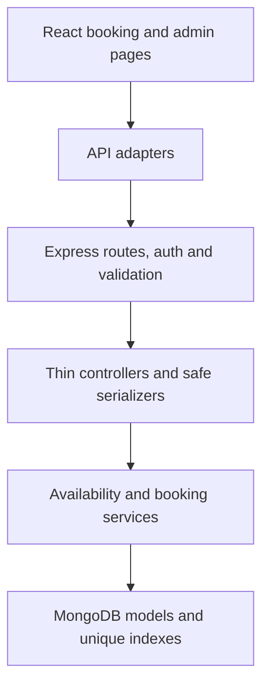
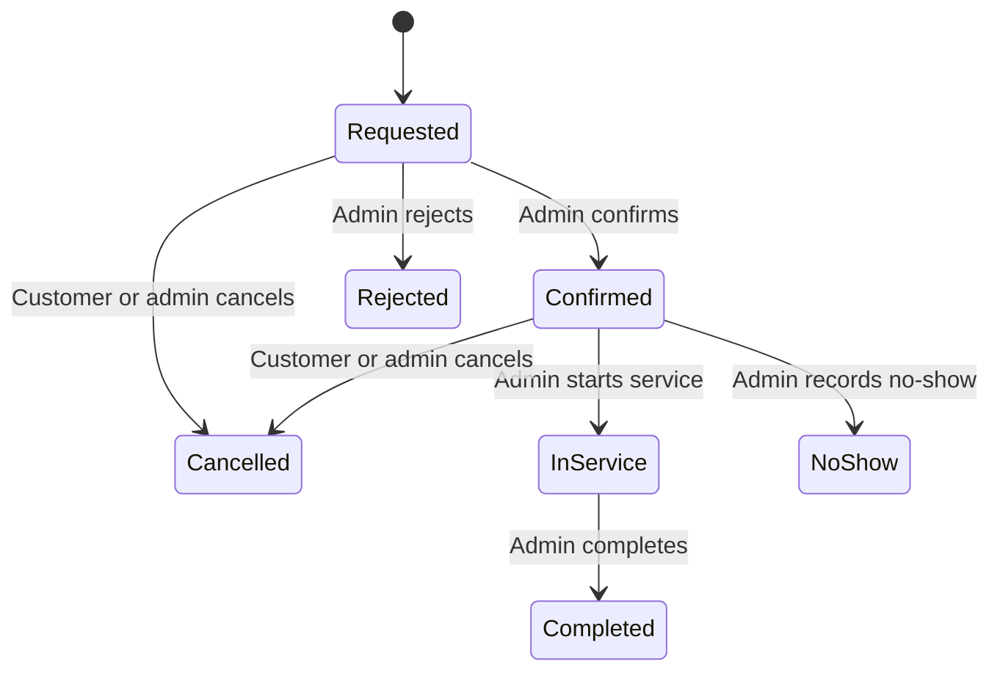

# Vehicle Service Booking — Core Booking Phase Design

Date: 2026-08-29  
Status: Approved for implementation on 2026-08-29  
Scope: Complete the first end-to-end service-booking vertical slice on top of the verified Authentication and Vehicle Profiles baseline

## 1. Goal

Turn the existing authentication and vehicle-profile foundation into a genuine Vehicle Service Booking application. A customer must be able to select an owned active vehicle, select an active service, see duration-aware availability, create a booking, review its lifecycle, and cancel it when permitted. An administrator must be able to manage the service catalogue and workshop schedule, review bookings, and apply valid status transitions.

The phase prioritizes correctness, authorization, concurrency safety, accessible user experience, automated evidence, and recruiter-readable documentation. It does not add unrelated feature volume.

## 2. Existing Baseline That Must Be Preserved

- Registration, email verification, login, session restoration, logout, password reset, password change, and administrator invitations.
- Customer vehicle create, list, edit, archive, and restore behavior.
- Five-active-vehicle concurrency rule and globally unique immutable registration numbers.
- Administrator read-only customer vehicle list.
- Existing cookie/JWT security, origin guard, validation, centralized error handling, safe serializers, and role guards.
- Existing response wording and acceptance behavior covered by the current tests.
- The current `customer | admin` role model. Technician login is not added in this phase.
- No DELETE endpoint for vehicles, services, or bookings.

The original uploaded ZIP remains the protected rollback baseline. The existing `.env` is never copied into a deliverable or modified by this phase.

## 3. Chosen Approach

### Selected

Build one complete booking vertical slice using the existing layered pattern:



### Rejected for this phase

1. Numerous unrelated CRUD screens: high surface area with little engineering depth.
2. AI, OBD-II simulation, predictive maintenance, or Socket.IO before the core booking workflow exists.
3. Replacing the working authentication or vehicle subsystems.
4. A booking-overlap check implemented as `find()` followed by `create()`: it is vulnerable to concurrent double booking.
5. A standalone-only reservation workflow based on cleanup after partial multi-document writes. Phase 1 instead requires a MongoDB replica set and uses transactions for cross-document invariants, plus a unique multikey reservation index as the final overlap arbiter.

## 4. Phase Boundaries

### Included

- One workshop.
- Workshop timezone: `Asia/Kolkata`.
- Thirty-minute scheduling grid.
- Two service bays by default; administrator may configure one through five.
- Weekly opening hours and date-specific closures or special hours.
- Active/inactive service catalogue with duration-aware services.
- Availability search for the next 30 calendar days.
- Minimum booking lead time of 60 minutes.
- Customer booking creation, list, detail, timeline, and cancellation.
- Administrator service management, schedule management, booking queue, filters, detail, and status transitions.
- Concurrency-safe variable-duration reservations.
- Root documentation, environment templates, seed data, CI definition, and complete automated regression gates.
- A single-node MongoDB replica-set development/test setup, with Atlas-compatible production configuration.

### Explicitly excluded

- Technician accounts, assignments, skills, or technician availability.
- Payments, prices, invoices, inventory, coupons, loyalty, or branches.
- Rescheduling. A customer cancels a permitted booking and creates a new one.
- Email, SMS, WhatsApp, push, or real-time notifications.
- AI diagnosis, predictive maintenance, OBD-II data, vehicle health scores, maps, or route planning.
- File uploads, chat, ratings, or reviews.
- Public service marketplace behavior.

These exclusions are deliberate. Later phases build on the stable booking lifecycle rather than bypassing it.

## 5. Scheduling Rules

1. All persisted instants are UTC `Date` values.
2. Workshop rules and displayed schedule labels use the IANA timezone `Asia/Kolkata`.
3. The scheduling grid is 30 minutes.
4. A service duration must be an integer from 30 through 240 minutes and divisible by 30.
5. A booking must start on a grid boundary and finish entirely inside one opening interval.
6. The booking horizon contains exactly 30 workshop-local dates: today through today plus 29 days, inclusive.
7. The start must be at least 60 minutes after the current instant.
8. Date overrides take precedence over weekly hours.
9. A closed date returns no slots.
10. The server derives `endsAt`, bay assignment, service duration, local date, and reservation keys. The client cannot submit them.
11. Availability results are advisory. Booking creation recalculates all rules and lets the database constraint make the final concurrency decision.

Use `luxon` on the server for explicit IANA-zone conversion and DST-safe date handling. Even though the initial zone has no daylight-saving transition, the engine and tests must not rely on that accident.

## 6. Data Model

### 6.1 Service

| Field | Rule |
|---|---|
| `name` | Required, trimmed, 2–80 characters |
| `slug` | Required, normalized lowercase kebab-case, globally unique, immutable |
| `nameKey` | Internal normalized/case-folded name, unique and recomputed on rename; never serialized |
| `category` | Required enum: `maintenance | repair | inspection | cleaning | tyre | electrical | other` |
| `description` | Required, trimmed, 10–500 characters |
| `durationMinutes` | Required integer, 30–240, divisible by 30 |
| `isActive` | Required Boolean, default `true`, server-managed through admin update |
| `bookingGuardVersion` | Internal integer, default `0`, excluded from queries/responses; incremented only to serialize booking creation with service changes |
| `createdAt`, `updatedAt` | Mongoose timestamps |

Indexes:

```js
serviceSchema.index({ slug: 1 }, { unique: true });
serviceSchema.index({ nameKey: 1 }, { unique: true });
serviceSchema.index({ isActive: 1, name: 1 });
```

Services are deactivated, never deleted. Editing or deactivating a service never rewrites, cancels, or reallocates an existing booking; historical and future bookings retain the snapshot and slot duration accepted at creation.

### 6.2 WorkshopSchedule

One singleton document is identified by immutable `key: "default"`.

| Field | Rule |
|---|---|
| `key` | Exactly `default`, unique and immutable |
| `timeZone` | Exactly `Asia/Kolkata` in Phase 1 |
| `slotMinutes` | Exactly `30` in Phase 1 |
| `bayCount` | Integer 1–5, default 2 |
| `weeklyHours` | Exactly seven records, sorted by and containing each ISO weekday `1` through `7` once; each is closed or has one non-overnight `[openMinute, closeMinute)` interval |
| `dateOverrides` | Unique `YYYY-MM-DD` records; closed or one special interval; maximum 366 entries |
| `bookingGuardVersion` | Internal integer, default `0`, excluded from queries/responses; incremented to serialize booking creation and schedule replacement |
| `createdAt`, `updatedAt` | Mongoose timestamps |

Minute values are integers from 0 through 1440. Open must be lower than close, and both values must be divisible by 30. Overnight operation is outside Phase 1. A full-document custom validator rejects duplicate override dates and any missing, duplicate, or unsorted weekday. This is required because a unique multikey index does not reject repeated values within the same document.

Default seed:

- Monday–Saturday: 09:00–18:00
- Sunday: closed
- Two bays

An administrator schedule update is rejected with exact `409 { "message": "Schedule change conflicts with existing bookings" }` when it would place any future capacity-retaining booking outside the proposed hours/overrides or above the proposed `bayCount`. The service builds and validates the complete proposed document rather than validating only patched fields. Schedule updates never silently move, cancel, or reassign bookings.

### 6.3 Booking

| Field | Rule |
|---|---|
| `customer` | Required reference to the authenticated customer |
| `vehicle` | Required reference to an active vehicle owned by `customer` at creation |
| `vehicleSnapshot` | Required immutable `{ registrationNumber, make, model, year, fuelType }` |
| `service` | Required reference to an active Service at creation |
| `serviceSnapshot` | Required immutable `{ name, slug, category, durationMinutes }` |
| `startsAt` | Required UTC Date, immutable after creation |
| `endsAt` | Required UTC Date, server-derived and immutable |
| `localDate` | Required `YYYY-MM-DD` snapshot in workshop timezone |
| `timeZone` | Required `Asia/Kolkata` snapshot |
| `bayNumber` | Required internal integer 1–5, server-assigned and immutable |
| `reservedSlotKeys` | Internal canonical array while the booking retains capacity; explicitly `default: undefined` and absent after cancellation, rejection, or no-show |
| `status` | `requested | confirmed | in_service | completed | cancelled | rejected | no_show` |
| `notes` | Optional customer text, trimmed, maximum 500 characters |
| `statusHistory` | Append-only transition snapshots |
| `createdAt`, `updatedAt` | Mongoose timestamps |

Each `statusHistory` entry contains an immutable actor snapshot:

```text
fromStatus | null
toStatus
changedAt
actor.userId
actor.username
actor.role: customer | admin
reason | null
```

Creation appends the first `null -> requested` entry using the authenticated customer snapshot. Customer responses expose only the actor label `Customer` or `Administrator`; they never expose an administrator id or username. Administrator responses may expose the actor id, username, and role.

Indexes:

```js
bookingSchema.index({ customer: 1, startsAt: -1 });
bookingSchema.index({ status: 1, startsAt: 1 });
bookingSchema.index({ vehicle: 1, startsAt: -1 });
bookingSchema.index(
  { reservedSlotKeys: 1 },
  {
    unique: true,
    name: "uniq_booking_reserved_slot",
    partialFilterExpression: { reservedSlotKeys: { $exists: true } },
  },
);
```

`reservedSlotKeys`, `bayNumber`, raw references, and Mongoose internals are excluded from customer responses. An administrator response may include `bayNumber` but never `reservedSlotKeys`.

The existing Vehicle model gains the same internal `bookingGuardVersion` integer, default `0` and excluded from queries/responses. It is not user-editable and does not change current vehicle behavior. Existing Vehicle edit/archive/restore commands increment it atomically with their business change; Service edits/deactivation do the same to the Service guard.

Editing or archiving a vehicle after booking creation does not rewrite or cancel the booking. The immutable vehicle snapshot keeps history stable; only creation of a new booking requires the current Vehicle document to be active and owned by the customer.

## 7. Concurrency-Safe Reservation Design

Each occupied 30-minute bay interval is represented by one canonical key:

```text
<UTC interval start ISO>|bay:<number>
```

Example for a 90-minute service assigned to bay 1:

```text
2026-09-01T03:30:00.000Z|bay:1
2026-09-01T04:00:00.000Z|bay:1
2026-09-01T04:30:00.000Z|bay:1
```

MongoDB indexes an array field as a multikey index. A unique multikey index prevents any reservation key in one booking from appearing in another booking. The insert of one Booking document and all of its reservation keys is atomic, so variable-duration overlap cannot pass under concurrent requests. This follows MongoDB's documented [unique multikey index](https://www.mongodb.com/docs/manual/core/indexes/index-types/index-multikey/#unique-multikey-indexes) behavior across separate documents. The partial unique constraint applies only while the reservation field exists, following MongoDB's documented [partial unique index](https://www.mongodb.com/docs/manual/core/index-partial/#partial-index-with-unique-constraint) behavior.

Creation algorithm:

1. Try candidate bay numbers `1` through the Phase 1 maximum of `5` in deterministic ascending order; every candidate is attempted in a fresh transaction because a duplicate-key error aborts its transaction. The current schedule read inside that transaction decides whether the candidate is within the current `bayCount`.
2. Inside that transaction, conditionally `findOneAndUpdate` the Vehicle by `_id`, authenticated owner, and `status: "active"`, incrementing its internal `bookingGuardVersion` and returning the document. A miss maps to the safe Vehicle 404.
3. Conditionally touch the Service by `_id` and `isActive: true` in the same way. A miss maps to `409 { "message": "This service is currently unavailable" }` after existence is safely resolved.
4. Touch and return the `key: "default"` WorkshopSchedule by incrementing its guard in the same transaction. Every guard-only touch of Vehicle, Service, or WorkshopSchedule uses `{ timestamps: false }`, so booking creation never changes their user-visible `updatedAt`.
5. From those transaction-consistent documents, recompute the service snapshot, vehicle snapshot, local date, valid offered start, `endsAt`, bay range, and every occupied grid interval. Client-derived scheduling fields are never used.
6. Construct the candidate bay's canonical reservation keys and insert one Booking, including the initial history event, within the transaction.
7. On the named reservation-index `E11000`, abort and try the next bay in a new transaction. Transient transaction/write-conflict errors use the driver's bounded transaction retry and rerun all conditional checks.
8. If every current bay collides, return exact `409 { "message": "That time is no longer available" }`.
9. Translate other duplicate-key errors by their index/key before any generic duplicate handler.

The guard increments intentionally make the small single-workshop schedule document a serialization point. A concurrent vehicle archive/edit, service edit/deactivation, or schedule replacement writes the same guarded document. MongoDB therefore orders the operations through transaction write conflicts: booking creation either uses the committed active/rule state, or retries and revalidates after the competing change. If booking creation wins, a later edit/archive/deactivation is allowed and its immutable snapshots preserve what was accepted.

Schedule replacement also runs in `withTransaction()`. It validates the complete proposed schedule and reads every remaining commitment matching `reservedSlotKeys: { $exists: true }` and `endsAt: { $gt: now }`, including a booking whose start already passed. It verifies each existing bay and remaining interval against the proposal, then increments/replaces the same WorkshopSchedule document. A conflict retries the whole read/validate/write operation; an invalid proposal returns the schedule-conflict 409. There is no check-then-write race with booking creation.

Reservation invariant and capacity release:

- Customer/admin cancellation, admin rejection, and admin no-show use one conditional update that changes status, appends history, and `$unset`s `reservedSlotKeys` atomically.
- `requested`, `confirmed`, `in_service`, and `completed` require a non-empty `reservedSlotKeys` array.
- `cancelled`, `rejected`, and `no_show` must not contain reservation keys.
- The array must contain no duplicates, and its length must equal `serviceSnapshot.durationMinutes / 30`. Every element must exactly match the canonical sequence derived from `startsAt`, `bayNumber`, and the 30-minute grid.
- The Mongoose array path explicitly uses `default: undefined`, is never persisted as `[]`, and is removed only with `$unset`.
- Booking writes are restricted to sanctioned creation and conditional-transition service methods. Document validation plus query middleware validates supported `$set`, `$unset`, and `$push` shapes so status, history, and reservation ownership cannot diverge; all other managed-field updates are rejected.
- Application validation explicitly rejects duplicate keys inside one Booking array because MongoDB's unique multikey behavior enforces uniqueness across documents, not repeated values inside a single document.

The API never trusts an earlier availability response, `countDocuments()`, or a client-selected bay.

## 8. Booking State Machine and Authorization



| Action | Customer | Admin |
|---|---:|---:|
| Create requested booking | Own account only | No |
| Read booking | Own booking only | Any booking |
| Cancel requested/confirmed future booking | Own booking only | Any eligible booking |
| Confirm requested booking | No | Yes |
| Reject requested booking | No | Yes; reason required |
| Start confirmed booking | No | Yes |
| Mark confirmed booking no-show | No | Yes |
| Complete in-service booking | No | Yes |
| Change vehicle/service/time | No | No |

Exact transitions and timing:

- `requested -> confirmed`: administrator only and strictly before `startsAt`.
- `requested -> rejected`: administrator only, reason required, including after a missed start.
- `requested -> cancelled`: owning customer or administrator, strictly before `startsAt`; administrator reason required and customer reason optional.
- `confirmed -> cancelled`: owning customer or administrator, strictly before `startsAt`; administrator reason required and customer reason optional.
- `confirmed -> in_service`: administrator only, from 30 minutes before `startsAt` onward, with no upper bound until another terminal action wins.
- `confirmed -> no_show`: administrator only at or after `startsAt`; the atomic transition releases the remaining reserved capacity.
- `in_service -> completed`: administrator only.

`completed`, `cancelled`, `rejected`, and `no_show` are terminal. No terminal state can transition. A reason is forbidden for confirmation, start, completion, and no-show; it is required for rejection and administrator cancellation. When accepted, `reason` must be a string, is trimmed, must remain non-empty, and has a maximum of 300 characters. Timing failures return exact `409 { "message": "Booking action is not allowed at this time" }`. A stale or structurally invalid transition returns exact `409 { "message": "Booking status no longer permits this action" }`.

Every transition uses one conditional database update matching both `_id` and the expected current status. The update appends exactly one actor-snapshot history entry and releases capacity when required. Ownership misses and unauthorized booking IDs return the same safe `404 { "message": "Booking not found" }` shape.

Transition legality is centralized in `server/services/bookingStateMachine.js`; route/controller code must not duplicate it.

## 9. HTTP API

All routes use existing authentication, authorization, validation, async handling, and centralized errors. `/api/services`, `/api/bookings/availability`, and every customer Booking route use `authenticate -> authorize("customer")`: a guest receives 401 and an authenticated administrator receives 403. Every `/api/admin/*` route uses `authenticate -> authorize("admin")`: a guest receives 401 and an authenticated customer receives 403.

### Customer-visible service and availability routes

| Method | Path | Result |
|---|---|---|
| `GET` | `/api/services` | `200 { services }`; active services sorted by `name`, then `_id`, ascending |
| `GET` | `/api/bookings/availability?serviceId=<id>&date=YYYY-MM-DD` | Duration-aware available starts and remaining bay capacity |

Availability response:

```json
{
  "date": "2026-09-01",
  "timeZone": "Asia/Kolkata",
  "service": {
    "id": "...",
    "name": "Periodic Maintenance",
    "durationMinutes": 90
  },
  "slots": [
    {
      "startsAt": "2026-09-01T03:30:00.000Z",
      "endsAt": "2026-09-01T05:00:00.000Z",
      "remainingCapacity": 2
    }
  ]
}
```

`remainingCapacity` is the number of bays free for the service's entire `[startsAt, endsAt)` interval, not only its first grid cell. Slot results are ordered by `startsAt` ascending. `date` is validated against the 30-date horizon, and `serviceId` must resolve to an active service.

### Customer booking routes

| Method | Path | Result |
|---|---|---|
| `POST` | `/api/bookings` | `201 { booking }`; create requested booking |
| `GET` | `/api/bookings?scope=upcoming|history|all&status=<status>&page=<n>&limit=<n>` | `200 { bookings, pagination }`; paginated own bookings |
| `GET` | `/api/bookings/:id` | `200 { booking }`; own booking detail |
| `PATCH` | `/api/bookings/:id/cancel` | `200 { booking }`; cancel eligible own booking |

Create request accepts exactly:

```json
{
  "vehicleId": "...",
  "serviceId": "...",
  "startsAt": "2026-09-01T03:30:00.000Z",
  "notes": "Please inspect the battery"
}
```

Cancel accepts exactly an optional `reason`. When present it follows the shared reason contract: string, trimmed, non-empty after trimming, and at most 300 characters.

Customer list semantics:

- `scope` defaults to `upcoming`.
- `upcoming` contains `requested`/`confirmed` bookings whose scheduled interval has not ended (`endsAt >= now`), plus every `in_service` booking.
- `history` contains terminal bookings, plus any other nonterminal booking whose `endsAt < now`.
- `all` contains every own booking.
- A future cancelled/rejected booking is history, not upcoming.
- Upcoming and history are disjoint and exhaustive; an unprocessed booking whose start passed but end has not passed remains visible in upcoming until an administrator acts.
- `status`, when present, must be one enum value and is combined with scope.
- Upcoming order is `startsAt ASC, _id ASC`; history and all use `startsAt DESC, _id DESC`.
- `page` defaults to 1 and is capped at 10,000. `limit` defaults to 20 and is capped at 100, bounding the largest skip at 999,900 records. Invalid or repeated scalar query values fail validation rather than being coerced.

Every list pagination object is exactly:

```json
{ "page": 1, "limit": 20, "totalItems": 0, "totalPages": 0 }
```

### Administrator routes

| Method | Path | Result |
|---|---|---|
| `GET` | `/api/admin/services` | `200 { services, pagination }`; paginated active/inactive catalogue |
| `POST` | `/api/admin/services` | `201 { service }`; create service |
| `PATCH` | `/api/admin/services/:id` | `200 { service }`; edit or activate/deactivate service |
| `GET` | `/api/admin/workshop-schedule` | `200 { schedule }`; read singleton schedule |
| `PATCH` | `/api/admin/workshop-schedule` | `200 { schedule }`; replace editable hours, bays, and overrides |
| `GET` | `/api/admin/bookings` | `200 { bookings, pagination }`; paginated/filterable queue |
| `GET` | `/api/admin/bookings/:id` | `200 { booking }`; administrator booking detail |
| `PATCH` | `/api/admin/bookings/:id/status` | `200 { booking }`; apply one legal transition |

Administrator booking filters: `page`, `limit`, `status`, `dateFrom`, `dateTo`, and escaped `search` across the vehicle registration snapshot, username, email, and service snapshot name.

Administrator list rules:

- `page`/`limit` use the shared defaults and limits.
- `dateFrom` and `dateTo` are inclusive `YYYY-MM-DD` workshop-local dates and are converted to an exclusive UTC upper boundary safely; `dateFrom <= dateTo`.
- Default ordering is `startsAt ASC, _id ASC`; `status` and date filters compose with escaped, length-limited search.
- Service catalogue ordering is `name ASC, _id ASC` and supports optional `isActive=true|false` plus escaped search.
- `search`, when present, is trimmed and must contain 1–100 characters; its regex metacharacters are escaped before querying.
- Booking `status`, when present, must be exactly one Booking enum value. Service `isActive`, when present, must be the single lowercase scalar `true` or `false`.
- Every admin query parameter is a single scalar. Repeated values, unknown query keys, invalid dates/enums/booleans, non-integer pagination, and values above their limits fail structured validation.

Service create accepts exactly:

```json
{
  "name": "Periodic Maintenance",
  "category": "maintenance",
  "description": "Scheduled inspection and preventive maintenance.",
  "durationMinutes": 90
}
```

The server derives and stores the immutable slug from normalized name. Service PATCH accepts a non-empty subset of only `name`, `category`, `description`, `durationMinutes`, and `isActive`; `slug`, guards, timestamps, and unknown fields are forbidden. A create or rename that collides after normalization returns exact `409 { "message": "A service with this name already exists" }`.

Schedule PATCH is a full replacement of editable rules and accepts exactly:

```json
{
  "bayCount": 2,
  "weeklyHours": [
    { "weekday": 1, "isClosed": false, "openTime": "09:00", "closeTime": "18:00" },
    { "weekday": 2, "isClosed": false, "openTime": "09:00", "closeTime": "18:00" },
    { "weekday": 3, "isClosed": false, "openTime": "09:00", "closeTime": "18:00" },
    { "weekday": 4, "isClosed": false, "openTime": "09:00", "closeTime": "18:00" },
    { "weekday": 5, "isClosed": false, "openTime": "09:00", "closeTime": "18:00" },
    { "weekday": 6, "isClosed": false, "openTime": "09:00", "closeTime": "18:00" },
    { "weekday": 7, "isClosed": true }
  ],
  "dateOverrides": [
    { "date": "2026-10-02", "isClosed": true }
  ]
}
```

Open records require `HH:mm` `openTime`/`closeTime`; closed records forbid them. The server converts labels to minute integers. `key`, `timeZone`, `slotMinutes`, guard/version fields, timestamps, and unknown fields are forbidden.

GET and PATCH serialize the schedule identically:

```json
{
  "schedule": {
    "timeZone": "Asia/Kolkata",
    "slotMinutes": 30,
    "bayCount": 2,
    "weeklyHours": [
      { "weekday": 1, "isClosed": false, "openTime": "09:00", "closeTime": "18:00" },
      { "weekday": 7, "isClosed": true }
    ],
    "dateOverrides": [
      { "date": "2026-10-02", "isClosed": true }
    ],
    "updatedAt": "2026-08-29T12:00:00.000Z"
  }
}
```

The real response always contains all seven sorted weekdays; the abbreviated example shows the open and closed shapes. Overrides are sorted by date. Stored minute values, `key`, `_id`, `__v`, and `bookingGuardVersion` are never serialized.

Administrator status PATCH accepts exactly `{ "toStatus": "<target>", "reason": "<optional>" }`. Unknown fields are rejected. `toStatus` is checked against the centralized state machine; the type, trim, non-blank, 300-character maximum, required, and forbidden reason rules in Section 8 apply before the command runs.

No administrator endpoint changes a booking's customer, vehicle, service, start time, end time, or reservation keys.

## 10. Response and Error Contracts

Safe customer Booking response:

```text
id
vehicle: reference id plus snapshot registrationNumber, make, model, year, fuelType
service: snapshot name, slug, category, durationMinutes
startsAt
endsAt
localDate
timeZone
status
notes (when present)
statusHistory: fromStatus, toStatus, changedAt, actorLabel, reason
createdAt
updatedAt
```

Administrator responses additionally include safe customer identity, `bayNumber`, and the status-history actor snapshot. Customer status history exposes only `actorLabel: "Customer" | "Administrator"`; administrator ids and usernames never cross the customer serializer. The `vehicle.id` is the stable Vehicle reference while all displayed vehicle attributes come from the immutable booking snapshot.

Exact intentional errors:

- `404 { "message": "Service not found" }`
- `404 { "message": "Vehicle not found" }`
- `404 { "message": "Booking not found" }`
- `409 { "message": "That time is no longer available" }`
- `409 { "message": "Booking status no longer permits this action" }`
- `409 { "message": "Booking action is not allowed at this time" }`
- `409 { "message": "This service is currently unavailable" }`
- `409 { "message": "A service with this name already exists" }`
- `409 { "message": "Schedule change conflicts with existing bookings" }`

Validation continues to use the existing structured validation response. Invalid ObjectIds are translated to safe 404 responses before reaching Mongoose casts.

## 11. Server Architecture and File Boundaries

### New models

- `server/models/Service.js`
- `server/models/WorkshopSchedule.js`
- `server/models/Booking.js`

### New domain/services

- `server/services/serviceCatalogService.js`
- `server/services/workshopScheduleService.js`
- `server/services/availabilityService.js` — pure interval/grid calculation plus data-loading facade
- `server/services/bookingStateMachine.js` — pure transition authority
- `server/services/bookingService.js` — ownership, reservation and lifecycle commands

### New HTTP/support files

- `server/routes/serviceRoutes.js`
- `server/routes/bookingRoutes.js`
- additions to `server/routes/adminRoutes.js`
- `server/controllers/serviceController.js`
- `server/controllers/bookingController.js`
- additions to `server/controllers/adminController.js`
- `server/validators/serviceValidators.js`
- `server/validators/scheduleValidators.js`
- `server/validators/bookingValidators.js`
- `server/middleware/requireValidBookingId.js`
- `server/utils/serviceResponse.js`
- `server/utils/bookingResponse.js`
- `server/config/bookingPolicy.js`

`server/app.js` mounts `/api/services` and `/api/bookings`. `server/index.js` initializes every new model before listening.

Controllers remain thin. Domain decisions belong to services; serialization belongs to response utilities; validation and sanitization belong to validators.

## 12. Client Architecture and User Experience

### New API and utility boundaries

- `client/src/api/serviceApi.js`
- `client/src/api/bookingApi.js`
- `client/src/utils/bookingValidation.js`
- `client/src/utils/bookingErrors.js`
- `client/src/utils/bookingPresentation.js`
- `client/src/utils/protectedApiError.js` — shared 401 handling that clears auth state and redirects to login

### Customer pages

- `/book-service` — accessible four-step booking wizard
- `/bookings` — upcoming/history views and filters
- `/bookings/:id` — booking detail, status timeline, and eligible cancellation

### Administrator pages

- `/admin/services` — create/edit/activate/deactivate catalogue
- `/admin/schedule` — opening hours, bay count, and date overrides
- `/admin/bookings` — responsive queue with search/filter/pagination
- `/admin/bookings/:id` — customer/vehicle/service detail and legal transition controls

### Shared components

- `BookingStatusBadge`
- `BookingTimeline`
- `BookingFilters`
- `BookingSummary`
- `ConfirmAction`
- `AsyncState`

`AppShell` becomes role-aware and provides accessible navigation to existing and new pages. Active navigation is visually identified and exposed with `aria-current="page"`.

Every existing and new protected API flow uses the shared protected-error helper. A 401 clears the session once, preserves the existing safe redirect behavior, and navigates to `/login`; feature pages do not each invent a different expired-session branch. The existing vehicle helper may delegate to or re-export the shared behavior so current acceptance behavior remains stable.

The wizard requirements:

1. Only active owned vehicles appear.
2. Service cards show description and estimated duration, not price.
3. Date selection uses workshop-local labels.
4. Slot buttons display start/end labels and remaining capacity.
5. Submission is disabled while pending.
6. A 409 refreshes availability and explains that another user took the slot.
7. The review step states vehicle, service, duration, date, time, and notes before confirmation.
8. Keyboard navigation, visible focus, reduced-motion preference, labelled controls, `aria-describedby`, status announcements, empty states, retry paths, and narrow-screen layouts are required.

## 13. Seed and Migration Behavior

At server startup, before listening, initialize the default WorkshopSchedule with:

```js
findOneAndUpdate(
  { key: "default" },
  { $setOnInsert: defaultSchedule },
  { upsert: true, returnDocument: "after", setDefaultsOnInsert: true },
)
```

This runs once in the startup lifecycle, not during a customer GET. A concurrent first-start duplicate-key race retries by reading `key: "default"`. Startup fails clearly if initialization cannot complete; requests never mutate configuration as a side effect.

Add an idempotent `server/scripts/seed-booking-foundation.js` command that:

1. Upserts the default WorkshopSchedule.
2. Inserts a small deterministic service catalogue by slug using `$setOnInsert`, so rerunning the seed never overwrites administrator edits:
   - Periodic Maintenance — 90 minutes
   - Oil and Filter Change — 60 minutes
   - Brake Inspection — 60 minutes
   - Battery and Electrical Check — 60 minutes
   - Wheel Alignment — 90 minutes
   - Vehicle Cleaning — 60 minutes
3. Never creates users, changes passwords, or modifies vehicles.
4. Never deletes or resets existing data.

Service seeding remains an explicit developer command and never runs implicitly in production startup.

## 14. Testing Strategy

Every behavior is implemented test-first. Focused tests must fail for the intended reason before production code is added.

### Server unit/model tests

- Service normalization, duration boundaries, unknown fields, immutability, and indexes.
- Schedule exact ISO weekday set/order, full-replacement validation, duplicate override dates within one document, hours, grid boundaries, and index.
- Booking required fields, initial history, actor snapshots, immutable fields, and exact indexes.
- Reservation invariant matrix: required/absent by status, `default: undefined`, never empty, exact key count and canonical sequence, and duplicate values within one document.
- Managed Booking update middleware rejects unsupported `$set`, `$unset`, `$push`, unknown pipeline, and direct lifecycle writes.
- Pure availability grid, lead time, horizon, closures, special hours, capacity, edge-of-day, and timezone behavior.
- State-machine transition, actor, terminal, and exact timing matrix for both roles, including no-show; reason tests cover wrong type, whitespace-only, 300/301-character boundaries, required, optional, and forbidden cases.

### Server integration/route tests

- Active owned vehicle and active service requirements.
- Another customer's vehicle and booking are hidden.
- Archived vehicle cannot be booked.
- Server ignores/rejects managed scheduling fields.
- Simultaneous same-time requests never exceed bay capacity.
- Deliberately parallel create-vs-vehicle-archive, create-vs-service-deactivate/edit, and create-vs-schedule-replacement tests prove that the committed booking matches one complete rule version.
- Booking guard touches do not change Vehicle, Service, or WorkshopSchedule `updatedAt`; business edits increment the relevant guard and retain normal timestamps.
- Schedule replacement racing booking creation either safely commits a valid ordering or returns the documented conflict; it never invalidates a committed Booking. Conflict coverage includes a started-but-not-ended commitment and a completed booking whose retained interval has not ended.
- A 30-minute request cannot overlap any interval of a longer booking in the same bay.
- A free second bay permits the second booking.
- Cancellation/rejection atomically releases capacity.
- No-show atomically releases remaining capacity while preserving the audit snapshot; completion retains the accepted interval.
- Invalid, stale, reason, and timing transitions return their exact 409/validation responses.
- Requested past bookings can be rejected; confirmed past bookings can be started or marked no-show according to policy.
- Customer/admin authorization matrix.
- Safe response projections never leak reservation keys or raw owner data.
- Admin filters use sanitized numeric values and escaped search input.
- Existing authentication and vehicle tests remain green.

### Client tests

- API URLs, queries, credentials, and exact request bodies.
- Customer/admin route guards.
- Wizard validation and step navigation.
- Availability loading, closed/empty states, 409 refresh, retry, and no duplicate submission.
- Booking list/detail/timeline/cancellation.
- Admin service, schedule, queue, filter, and transition interactions.
- Session-expiry redirect on every new protected page mutation.
- Shared protected-error behavior clears auth and redirects exactly once on a 401.
- Responsive and accessible structural assertions.

### Completion gate

- Full server suite passes against the guarded test database.
- Full client suite passes.
- Client lint passes.
- Client production build passes.
- New booking race test passes repeatedly.
- Race tests issue simultaneous Promise-based requests even when the overall Node test runner remains at its existing `--test-concurrency=1` isolation setting.
- Browser acceptance covers customer creation/cancellation and the full admin status lifecycle.
- Final ZIP integrity, required-file manifest, exclusions, non-zero size, entry count, and SHA-256 are verified.

## 15. Implementation Gates

This remains one product phase but is delivered through four separately reviewable implementation plans. A gate must pass its focused tests before the next gate begins.

1. **Domain integrity:** replica-set test/dev setup, models, startup schedule initialization, explicit service seed, availability engine, reservation invariant, transaction guards, state machine, and server race tests.
2. **Customer vertical slice:** customer service/availability/booking APIs, serializers, shared protected-error handling, booking wizard, customer list/detail/timeline/cancel, and customer browser acceptance.
3. **Administrator operations:** catalogue, full schedule replacement, booking queue/detail/status APIs and UI, schedule-conflict tests, and complete lifecycle browser acceptance.
4. **Release evidence:** full regression, accessibility/responsive checks, CI, root documentation, environment templates, acceptance record, secret/dependency exclusion scan, and verified versioned ZIP.

No gate is called complete from focused tests alone. Gate 4 reruns the complete server and client verification matrix.

## 16. Portfolio and Developer Experience

Add:

- Root `README.md` with problem, roles, architecture, data-integrity decisions, screenshots, setup, seed, commands, demo scenario, and honest limitations.
- `server/.env.example` and `client/.env.example` containing names and safe examples only.
- Root scripts or documented commands for install, test, lint, build, and seed.
- `.github/workflows/ci.yml` that runs supported no-secret checks. Database-backed CI uses a MongoDB service and never a development database.
- `docker-compose.yml` (or an equivalently documented command) that starts a single-node MongoDB replica set for development and CI, plus an idempotent replica-set initialization/health step.
- A browser-level acceptance checklist and API summary.
- Node engine declarations matching the verified development runtime range.

No badges, coverage percentage, live URL, or production-security claim is added unless independently verified.

## 17. Safety and Delivery

1. Work from a copy of the uploaded verified ZIP.
2. Preserve the original ZIP unchanged.
3. Do not include `.env`, `node_modules`, `dist`, coverage, database files, `.git`, or nested ZIPs in the deliverable.
4. Do not change real customer/admin passwords or development database records during automated testing.
5. Automated tests may use only the guarded test database.
6. Make a new versioned ZIP; do not replace the protected source ZIP.
7. Persist the completed deliverable and provide its exact size, entry count, and SHA-256.

## 18. Success Criteria

Phase 1 is complete only when:

- A verified customer can create a booking using an active owned vehicle and an available duration-aware slot.
- Concurrent requests cannot exceed configured bay capacity or overlap the same bay interval.
- The customer can review and validly cancel their booking.
- The administrator can manage services/schedule, find the booking, and apply the complete legal lifecycle.
- Invalid ownership, input, time, status, and concurrency cases are rejected safely.
- Existing authentication and vehicle behavior remains unchanged and green.
- The UI is responsive and accessible across customer and administrator flows.
- The full verification gate passes and a new independently verified source ZIP is delivered.

## 19. Future Phases

After this phase is stable:

1. Technician accounts and assignment.
2. Socket.IO status updates and notification jobs.
3. OBD-II telemetry simulator and vehicle digital twin.
4. Explainable maintenance recommendations and predictive maintenance.
5. PWA/offline support, observability, deployment, and advanced portfolio presentation.

Future work must reuse the booking state machine and reservation constraint rather than weakening them.
